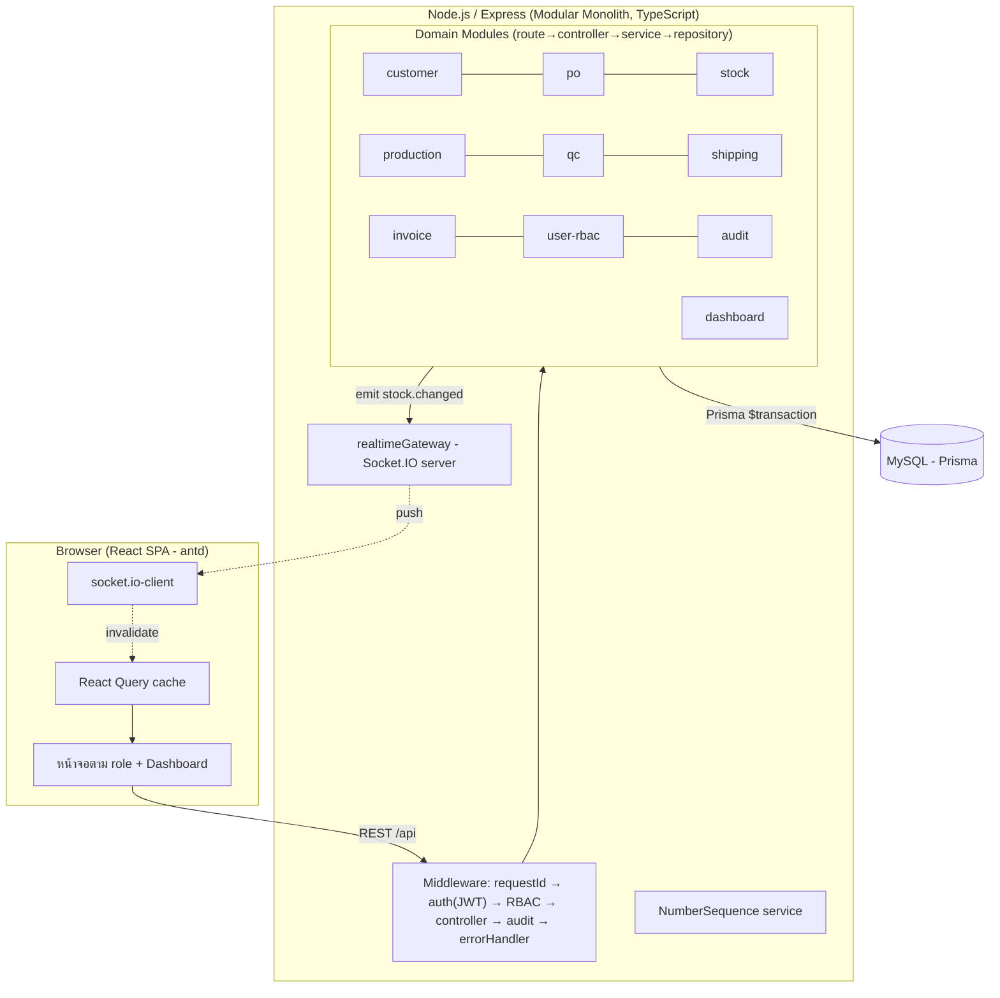
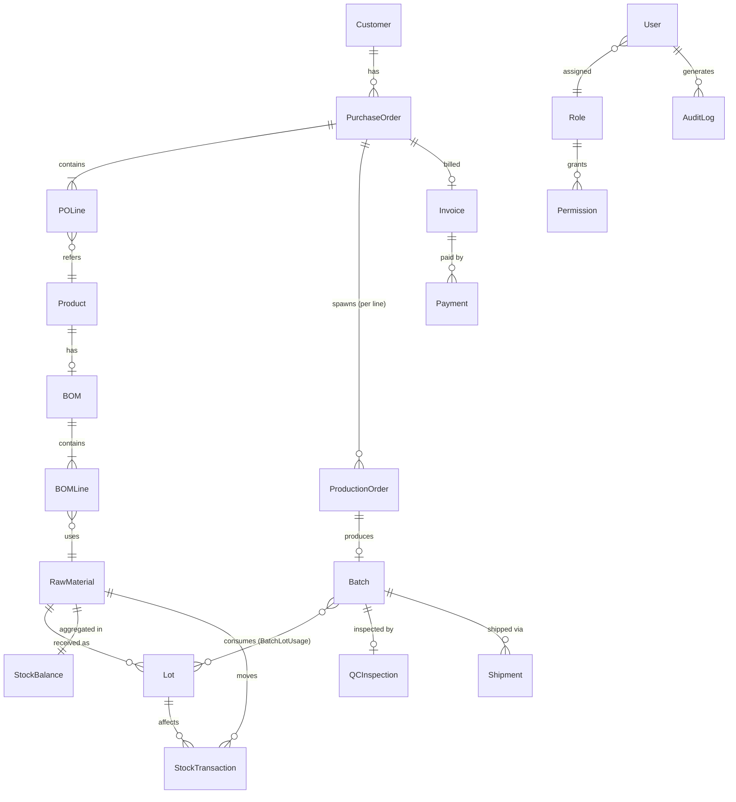

# Architecture — ERP Core Prototype (Order-to-Cash)

- **slug**: `erp-core-prototype`
- **สถานะ**: Proposed — รอ Human Gate 1 (ปอนด์ approve)
- **ผู้เขียน**: Tech-Lead
- **วันที่**: 2026-07-06
- **อ้างอิง**: brief.md, user-stories.md (ECP-001–036), ADR-000 ถึง ADR-008

> เอกสารนี้เป็นภาพรวมสถาปัตยกรรมสำหรับ **prototype** — ยึดหลัก "เรียบง่ายก่อน แต่ไม่ปิดทาง
> production (Phase 2 local → Phase 3 GCP)" ทุกการตัดสินใจสำคัญมี ADR รองรับ (ดู §10)

---

## 1. ภาพรวมสถาปัตยกรรม (High-level)

Modular Monolith: React SPA (frontend) + Node.js/Express (backend เดียว) + MySQL
Real-time stock ผ่าน WebSocket (Socket.IO) โดยความถูกต้องของยอดมาจาก DB transaction



**หลักการพกพา (Phase 3 GCP)** ตาม ADR-001: stateless app, config ผ่าน env,
containerized (Docker), DB แยกภายนอก → ย้ายไป Cloud Run + Cloud SQL ได้โดยไม่แก้ business logic

---

## 2. โครงสร้างโฟลเดอร์ `src/` (และ repo)

โครงแบบ monorepo-lite (frontend + backend ใน repo เดียว, แชร์ type ของ API contract)

```
/
├─ docker-compose.yml          # local: node + mysql (DevOps)
├─ Dockerfile.backend
├─ Dockerfile.frontend
├─ .env.example                # ตัวแปร config ทั้งหมด (ไม่ commit ค่าจริง)
├─ prisma/
│  ├─ schema.prisma            # data model กลาง (§4)
│  ├─ migrations/
│  └─ seed.ts                  # mock/seed data (§8)
├─ src/
│  ├─ backend/
│  │  ├─ app.ts                # สร้าง express app + middleware pipeline
│  │  ├─ server.ts             # bootstrap http + socket.io
│  │  ├─ config/               # อ่าน env (db, jwt, port)
│  │  ├─ middleware/           # requestId, auth, requirePermission, audit, errorHandler
│  │  ├─ lib/
│  │  │  ├─ prisma.ts          # Prisma client (singleton)
│  │  │  ├─ realtimeGateway.ts # interface emit(event,payload) → Socket.IO (ADR-004)
│  │  │  ├─ numberSequence.ts  # ออกเลข PO/Batch/Shipment/Invoice (ADR-006)
│  │  │  └─ errors.ts          # AppError + แปลงเป็นข้อความไทย (ECP-036)
│  │  └─ modules/
│  │     ├─ customer/          # route, controller, service, repository, schema(zod)
│  │     ├─ po/
│  │     ├─ stock/             # goods receipt, balance, reservation, ledger, traceability
│  │     ├─ production/
│  │     ├─ qc/
│  │     ├─ shipping/
│  │     ├─ invoice/           # invoice + payment
│  │     ├─ user/              # user + role + permission (RBAC config)
│  │     ├─ audit/
│  │     └─ dashboard/         # aggregation ต่อ role
│  ├─ frontend/
│  │  ├─ main.tsx, App.tsx, router.tsx
│  │  ├─ lib/                  # apiClient, socket, authContext, permission guard
│  │  ├─ components/           # shared (Table, StatusTag, ErrorBoundary, OnboardingTour)
│  │  └─ pages/                # ตามโดเมน + dashboards/ (7 หน้า)
│  └─ shared/
│     └─ types/               # API request/response types (แชร์ FE/BE)
└─ tests/                      # QA: unit / integration / e2e (§ tasks.md)
```

---

## 3. Data Model — ER สรุป (ครอบคลุมทุก entity ตาม Data Rules ของ BA)



### 3.1 ตารางหลักและฟิลด์ (ตรงตาม Data Rules — user-stories.md §Data Rules)

| Entity | ฟิลด์สำคัญ | หมายเหตุ/กติกา |
|---|---|---|
| **Customer** | id, name*, address, phone*, email*, contact_person, status(Active/Inactive) | name/phone/email บังคับ; ชื่อซ้ำ = เตือนไม่ block (ECP-001) |
| **Product** (finished good) | id, name, uom, status | สินค้าสำเร็จรูปที่ PO สั่ง |
| **BOM** | id, product_id(unique), status | 1 สูตรต่อสินค้า (prototype, ไม่มี version) |
| **BOMLine** | id, bom_id, material_id, qty_per_unit | ใช้คำนวณ stock check |
| **RawMaterial** | id, name, uom, status(Active/Discontinued) | |
| **Lot** | id, material_id, lot_number, received_qty, remaining_qty, received_date, **incoming_qc_status**(Pending/Passed/Failed) | lot_number unique/material; incoming QC = ECP-017 |
| **StockBalance** | material_id(PK), physical_qty, reserved_qty, updated_at | available = physical − reserved (ECP-010); projection ที่อ่านเร็ว |
| **StockTransaction** | id, material_id, lot_id?, type(Receipt/Reservation/ReservationRelease/Issue/Adjustment), qty, ref_doc_type, ref_doc_id, created_at | **append-only ledger**; เขียนคู่กับ StockBalance ใน tx เดียว (ADR-004) |
| **PurchaseOrder** | id, po_number(unique), customer_id, order_date, requested_delivery_date, status | state machine §5.1 |
| **POLine** | id, po_id, product_id, quantity(>0), uom, unit_price(≥0) | ≥1 บรรทัดก่อน confirm (ECP-004) |
| **ProductionOrder** | id, po_line_id, assigned_to?, status, planned_qty | state machine §5.2 |
| **Batch** | id, batch_number(unique), production_order_id, product_id, produced_qty, status | state machine §5.3 |
| **BatchLotUsage** | id, batch_id, lot_id, material_id, qty_used | traceability M:N (ECP-013 AC2 หลาย Lot ต่อ material) |
| **QCInspection** | id, batch_id, inspector_id, result(Approved/Rejected), remarks, inspected_at | manual judgment (ADR/Epic5) |
| **Shipment** | id, shipment_number(unique), po_id, batch_id, shipped_date(≤today), status(Draft/Shipped/Delivered) | สร้างได้จาก Batch=QCApproved เท่านั้น (ECP-018) |
| **Invoice** | id, invoice_number(unique), po_id, issue_date, amount(DECIMAL 12,2 THB), status(Issued/PartiallyPaid/Paid) | 1 ใบ/PO; amount=Σ(qty×unit_price); ไม่มี VAT |
| **Payment** | id, invoice_id, amount(>0, ≤คงค้าง), payment_date(≤today), method(text) | ห้ามเกินคงค้าง (ECP-021) |
| **User** | id, username(unique), full_name, password_hash, role_id, status(Active/Inactive), last_login_at | bcrypt (ADR-005) |
| **Role** | id, role_name(unique), is_system | 7 roles seed + สร้างเพิ่มได้ |
| **Permission** | id, role_id, resource, action, allow(bool) | matrix §7; config ผ่านหน้าจอ (ECP-024) |
| **AuditLog** | id, user_id, action_type, entity_type, entity_id, timestamp, detail(JSON) | **append-only** (ADR-007) |
| **NumberSequence** | prefix, period_key, counter | ออกเลขเอกสาร (ADR-006) |

*บังคับ (required)

### 3.2 เงินและหน่วย
- จำนวนเงินทุกฟิลด์ = `DECIMAL(12,2)` THB, ไม่มี currency/company column (single company)
- ไม่มีการคำนวณ VAT/ภาษี (out-of-scope)

---

## 4. Real-time Stock Flow (ตอบ pain หลัก — ADR-004)

จุดที่กระทบสต็อกทุกจุดทำใน **1 DB transaction** แล้ว emit event:

| เหตุการณ์ | ผลต่อสต็อก (ภายใน tx เดียว) | Event |
|---|---|---|
| Goods Receipt (ECP-008) | +Lot, physical_qty += qty, StockTxn(Receipt) | stock.changed |
| Confirm PO (ECP-004/009/010) | เช็ค BOM vs available; ถ้าพอ → reserved_qty += need, StockTxn(Reservation) | stock.changed |
| Cancel PO ก่อนผลิต (ECP-005/010) | reserved_qty −= need, StockTxn(ReservationRelease) | stock.changed |
| บันทึกผลิต/เบิกจริง (ECP-013) | physical_qty −= used, reserved_qty −= used, Lot.remaining −= used, StockTxn(Issue) | stock.changed |
| ปรับยอด (adjustment) | physical_qty ±, StockTxn(Adjustment) | stock.changed |

- Client หน้า stock (ECP-007) และ dashboard คลัง (ECP-028) subscribe room `stock`
  → ได้ยอดใหม่ทันที (fallback polling 30 วิ กัน socket หลุด, ยังผ่าน ≤1 นาที)
- เบิกเกิน physical จริง → ปฏิเสธใน tx (ECP-010 AC3)

---

## 5. State Machines สำคัญ (ผูกกับ ECP-006 timeline)

### 5.1 PurchaseOrder
`Draft → Confirmed → InProduction → Shipped → Invoiced → Closed`
- `Cancelled` ได้จาก `Draft`/`Confirmed` เท่านั้น (ECP-005 AC2) → คืน reservation
- `Confirmed` ต้องผ่าน stock check + มี BOM ครบ (ECP-009 AC3)
- QC Rejected → PO แสดง "รอผลิตใหม่ (QC ไม่ผ่าน)" (ECP-006 AC2 / ECP-015 AC2)

### 5.2 ProductionOrder
`Pending → Assigned → InProgress → Completed` (`Cancelled` ถ้า PO ต้นทางถูกยกเลิกก่อน Assigned)

### 5.3 Batch
`InProgress → Completed → QCPending → (QCApproved | QCRejected) → [ถ้า Approved] ReadyToShip → Shipped`
- Shipment สร้างได้เฉพาะ `QCApproved`/`ReadyToShip` (ECP-018)

### 5.4 Invoice
`Issued → PartiallyPaid → Paid` (ตามยอดชำระสะสม, ECP-021)

---

## 6. API Surface (สรุป — REST `/api/v1`)

ทุก endpoint (ยกเว้น `POST /auth/login`) ผ่าน `auth` + `requirePermission`.
รูปแบบ error กลาง: `{ error: { code, message(ไทย), fields? } }` (ECP-036).

| โดเมน | Endpoints (ย่อ) | Stories |
|---|---|---|
| Auth | `POST /auth/login`, `POST /auth/logout`, `GET /auth/me` | ECP-025, 034 |
| Customer | `GET/POST /customers`, `GET/PUT /customers/:id`, `GET /customers/:id/pos` | ECP-001,002,003 |
| PO | `GET/POST /pos`, `GET /pos/:id`, `POST /pos/:id/confirm`, `POST /pos/:id/cancel`, `GET /pos/:id/timeline` | ECP-004,005,006 |
| Stock | `GET /stock` (balances), `POST /stock/receipts` (goods receipt), `POST /stock/check` (BOM check), `GET /stock/transactions` | ECP-007,008,009,010 |
| Traceability | `GET /trace?lot=...` (Lot→Batch→FG→PO) | ECP-014 |
| Production | `GET /production/queue`, `POST /production/:poLineId/assign`, `POST /production/:id/produce` | ECP-011,012,013 |
| QC | `POST /qc/batches/:id/inspect`, `GET /qc/batches`, `POST /qc/lots/:id/inspect` (incoming) | ECP-015,016,017 |
| Shipping | `GET /shipments`, `POST /shipments`, `PATCH /shipments/:id/status` | ECP-018,019 |
| Invoice | `GET /invoices`, `POST /invoices` (from PO), `POST /invoices/:id/payments` | ECP-020,021,022 |
| User/RBAC | `GET/POST /users`, `PUT /users/:id`, `GET /roles`, `GET/PUT /roles/:id/permissions` | ECP-023,024 |
| Audit | `GET /audit-logs` (filter+pagination, read-only) | ECP-025,026 |
| Dashboard | `GET /dashboard/:role` (aggregation ต่อ role) | ECP-027–033 |
| Realtime | WebSocket namespace `/rt`, room `stock` (event `stock.changed`) | ECP-007,028 |

---

## 7. Permission Matrix เต็ม (seed default — ADR-005)

Resource × Action → role ใดได้บ้าง (● = allow ตั้งต้น). Admin = ● ทุกช่องเสมอ (และแก้ค่าอื่น
ผ่านหน้าจอ config ได้). ผู้ใช้เข้า resource ที่ไม่มีสิทธิ์ = ปฏิเสธแม้เรียก URL ตรง.

Roles: **SA**=Sales/CS, **WH**=Warehouse, **PR**=Production, **QA**=QA/QC, **LO**=Logistics,
**FI**=Finance, **AD**=Admin

| Resource | Action | SA | WH | PR | QA | LO | FI | AD |
|---|---|:--:|:--:|:--:|:--:|:--:|:--:|:--:|
| customer | view / create / update | ● | | | | | | ● |
| po | view | ● | | ● | | | ● | ● |
| po | create / confirm / cancel | ● | | | | | | ● |
| stock | view | ● | ● | ● | | | | ● |
| stock | goods_receipt | | ● | | | | | ● |
| stock | check_bom | ● | ● | ● | | | | ● |
| stock | adjust | | ● | | | | | ● |
| traceability | view | | ● | ● | ● | | | ● |
| production | view_queue | | | ● | | | | ● |
| production | assign | | | ● | | | | ● |
| production | produce (create batch) | | | ● | | | | ● |
| qc | inspect_batch | | | | ● | | | ● |
| qc | inspect_incoming_lot | | | | ● | | | ● |
| qc | view_batches | | | ● | ● | | | ● |
| shipping | view | ● | | | | ● | | ● |
| shipping | create / update_status | | | | | ● | | ● |
| invoice | view | ● | | | | | ● | ● |
| invoice | create / record_payment | | | | | | ● | ● |
| user_management | view_users | | | | | | | ● |
| user_management | manage_users | | | | | | | ● |
| user_management | manage_permission | | | | | | | ● |
| audit | view | | | | | | | ● |
| dashboard | sales | ● | | | | | | ● |
| dashboard | warehouse | | ● | | | | | ● |
| dashboard | production | | | ● | | | | ● |
| dashboard | qc | | | | ● | | | ● |
| dashboard | logistics | | | | | ● | | ● |
| dashboard | finance | | | | | | ● | ● |
| dashboard | admin | | | | | | | ● |

**Guardrail (ECP-024 AC2)**: ระบบห้ามบันทึก config ที่ทำให้ไม่มี role ใดมี
`user_management.manage_permission = ●` (กัน lockout).

---

## 8. กลยุทธ์ Seed / Mock Data (`prisma/seed.ts`)

Prototype ใช้ demo flow ทั้งเส้น (DoD) → seed ต้องเดินได้ครบ end-to-end:
- **Users**: 7 บัญชี (1 ต่อ role) + admin, password ตั้งต้นเดียวกัน (เอกสารส่งมอบ), bcrypt hash
- **Roles/Permission**: 7 roles + matrix §7
- **Master data**: ~5 customers, ~5 finished products (แต่ละอันมี BOM), ~10 raw materials
- **BOM**: ครบทุก product ยกเว้น **จงใจเว้น 1 product ไม่มี BOM** เพื่อทดสอบ ECP-009 AC3
- **Stock**: goods receipt ตั้งต้นให้ทุก material มี Lot + ยอด, จงใจตั้ง **1 material ยอดต่ำ**
  (ทดสอบ insufficient/near-out ECP-004 AC2, ECP-028), **1 material = 0** (ECP-007 AC2)
- **ตัวอย่าง flow สำเร็จ 1 ชุด**: PO → Confirmed → Production → Batch → QC Approved → Shipment
  → Invoice → Payment (ให้ dashboard/timeline มีข้อมูลโชว์)
- Seed ต้อง **idempotent/reset ได้** (รันซ้ำเพื่อ demo/UAT รอบใหม่)

---

## 9. Usability / Cross-cutting (Epic 10)

- เมนู+หน้า home ตาม permission ของ role (ECP-034) — คำนวณจาก permission ใน token
- Onboarding tooltip/tour ครั้งแรก (antd `Tour`) — ECP-034 AC2
- Error กลางเป็นภาษาไทย ไม่โผล่ technical detail (ECP-036) — errorHandler + `AppError` code→ข้อความไทย
- role ที่ไม่มีเมนู → แสดงข้อความแนะนำติดต่อ Admin (ECP-034 AC3)

---

## 10. Traceability: Decision → ADR

| การตัดสินใจ | ADR |
|---|---|
| Modular monolith, local-first & GCP-portable | ADR-001 |
| Backend: Express + TypeScript + Zod | ADR-002 |
| ORM: Prisma + MySQL, migration, $transaction | ADR-003 |
| Real-time stock: transactional ledger + Socket.IO (+fallback) | ADR-004 |
| Auth JWT + DB-driven permission matrix | ADR-005 |
| Lot/Batch/Doc number format (**รอปอนด์ยืนยัน**) | ADR-006 |
| Audit log append-only + interceptor | ADR-007 |
| Frontend React+Vite+antd+React Query | ADR-008 |

---

## 11. ผลกระทบต่อโค้ดเดิม (Impact)

`src/` ปัจจุบันว่าง (มีแค่ `.gitkeep`) → เป็นงาน greenfield ทั้งหมด ไม่มี breaking change
ต่อของเดิม. ADR-000 (stack) ไม่ถูกขัด — ADR ใหม่ทั้งหมดเป็นรายละเอียดรองภายใต้ stack เดิม.

---

## 12. สิ่งที่ตั้งใจ "ไม่ทำ" ในรอบ prototype (กัน over-engineering)

- ไม่ทำ microservices, message queue, Redis, refresh-token rotation, multi-company/currency,
  BOM versioning, IoT, external notification, load/security hardening (ตาม brief out-of-scope)
- บันทึกจุดที่ต้องทำเพิ่มเมื่อขึ้น Phase 3 ไว้ใน ADR ที่เกี่ยวข้อง (Socket.IO Redis adapter,
  DB-level audit immutability, Cloud SQL) — เพื่อไม่ปิดทางแต่ไม่ลงมือก่อนเวลา
