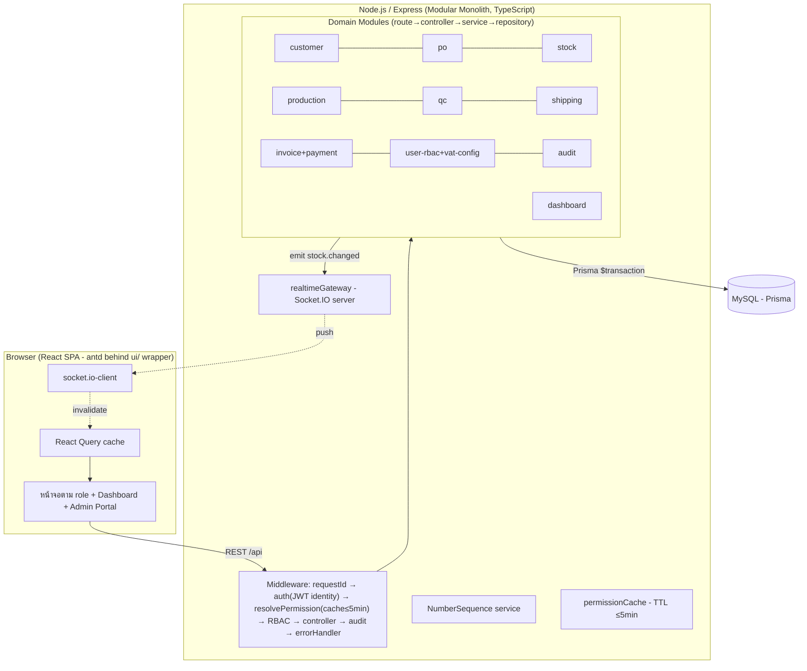
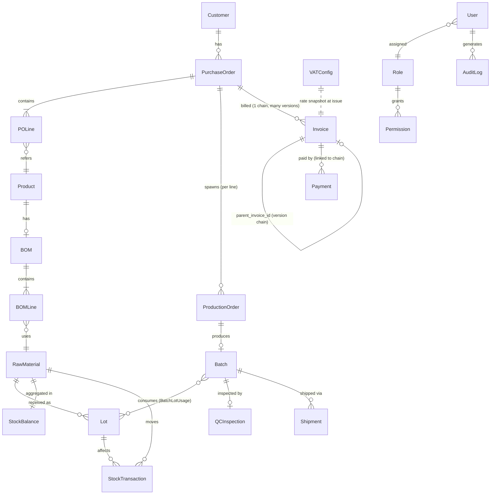

# Architecture — ERP Core Prototype (Order-to-Cash)

- **slug**: `erp-core-prototype`
- **สถานะ**: Accepted (แก้ไขตามเงื่อนไข Human Gate 1 — ปอนด์ approve-with-conditions 2026-07-06) → READY_FOR_ENGINEER
- **ผู้เขียน**: Tech-Lead
- **วันที่**: 2026-07-06 (rev.2)
- **อ้างอิง**: brief.md, user-stories.md (**ECP-001–038**), ADR-000 ถึง ADR-008

> เอกสารนี้เป็นภาพรวมสถาปัตยกรรมสำหรับ **prototype** — ยึดหลัก "เรียบง่ายก่อน แต่ไม่ปิดทาง
> production (Phase 2 local → Phase 3 GCP)" ทุกการตัดสินใจสำคัญมี ADR รองรับ (ดู §10)

## ประวัติการแก้ไข (Revision History)

| rev | วันที่ | สาระ |
|---|---|---|
| 1 | 2026-07-06 | ฉบับ Gate 1 (ECP-001–036): modular monolith, real-time stock, RBAC, seed |
| **2** | **2026-07-06** | **แก้ตามเงื่อนไข Gate 1: (1) Invoice versioning + VATConfig (ECP-037/038) → ปรับ ER/state/API/seed (2) Customer/User ID auto-gen (3) permission cache TTL ≤5 นาที (ADR-005 rev.2) (4) เพิ่ม §NFR ความเร็ว+ความแม่นยำ (indexing, transaction isolation, reconciliation) (5) UI wrapper layer (ADR-008 rev.2) (6) Payment↔invoice-version reconciliation default** |

---

## 1. ภาพรวมสถาปัตยกรรม (High-level)

Modular Monolith: React SPA (frontend) + Node.js/Express (backend เดียว) + MySQL
Real-time stock ผ่าน WebSocket (Socket.IO) โดยความถูกต้องของยอดมาจาก DB transaction



**หลักการพกพา (Phase 3 GCP)** ตาม ADR-001: stateless app, config ผ่าน env, containerized (Docker),
DB แยกภายนอก → ย้ายไป Cloud Run + Cloud SQL ได้โดยไม่แก้ business logic. `permissionCache` เป็น per-instance
ได้เพราะ TTL ≤5 นาที การันตี converge (ADR-005 rev.2).

---

## 2. โครงสร้างโฟลเดอร์ `src/` (และ repo)

```
/
├─ docker-compose.yml          # local: node + mysql (DevOps)
├─ Dockerfile.backend / Dockerfile.frontend
├─ .env.example                # ตัวแปร config ทั้งหมด (§NFR/DevOps)
├─ prisma/
│  ├─ schema.prisma            # data model กลาง (§3)
│  ├─ migrations/
│  └─ seed.ts                  # mock/seed data (§8)
├─ src/
│  ├─ backend/
│  │  ├─ app.ts / server.ts    # express app + middleware ; bootstrap http + socket.io
│  │  ├─ config/               # อ่าน env (db, jwt, SESSION_TTL, PERMISSION_CACHE_TTL, vat default)
│  │  ├─ middleware/           # requestId, auth, resolvePermission, requirePermission, audit, errorHandler
│  │  ├─ lib/
│  │  │  ├─ prisma.ts          # Prisma client (singleton)
│  │  │  ├─ realtimeGateway.ts # emit(event,payload) → Socket.IO (ADR-004)
│  │  │  ├─ numberSequence.ts  # ออกเลข Customer/User/PO/Batch/Shipment/Invoice (ADR-006 rev.2)
│  │  │  ├─ permissionCache.ts # resolve+cache permission ต่อ user, TTL ≤5min (ADR-005 rev.2)
│  │  │  └─ errors.ts          # AppError + แปลงเป็นข้อความไทย (ECP-036)
│  │  └─ modules/
│  │     ├─ customer/ po/ stock/ production/ qc/ shipping/
│  │     ├─ invoice/           # invoice (versioning) + payment (reconciliation)
│  │     ├─ user/              # user + role + permission + **vat-config** (Admin Portal เดียวกัน)
│  │     ├─ audit/ dashboard/
│  ├─ frontend/
│  │  ├─ main.tsx, App.tsx, router.tsx
│  │  ├─ ui/                   # **UI wrapper layer (ADR-008 rev.2) — จุดเดียวที่ import antd**
│  │  ├─ lib/                  # apiClient, socket, authContext, permission guard
│  │  ├─ hooks/                # React Query hooks (business logic, ไม่พึ่ง antd)
│  │  ├─ components/           # shared ที่ประกอบจาก ui/
│  │  └─ pages/                # ตามโดเมน + dashboards/ (7) + admin/ (users + vat-config)
│  └─ shared/types/           # API request/response types (แชร์ FE/BE)
├─ .eslintrc.*                 # no-restricted-imports: ห้าม import antd นอก src/frontend/ui/
└─ tests/                      # QA: unit / integration / e2e (§ tasks.md)
```

---

## 3. Data Model — ER สรุป (ครอบคลุมทุก entity ตาม Data Rules ของ BA rev. Gate 1)



### 3.1 ตารางหลักและฟิลด์ (ตรงตาม Data Rules — user-stories.md §Data Rules rev. Gate 1)

| Entity | ฟิลด์สำคัญ | หมายเหตุ/กติกา |
|---|---|---|
| **Customer** | id (PK internal), **customer_id (unique, auto-gen `CUS-NNNNNNNN`, ADR-006 — strip ค่าจาก client)**, name*, address, phone*, email*, contact_person, status | ไม่มีช่องกรอก customer_id (ECP-001 AC1/AC4); ชื่อซ้ำ=เตือนไม่ block |
| **Product** (finished good) | id, name, uom, status | สินค้าสำเร็จรูปที่ PO สั่ง |
| **BOM / BOMLine** | BOM(id, product_id unique, status); BOMLine(id, bom_id, material_id, qty_per_unit) | 1 สูตร/สินค้า; ไม่มี BOM = block confirm PO (ECP-009 AC3) |
| **RawMaterial** | id, name, uom, status | |
| **Lot** | id, material_id, lot_number, received_qty, remaining_qty, received_date, **incoming_qc_status**(Pending/Passed/Failed) | lot_number unique/material, free text (ADR-006); incoming QC = ECP-017 |
| **StockBalance** | material_id(PK), physical_qty, reserved_qty, updated_at | available = physical − reserved; projection อ่านเร็ว (ดู §NFR) |
| **StockTransaction** | id, material_id, lot_id?, type(Receipt/Reservation/ReservationRelease/Issue/Adjustment), qty(+/−), ref_doc_type, ref_doc_id, created_at | **append-only ledger**; เขียนคู่ StockBalance ใน tx เดียว (ADR-004); ผลรวม ledger = physical 100% (§NFR, ECP-010 AC4) |
| **PurchaseOrder / POLine** | PO(id, po_number unique `PO-YYYYMM-NNNNNN`, customer_id, order_date, requested_delivery_date, status); POLine(id, po_id, product_id, quantity>0, uom, unit_price≥0) | state §5.1; ≥1 line ก่อน confirm |
| **ProductionOrder** | id, po_line_id, assigned_to?, status, planned_qty | state §5.2 |
| **Batch / BatchLotUsage** | Batch(id, batch_number unique `B-YYYYMMDD-NNNNN`, production_order_id, product_id, produced_qty, status); BatchLotUsage(id, batch_id, lot_id, material_id, qty_used) | state §5.3; traceability M:N (ECP-013 AC2) |
| **QCInspection** | id, batch_id, inspector_id, result(Approved/Rejected), remarks, inspected_at | manual judgment (Epic 5) |
| **Shipment** | id, shipment_number unique `SH-YYYYMMDD-NNNNN`, po_id, batch_id, shipped_date(≤today), status(Draft/Shipped/Delivered) | สร้างได้จาก Batch=QCApproved เท่านั้น (ECP-018) |
| **Invoice (rev. Gate 1)** | id (PK internal), **invoice_no** (chain, คงที่ทั้งสาย `INV-YYYY-NNNNNN`), **version** (int≥1), **parent_invoice_id** (self-FK, null สำหรับ v1), po_id, issue_date, issued_by, **subtotal** DECIMAL(12,2)=Σ(qty×unit_price), **vat_rate_applied** DECIMAL(5,2) (snapshot จาก VATConfig ณ ออกเอกสาร), **vat_amount** DECIMAL(12,2)=round(subtotal×rate/100,2), **total_amount** DECIMAL(12,2)=subtotal+vat_amount, status(Issued/PartiallyPaid/Paid/**Superseded**) | **unique (invoice_no, version)**; 1 chain/PO (group by po_id); แก้ได้เฉพาะ version ล่าสุด (§5.4, ECP-037 AC3); version เก่า=Superseded read-only ห้ามลบ/แก้; vat_rate_applied ไม่เปลี่ยนตาม VATConfig ภายหลัง (ECP-038 AC2) |
| **VATConfig (ใหม่)** | id (แถวเดียวระดับบริษัท, singleton), rate DECIMAL(5,2) default 7.00, updated_by, updated_at | rate 0–100 (ECP-038 AC3); แก้ได้เฉพาะ Admin ผ่าน Admin Portal; มีผลกับ invoice ที่ออกใหม่เท่านั้น |
| **Payment (rev. Gate 1)** | id, **invoice_chain_key** (= po_id หรือ invoice_no ผูกกับ "สาย" ไม่ผูก version row), amount>0, payment_date(≤today), method(text), recorded_by | ผูกกับ chain ไม่ผูก version → คงอยู่เมื่อมี version ใหม่ (§5.5 reconciliation); ห้ามเกินยอดคงค้างของ version ล่าสุด (ECP-021 AC3) |
| **User (rev. Gate 1)** | id (PK internal), **user_id (unique, auto-gen `USR-NNNNNNNN`, strip ค่าจาก client)**, username(unique, Admin กรอก), full_name, password_hash, role_id, status, last_login_at | user_id แยกจาก username, ไม่มีช่องกรอก (ECP-023 AC1/AC4); bcrypt (ADR-005) |
| **Role / Permission** | Role(id, role_name unique, is_system); Permission(id, role_id, resource, action, allow) | matrix §7; config ผ่านหน้าจอ (ECP-024); resolve ผ่าน permissionCache (ADR-005 rev.2) |
| **AuditLog** | id, user_id, action_type, entity_type, entity_id, timestamp, detail(JSON) | **append-only** (ADR-007); +action ใหม่ `ReviseInvoice`, `UpdateVATConfig` |
| **NumberSequence** | prefix, period_key, counter (PK: prefix+period_key) | ออกเลขทุกชนิด concurrency-safe (ADR-006 rev.2) |

*บังคับ (required)

### 3.2 เงินและหน่วย (rev. Gate 1)
- จำนวนเงินทุกฟิลด์ = `DECIMAL(12,2)` THB, ไม่มี currency/company column (single company)
- **มี VAT แล้ว (ยกเลิก "ไม่มี VAT" ของ rev.1):** invoice เก็บ subtotal / vat_rate_applied / vat_amount /
  total_amount แยกฟิลด์; vat_amount = round(subtotal × vat_rate_applied/100, 2) — ปัดทศนิยม 2 ตำแหน่ง
  (round-half-up) คำนวณครั้งเดียวตอนสร้าง version แล้วเก็บเป็น snapshot (ไม่คำนวณ on-the-fly)

---

## 4. Real-time Stock Flow (ตอบ pain หลัก — ADR-004)

จุดที่กระทบสต็อกทุกจุดทำใน **1 DB transaction** แล้ว emit event (ดู §NFR สำหรับ isolation/lock):

| เหตุการณ์ | ผลต่อสต็อก (ภายใน tx เดียว) | Event |
|---|---|---|
| Goods Receipt (ECP-008) | +Lot, physical_qty += qty, StockTxn(Receipt) | stock.changed |
| Confirm PO (ECP-004/009/010) | เช็ค BOM vs available; ถ้าพอ → reserved_qty += need, StockTxn(Reservation) | stock.changed |
| Cancel PO ก่อนผลิต (ECP-005/010) | reserved_qty −= need, StockTxn(ReservationRelease) | stock.changed |
| บันทึกผลิต/เบิกจริง (ECP-013) | physical_qty −= used, reserved_qty −= used, Lot.remaining −= used, StockTxn(Issue) | stock.changed |
| ปรับยอด (adjustment) | physical_qty ±, StockTxn(Adjustment) | stock.changed |

- Client หน้า stock (ECP-007) และ dashboard คลัง (ECP-028) subscribe room `stock` → ยอดใหม่ทันที
  (fallback polling 30 วิ กัน socket หลุด, ยังผ่าน ≤1 นาที)
- เบิกเกิน physical จริง → ปฏิเสธใน tx (ECP-010 AC3)

---

## 5. State Machines สำคัญ (ผูกกับ ECP-006 timeline)

### 5.1 PurchaseOrder
`Draft → Confirmed → InProduction → Shipped → Invoiced → Closed` ; `Cancelled` ได้จาก Draft/Confirmed เท่านั้น (ECP-005 AC2) → คืน reservation ; `Confirmed` ต้องผ่าน stock check + มี BOM (ECP-009 AC3)

### 5.2 ProductionOrder
`Pending → Assigned → InProgress → Completed` (`Cancelled` ถ้า PO ต้นทางถูกยกเลิกก่อน Assigned)

### 5.3 Batch
`InProgress → Completed → QCPending → (QCApproved | QCRejected) → [ถ้า Approved] ReadyToShip → Shipped`

### 5.4 Invoice + Versioning (rev. Gate 1 — ECP-020/037)
สถานะต่อ **row (version)**: `Issued → PartiallyPaid → Paid` ตามยอดชำระ (ECP-021); และ **`Superseded`**
เมื่อถูกแทนที่ด้วย version ใหม่.

```
ออก invoice (ECP-020):  PO=Shipped → สร้าง Invoice v1 (parent=null, snapshot VAT), PO→Invoiced
แก้ไข (ECP-037):        แก้ได้เฉพาะ version ล่าสุดของสาย (group by po_id)
                        → สร้าง Invoice v(n+1) [parent_invoice_id = id ของ v(n)]
                        → v(n).status = Superseded (read-only ตลอดไป ห้ามลบ/แก้)
                        → v(n+1) เป็น "active version" ที่ใช้เรียกเก็บเงินต่อไป
กติกา:  - ออก invoice สายใหม่ซ้ำต่อ PO เดิม = block ชี้ไปใช้ revise แทน (ECP-020 AC2)
        - แก้ version ที่ไม่ใช่ล่าสุด = block + ลิงก์ไป version ล่าสุด (ECP-037 AC3)
        - version ต้องมี ≥1 line (ECP-037 AC4)
        - vat_rate_applied ของ version ใหม่ = ค่า VATConfig ปัจจุบัน ณ ตอน revise (snapshot ใหม่ของ version นั้น)
```

### 5.5 Payment ↔ Invoice Version — Reconciliation (default ปลอดภัย, rev. Gate 1)
BA ตั้ง default: **แก้ไข invoice ได้เสมอถ้าเป็น version ล่าสุด** (ไม่ผูกเงื่อนไขสถานะชำระ). Tech-Lead
ออกแบบ reconciliation ให้ **ปลอดภัย + QA ทดสอบได้ + ติดป้ายยืนยันกับปอนด์ช่วง UAT** ดังนี้:

- **Payment ผูกกับ "สาย invoice" (chain: po_id/invoice_no) ไม่ผูกกับ version row** → เมื่อสร้าง version
  ใหม่ payments ที่บันทึกไว้ **carry-over ทั้งหมด ไม่ถูกลบ/ไม่ auto-refund** (คง audit)
- **outstanding = active_version.total_amount − Σ(payments ของสาย)** ; สถานะ active version คำนวณใหม่:
  - paid ≥ total → `Paid` ; 0 < paid < total → `PartiallyPaid` ; paid = 0 → `Issued`
- **กรณี over-paid (version ใหม่ total < ยอดที่จ่ายไปแล้ว):** outstanding เป็นลบ → ระบบ **ไม่ mark Paid ผิด**,
  ตั้งธง `overpaid` และแสดงเตือน "ยอดชำระเกินยอด invoice version ล่าสุด ต้องคืนเงิน/ปรับปรุง กรุณาตรวจสอบ"
  (ตาม BA — ไม่ auto-refund; ให้ Finance จัดการเอง)
- **ตอน revise invoice ที่มี payment แล้ว:** แสดงเตือนก่อนบันทึก "invoice นี้มีการรับชำระแล้ว การแก้ไขจะสร้าง
  version ใหม่ที่อาจมียอดต่างจากที่บันทึกรับชำระไว้ กรุณาตรวจสอบยอดชำระซ้ำ" (BA)
- **⚠ ต้องยืนยันกับปอนด์ช่วง UAT:** ปอนด์ต้องการ (ก) อนุญาตแก้ไขได้แม้ชำระแล้ว (default นี้) หรือ
  (ข) block การแก้ไขเมื่อ Paid/PartiallyPaid — ป้าย UAT ใน tasks (E20/Q7). ทั้งสองแบบเปลี่ยนได้ด้วย config
  เดียว (นโยบาย `INVOICE_EDIT_AFTER_PAYMENT`) — ไม่ปิดทางทั้งสองทางเลือก

---

## 6. API Surface (สรุป — REST `/api/v1`)

ทุก endpoint (ยกเว้น `POST /auth/login`) ผ่าน `auth` → `resolvePermission(cache)` → `requirePermission`.
error กลาง: `{ error: { code, message(ไทย), fields? } }` (ECP-036).

| โดเมน | Endpoints (ย่อ) | Stories |
|---|---|---|
| Auth | `POST /auth/login`, `POST /auth/logout`, `GET /auth/me` (คืน user+permission สดจาก cache) | ECP-025,034 |
| Customer | `GET/POST /customers` (**server strip customer_id ที่ client ส่ง**), `GET/PUT /customers/:id`, `GET /customers/:id/pos` | ECP-001,002,003 |
| PO | `GET/POST /pos`, `GET /pos/:id`, `POST /pos/:id/confirm`, `POST /pos/:id/cancel`, `GET /pos/:id/timeline` | ECP-004,005,006 |
| Stock | `GET /stock`, `POST /stock/receipts`, `POST /stock/check`, `GET /stock/transactions`, **`GET /stock/reconciliation?material=` (ledger vs balance, ECP-010 AC4)** | ECP-007,008,009,010 |
| Traceability | `GET /trace?lot=...` | ECP-014 |
| Production | `GET /production/queue`, `POST /production/:poLineId/assign`, `POST /production/:id/produce` | ECP-011,012,013 |
| QC | `POST /qc/batches/:id/inspect`, `GET /qc/batches`, `POST /qc/lots/:id/inspect` | ECP-015,016,017 |
| Shipping | `GET /shipments`, `POST /shipments`, `PATCH /shipments/:id/status` | ECP-018,019 |
| Invoice | `GET /invoices`, `POST /pos/:id/invoice` (ออก v1 พร้อม snapshot VAT), **`POST /invoices/:id/revise` (สร้าง version ใหม่, ECP-037)**, **`GET /pos/:id/invoice/versions` (ทั้งสาย timeline)**, `POST /invoices/:id/payments` (chain-linked) | ECP-020,021,022,**037** |
| Admin/VAT | **`GET /admin/vat-config`, `PUT /admin/vat-config` (rate 0–100, Admin only, ECP-038)** | **ECP-038** |
| User/RBAC | `GET/POST /users` (**server strip user_id**), `PUT /users/:id`, `GET /roles`, `GET/PUT /roles/:id/permissions` (แก้แล้ว invalidate permissionCache) | ECP-023,024 |
| Audit | `GET /audit-logs` (filter+pagination, read-only) | ECP-025,026 |
| Dashboard | `GET /dashboard/:role` | ECP-027–033 |
| Realtime | WebSocket namespace `/rt`, room `stock` (event `stock.changed`) | ECP-007,028 |

---

## 7. Permission Matrix เต็ม (seed default — ADR-005 rev.2)

Roles: **SA**=Sales/CS, **WH**=Warehouse, **PR**=Production, **QA**=QA/QC, **LO**=Logistics, **FI**=Finance, **AD**=Admin.
Admin = ● ทุกช่องเสมอ. เข้า resource ที่ไม่มีสิทธิ์ = ปฏิเสธแม้เรียก URL ตรง. resolve ผ่าน permissionCache TTL ≤5 นาที.

| Resource | Action | SA | WH | PR | QA | LO | FI | AD |
|---|---|:--:|:--:|:--:|:--:|:--:|:--:|:--:|
| customer | view / create / update | ● | | | | | | ● |
| po | view | ● | | ● | | | ● | ● |
| po | create / confirm / cancel | ● | | | | | | ● |
| stock | view / check_bom | ● | ● | ● | | | | ● |
| stock | goods_receipt / adjust | | ● | | | | | ● |
| stock | view_reconciliation | | ● | | | | | ● |
| traceability | view | | ● | ● | ● | | | ● |
| production | view_queue / assign / produce | | | ● | | | | ● |
| qc | inspect_batch / inspect_incoming_lot | | | | ● | | | ● |
| qc | view_batches | | | ● | ● | | | ● |
| shipping | view | ● | | | | ● | | ● |
| shipping | create / update_status | | | | | ● | | ● |
| invoice | view | ● | | | | | ● | ● |
| invoice | create / **revise** / record_payment | | | | | | ● | ● |
| user_management | view_users / manage_users / manage_permission | | | | | | | ● |
| **admin** | **manage_vat_config** | | | | | | | ● |
| audit | view | | | | | | | ● |
| dashboard | sales / warehouse / production / qc / logistics / finance / admin | ●(ตาม role) | | | | | | ● |

**Guardrail (ECP-024 AC2):** ห้ามบันทึก config ที่ทำให้ไม่มี role ใดมี `user_management.manage_permission = ●`.

---

## 8. กลยุทธ์ Seed / Mock Data (`prisma/seed.ts`)

- **Users**: 7 บัญชี (1/role) + admin, password ตั้งต้นเดียวกัน (เอกสารส่งมอบ), bcrypt; **user_id auto-gen ผ่าน NumberSequence**
- **Roles/Permission**: 7 roles + matrix §7 (รวม `admin.manage_vat_config`, `invoice.revise`)
- **VATConfig**: 1 แถว rate = **7.00** (default, ECP-038)
- **Master data**: ~5 customers (**customer_id auto-gen**), ~5 finished products (มี BOM), ~10 raw materials
- **BOM**: ครบทุก product ยกเว้น **จงใจเว้น 1 product ไม่มี BOM** (ทดสอบ ECP-009 AC3)
- **Stock**: goods receipt ให้ทุก material มี Lot + ยอด; **1 material ยอดต่ำ** (ECP-004 AC2/ECP-028), **1 material = 0** (ECP-007 AC2)
- **flow สำเร็จ 1 ชุด**: PO → Confirmed → Production → Batch → QC Approved → Shipment → **Invoice v1 (VAT 7% snapshot)** → Payment
  (+ **1 ชุด demo การ revise invoice → v2 + payment carry-over** สำหรับโชว์ ECP-037/reconciliation)
- Seed ต้อง **idempotent/reset ได้**

---

## NFR — ความเร็ว + ความแม่นยำสูง (เงื่อนไข Gate 1 #4, ผูก user-stories §NFR)

> ปอนด์เน้น "เน้นความเร็วและความแม่นยำสูง" โดยเฉพาะ stock ledger. ต่อไปนี้คือมาตรการเชิงสถาปัตยกรรม
> (อ้างตัวเลข BKV เดิม ไม่ตั้งใหม่ขัดกัน — ตาราง NFR ใน user-stories.md):

**N1. ความแม่นยำ stock ledger 100% (ECP-010 AC4) — transaction isolation & locking**
- ทุกธุรกรรมสต็อกเขียน `StockTransaction` (append-only) **คู่กับ** อัปเดต `StockBalance` ใน **`$transaction`
  เดียว** (ADR-003/004) → atomic, ไม่มี partial write
- ป้องกัน lost-update ภายใต้ concurrency: **row-lock `StockBalance` ของ material นั้น** (`SELECT ... FOR UPDATE`)
  ก่อนคำนวณ/เขียน ในทุก path ที่เปลี่ยนยอด (receipt/reserve/release/issue/adjust) — serialize ต่อ material
- isolation ระดับ **READ COMMITTED** (default MySQL InnoDB) + explicit row lock ข้างต้นเพียงพอ (ไม่ต้อง
  SERIALIZABLE ทั้ง tx ซึ่งกระทบ throughput) — เลือก lock เฉพาะแถวที่แก้เพื่อความเร็ว+ถูกต้อง
- **reconciliation check** (`GET /stock/reconciliation`): Σ(StockTransaction.qty ของ material) ต้อง = StockBalance.physical_qty
  100% — endpoint นี้ให้ QA รันหลังทำธุรกรรมพร้อมกันจำนวนมาก (ECP-010 AC4, tasks Q7)

**N2. ความเร็ว stock/dashboard (≤1 นาที, ECP-007/028)**
- `StockBalance` เป็น **projection อ่านเร็ว** (ไม่ต้อง SUM ledger ทุกครั้งที่แสดงผล) — ledger ใช้เพื่อ audit/reconcile
- real-time push (Socket.IO) + fallback polling → ยอดใหม่ ≤1 นาที (§4)

**N3. Indexing strategy (ความเร็ว query หลัก)**
- `StockTransaction(material_id, created_at)` ; `StockBalance` PK = material_id
- `Lot(material_id, lot_number)` unique ; `BatchLotUsage(lot_id)`, `BatchLotUsage(batch_id)` (traceability ≤5 นาที, ECP-014)
- `PurchaseOrder(status)`, `PurchaseOrder(customer_id)` ; `Batch(status)` ; `Shipment(po_id)`
- `Invoice(po_id, version)` + unique `(invoice_no, version)` ; `Payment(invoice_chain_key)`
- `AuditLog(user_id, timestamp)`, `AuditLog(action_type, timestamp)` (ค้น ≥1,000 รายการ, ECP-026 AC2)
- `Customer(customer_id)` unique, `User(user_id)` unique, `User(username)` unique

**N4. ความแม่นยำเลขเอกสาร (ADR-006 rev.2)** — NumberSequence ออกเลขใน tx + row-lock ต่อคีย์ → ไม่ซ้ำแม้ concurrency (tasks Q7)

---

## 9. Usability / Cross-cutting (Epic 10) + Admin Portal
- เมนู+home ตาม permission (ECP-034) ; onboarding `ui/OnboardingTour` (ECP-034 AC2) ; role ว่าง → แนะนำติดต่อ Admin (AC3)
- error กลางเป็นไทย ไม่โผล่ technical (ECP-036) — errorHandler + `AppError` code→ไทย, แสดงผ่าน `ui/Notify`
- **Admin Portal (ECP-038):** หน้า "จัดการผู้ใช้งาน" + แท็บ/ส่วน "ตั้งค่า VAT" อยู่ที่เดียวกัน (route `/admin`)
- FE ทั้งหมด import UI ผ่าน `src/frontend/ui/` เท่านั้น (ADR-008 rev.2)

---

## 10. Traceability: Decision → ADR

| การตัดสินใจ | ADR |
|---|---|
| Modular monolith, local-first & GCP-portable | ADR-001 |
| Backend: Express + TypeScript + Zod | ADR-002 |
| ORM: Prisma + MySQL, migration, $transaction, row-lock | ADR-003 |
| Real-time stock: transactional ledger + Socket.IO (+fallback) | ADR-004 |
| Auth JWT identity + permission cache TTL ≤5 นาที | **ADR-005 rev.2** |
| Number format (เผื่อหลัก, concurrency-safe) + Customer/User ID + Invoice version chain | **ADR-006 rev.2** |
| Audit log append-only + interceptor | ADR-007 |
| Frontend React+Vite+antd (behind ui/ wrapper)+React Query | **ADR-008 rev.2** |

---

## 11. ผลกระทบต่อโค้ดเดิม (Impact)
`src/` ปัจจุบันว่าง (มีแค่ `.gitkeep`) → greenfield ทั้งหมด ไม่มี breaking change. ADR-000 (stack) ไม่ถูกขัด.
rev.2 ทั้งหมดเป็นการ **แก้ ADR เดิมด้วย revision history** (005/006/008) ไม่มี ADR ใดถูกขัดโดยไม่มี superseding note.

---

## 12. สิ่งที่ตั้งใจ "ไม่ทำ" ในรอบ prototype (กัน over-engineering)
- ไม่ทำ microservices, MQ, Redis, refresh-token rotation, multi-company/currency, BOM versioning, IoT, external notify, load/security hardening
- ไม่ทำ multi-rate VAT (ต่อสินค้า/ลูกค้า) — VATConfig เป็นค่าเดียวระดับบริษัท (สอดคล้อง single company)
- ไม่ auto-refund/auto-adjust payment เมื่อ over-paid (Finance จัดการเอง + ธง overpaid) — §5.5
- backlog Phase 3 บันทึกใน ADR: Socket.IO Redis adapter, shared permission cache/pub-sub invalidation,
  DB-level audit immutability, sharded number sequence, Cloud SQL
