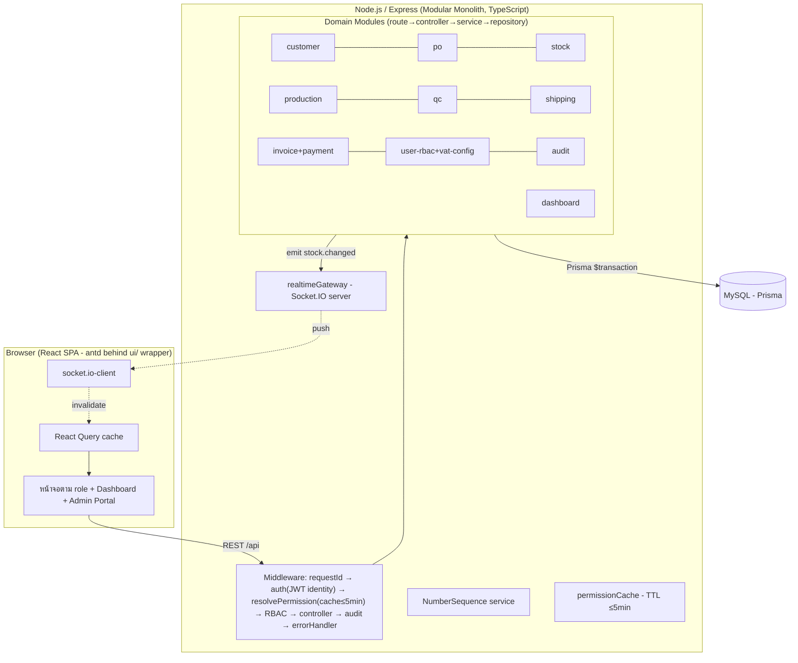
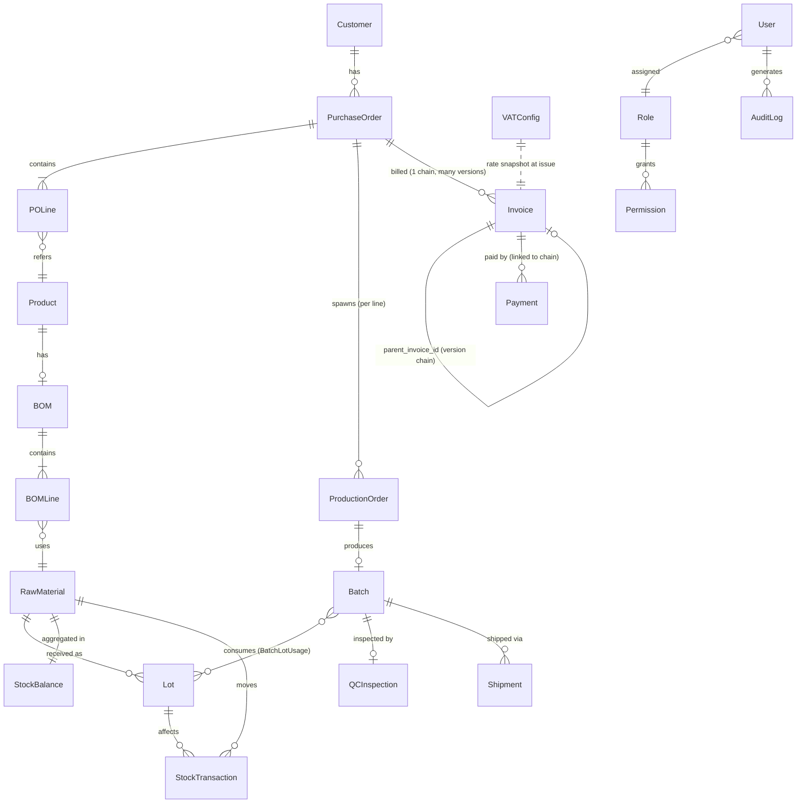

# Architecture — ERP Core Prototype (Order-to-Cash)

- **slug**: `erp-core-prototype`
- **สถานะ**: Accepted (rev.3 — Gate 2 rework, ต่อจาก rev.2 Human Gate 1) → READY_FOR_ENGINEER
- **ผู้เขียน**: Tech-Lead
- **วันที่**: 2026-07-07 (rev.3)
- **อ้างอิง**: brief.md, user-stories.md (**ECP-001–044**), ADR-000 ถึง ADR-009

> เอกสารนี้เป็นภาพรวมสถาปัตยกรรมสำหรับ **prototype** — ยึดหลัก "เรียบง่ายก่อน แต่ไม่ปิดทาง
> production (Phase 2 local → Phase 3 GCP)" ทุกการตัดสินใจสำคัญมี ADR รองรับ (ดู §10)
> **รอบ rev.3 (Gate 2 rework) = ดู §13 (delta) — ข้อ 1–12 ยังมีผลทั้งหมด เว้นที่ §13 ระบุ**

## ประวัติการแก้ไข (Revision History)

| rev | วันที่ | สาระ |
|---|---|---|
| 1 | 2026-07-06 | ฉบับ Gate 1 (ECP-001–036): modular monolith, real-time stock, RBAC, seed |
| **2** | **2026-07-06** | **แก้ตามเงื่อนไข Gate 1: (1) Invoice versioning + VATConfig (ECP-037/038) → ปรับ ER/state/API/seed (2) Customer/User ID auto-gen (3) permission cache TTL ≤5 นาที (ADR-005 rev.2) (4) เพิ่ม §NFR ความเร็ว+ความแม่นยำ (indexing, transaction isolation, reconciliation) (5) UI wrapper layer (ADR-008 rev.2) (6) Payment↔invoice-version reconciliation default** |
| **3** | **2026-07-07** | **Gate 2 rework (ECP-039–044 + แก้ ECP-001/002/004/007/008/013/014/017/020): 5 defect root-cause + CompanyProfile/discount/Thai tax-invoice (ADR-009) + BOM UI + production FIFO auto-calc + trace auto-detect + customer tax fields + UI consistency/responsive scope-down → ดู §13** |

---

## 1. ภาพรวมสถาปัตยกรรม (High-level)

Modular Monolith: React SPA (frontend) + Node.js/Express (backend เดียว) + MySQL
Real-time stock ผ่าน WebSocket (Socket.IO) โดยความถูกต้องของยอดมาจาก DB transaction



**หลักการพกพา (Phase 3 GCP)** ตาม ADR-001: stateless app, config ผ่าน env, containerized (Docker),
DB แยกภายนอก → ย้ายไป Cloud Run + Cloud SQL ได้โดยไม่แก้ business logic. `permissionCache` เป็น per-instance
ได้เพราะ TTL ≤5 นาที การันตี converge (ADR-005 rev.2).

---

## 2. โครงสร้างโฟลเดอร์ `src/` (และ repo)

```
/
├─ docker-compose.yml          # local: node + mysql (DevOps)
├─ Dockerfile.backend / Dockerfile.frontend
├─ .env.example                # ตัวแปร config ทั้งหมด (§NFR/DevOps)
├─ prisma/
│  ├─ schema.prisma            # data model กลาง (§3)
│  ├─ migrations/
│  └─ seed.ts                  # mock/seed data (§8)
├─ src/
│  ├─ backend/
│  │  ├─ app.ts / server.ts    # express app + middleware ; bootstrap http + socket.io
│  │  ├─ config/               # อ่าน env (db, jwt, SESSION_TTL, PERMISSION_CACHE_TTL, vat default)
│  │  ├─ middleware/           # requestId, auth, resolvePermission, requirePermission, audit, errorHandler
│  │  ├─ lib/
│  │  │  ├─ prisma.ts          # Prisma client (singleton)
│  │  │  ├─ realtimeGateway.ts # emit(event,payload) → Socket.IO (ADR-004)
│  │  │  ├─ numberSequence.ts  # ออกเลข Customer/User/PO/Batch/Shipment/Invoice (ADR-006 rev.2)
│  │  │  ├─ permissionCache.ts # resolve+cache permission ต่อ user, TTL ≤5min (ADR-005 rev.2)
│  │  │  └─ errors.ts          # AppError + แปลงเป็นข้อความไทย (ECP-036)
│  │  └─ modules/
│  │     ├─ customer/ po/ stock/ production/ qc/ shipping/
│  │     ├─ invoice/           # invoice (versioning) + payment (reconciliation)
│  │     ├─ user/              # user + role + permission + **vat-config** (Admin Portal เดียวกัน)
│  │     ├─ audit/ dashboard/
│  ├─ frontend/
│  │  ├─ main.tsx, App.tsx, router.tsx
│  │  ├─ ui/                   # **UI wrapper layer (ADR-008 rev.2) — จุดเดียวที่ import antd**
│  │  ├─ lib/                  # apiClient, socket, authContext, permission guard
│  │  ├─ hooks/                # React Query hooks (business logic, ไม่พึ่ง antd)
│  │  ├─ components/           # shared ที่ประกอบจาก ui/
│  │  └─ pages/                # ตามโดเมน + dashboards/ (7) + admin/ (users + vat-config)
│  └─ shared/                  # types + **thaiBahtText.ts (pure fn, rev.3/ADR-009)**
├─ .eslintrc.*                 # no-restricted-imports: ห้าม import antd นอก src/frontend/ui/
└─ tests/                      # QA: unit / integration / e2e (§ tasks.md)
```

---

## 3. Data Model — ER สรุป (ครอบคลุมทุก entity ตาม Data Rules ของ BA rev. Gate 1)



> **rev.3 เพิ่ม:** `CompanyProfile` (singleton), `Customer.tax_id/registered_address`,
> `Invoice.discount_amount/document_snapshot`, `Lot.supplier_name`, `QCInspection.lot_id` (XOR batch_id) —
> ดูรายละเอียด §13.2

### 3.1 ตารางหลักและฟิลด์ (ตรงตาม Data Rules — user-stories.md §Data Rules rev. Gate 1)

| Entity | ฟิลด์สำคัญ | หมายเหตุ/กติกา |
|---|---|---|
| **Customer** | id (PK internal), **customer_id (unique, auto-gen `CUS-NNNNNNNN`, ADR-006 — strip ค่าจาก client)**, name*, address, phone*, email*, contact_person, status | ไม่มีช่องกรอก customer_id (ECP-001 AC1/AC4); ชื่อซ้ำ=เตือนไม่ block; **rev.3: +tax_id, +registered_address (§13.2)** |
| **Product** (finished good) | id, name, uom, status | สินค้าสำเร็จรูปที่ PO สั่ง |
| **BOM / BOMLine** | BOM(id, product_id unique, status); BOMLine(id, bom_id, material_id, qty_per_unit) | 1 สูตร/สินค้า; ไม่มี BOM = block confirm PO (ECP-009 AC3); **rev.3: มี write endpoints (ECP-039)** |
| **RawMaterial** | id, name, uom, status | |
| **Lot** | id, material_id, lot_number, received_qty, remaining_qty, received_date, **incoming_qc_status**(Pending/Passed/Failed) | lot_number unique/material, free text (ADR-006); incoming QC = ECP-017; **rev.3: +supplier_name (§13.2)** |
| **StockBalance** | material_id(PK), physical_qty, reserved_qty, updated_at | available = physical − reserved; projection อ่านเร็ว (ดู §NFR) |
| **StockTransaction** | id, material_id, lot_id?, type(Receipt/Reservation/ReservationRelease/Issue/Adjustment), qty(+/−), ref_doc_type, ref_doc_id, created_at | **append-only ledger**; เขียนคู่ StockBalance ใน tx เดียว (ADR-004); ผลรวม ledger = physical 100% (§NFR, ECP-010 AC4) |
| **PurchaseOrder / POLine** | PO(id, po_number unique `PO-YYYYMM-NNNNNN`, customer_id, order_date, requested_delivery_date, status); POLine(id, po_id, product_id, quantity>0, uom, unit_price≥0) | state §5.1; ≥1 line ก่อน confirm; **rev.3: ลบ line ได้เฉพาะก่อน Confirmed (ECP-004 AC5)** |
| **ProductionOrder** | id, po_line_id, assigned_to?, status, planned_qty | state §5.2 |
| **Batch / BatchLotUsage** | Batch(id, batch_number unique `B-YYYYMMDD-NNNNN`, production_order_id, product_id, produced_qty, status); BatchLotUsage(id, batch_id, lot_id, material_id, qty_used) | state §5.3; traceability M:N (ECP-013 AC2) |
| **QCInspection** | id, batch_id, inspector_id, result(Approved/Rejected), remarks, inspected_at | manual judgment (Epic 5); **rev.3: +lot_id (XOR batch_id) สำหรับ incoming (§13.2)** |
| **Shipment** | id, shipment_number unique `SH-YYYYMMDD-NNNNN`, po_id, batch_id, shipped_date(≤today), status(Draft/Shipped/Delivered) | สร้างได้จาก Batch=QCApproved เท่านั้น (ECP-018) |
| **Invoice (rev. Gate 1)** | id (PK internal), **invoice_no** (chain, คงที่ทั้งสาย `INV-YYYY-NNNNNN`), **version** (int≥1), **parent_invoice_id** (self-FK, null สำหรับ v1), po_id, issue_date, issued_by, **subtotal** DECIMAL(12,2)=Σ(qty×unit_price), **vat_rate_applied** DECIMAL(5,2) (snapshot จาก VATConfig ณ ออกเอกสาร), **vat_amount** DECIMAL(12,2), **total_amount** DECIMAL(12,2), status(Issued/PartiallyPaid/Paid/**Superseded**) | **unique (invoice_no, version)**; 1 chain/PO; แก้ได้เฉพาะ version ล่าสุด (§5.4, ECP-037 AC3); **rev.3: +discount_amount, +document_snapshot; สูตร vat/total เปลี่ยน (§13.2)** |
| **VATConfig (ใหม่)** | id (แถวเดียวระดับบริษัท, singleton), rate DECIMAL(5,2) default 7.00, updated_by, updated_at | rate 0–100 (ECP-038 AC3); แก้ได้เฉพาะ Admin; มีผลกับ invoice ที่ออกใหม่เท่านั้น |
| **CompanyProfile (ใหม่ rev.3)** | id (singleton), company_name, address, tax_id(13), phone, logo_url, updated_by, updated_at | ผู้ออกบนเอกสาร; ต้องตั้งก่อนพิมพ์ใบแรก (ECP-041 AC4); snapshot ลง invoice ณ ออกเอกสาร (§13.5) |
| **Payment (rev. Gate 1)** | id, **invoice_chain_key**, amount>0, payment_date(≤today), method(text), recorded_by | ผูกกับ chain ไม่ผูก version (§5.5 reconciliation); ห้ามเกินยอดคงค้าง (ECP-021 AC3) |
| **User (rev. Gate 1)** | id (PK internal), **user_id (unique, auto-gen `USR-NNNNNNNN`, strip ค่าจาก client)**, username(unique), full_name, password_hash, role_id, status, last_login_at | user_id แยกจาก username, ไม่มีช่องกรอก (ECP-023 AC1/AC4); bcrypt (ADR-005) |
| **Role / Permission** | Role(id, role_name unique, is_system); Permission(id, role_id, resource, action, allow) | matrix §7 (+§13.4); config ผ่านหน้าจอ (ECP-024); resolve ผ่าน permissionCache (ADR-005 rev.2) |
| **AuditLog** | id, user_id, action_type, entity_type, entity_id, timestamp, detail(JSON) | **append-only** (ADR-007); +action `ReviseInvoice`, `UpdateVATConfig`; **rev.3: +`UpdateCompanyProfile`, `ManageBOM`** |
| **NumberSequence** | prefix, period_key, counter (PK: prefix+period_key) | ออกเลขทุกชนิด concurrency-safe (ADR-006 rev.2) |

*บังคับ (required)

### 3.2 เงินและหน่วย (rev. Gate 1)
- จำนวนเงินทุกฟิลด์ = `DECIMAL(12,2)` THB, ไม่มี currency/company column (single company)
- **มี VAT แล้ว:** invoice เก็บ subtotal / vat_rate_applied / vat_amount / total_amount แยกฟิลด์
- **rev.3:** เพิ่ม `discount_amount`; สูตร `vat_amount = round((subtotal − discount_amount) × vat_rate_applied/100, 2)` ;
  `total_amount = subtotal − discount_amount + vat_amount` — round-half-up 2 ตำแหน่ง คำนวณครั้งเดียวตอนสร้าง version เก็บ snapshot

---

## 4. Real-time Stock Flow (ตอบ pain หลัก — ADR-004)

จุดที่กระทบสต็อกทุกจุดทำใน **1 DB transaction** แล้ว emit event (ดู §NFR สำหรับ isolation/lock):

| เหตุการณ์ | ผลต่อสต็อก (ภายใน tx เดียว) | Event |
|---|---|---|
| Goods Receipt (ECP-008) | +Lot, physical_qty += qty, StockTxn(Receipt) | stock.changed |
| Confirm PO (ECP-004/009/010) | เช็ค BOM vs available; ถ้าพอ → reserved_qty += need, StockTxn(Reservation) | stock.changed |
| Cancel PO ก่อนผลิต (ECP-005/010) | reserved_qty −= need, StockTxn(ReservationRelease) | stock.changed |
| บันทึกผลิต/เบิกจริง (ECP-013) | physical_qty −= used, reserved_qty −= used, Lot.remaining −= used, StockTxn(Issue) | stock.changed |
| ปรับยอด (adjustment) | physical_qty ±, StockTxn(Adjustment) | stock.changed |

- Client หน้า stock (ECP-007) และ dashboard คลัง (ECP-028) subscribe room `stock` → ยอดใหม่ทันที
  (fallback polling 30 วิ กัน socket หลุด, ยังผ่าน ≤1 นาที)
- เบิกเกิน physical จริง → ปฏิเสธใน tx (ECP-010 AC3)

---

## 5. State Machines สำคัญ (ผูกกับ ECP-006 timeline)

### 5.1 PurchaseOrder
`Draft → Confirmed → InProduction → Shipped → Invoiced → Closed` ; `Cancelled` ได้จาก Draft/Confirmed เท่านั้น (ECP-005 AC2) → คืน reservation ; `Confirmed` ต้องผ่าน stock check + มี BOM (ECP-009 AC3)

### 5.2 ProductionOrder
`Pending → Assigned → InProgress → Completed` (`Cancelled` ถ้า PO ต้นทางถูกยกเลิกก่อน Assigned)

### 5.3 Batch
`InProgress → Completed → QCPending → (QCApproved | QCRejected) → [ถ้า Approved] ReadyToShip → Shipped`

### 5.4 Invoice + Versioning (rev. Gate 1 — ECP-020/037)
สถานะต่อ **row (version)**: `Issued → PartiallyPaid → Paid` ตามยอดชำระ (ECP-021); และ **`Superseded`**
เมื่อถูกแทนที่ด้วย version ใหม่.

```
ออก invoice (ECP-020):  PO=Shipped → สร้าง Invoice v1 (parent=null, snapshot VAT + document_snapshot), PO→Invoiced
แก้ไข (ECP-037):        แก้ได้เฉพาะ version ล่าสุดของสาย (group by po_id)
                        → สร้าง Invoice v(n+1) [parent_invoice_id = id ของ v(n)]
                        → v(n).status = Superseded (read-only ตลอดไป ห้ามลบ/แก้)
                        → v(n+1) เป็น "active version" ที่ใช้เรียกเก็บเงินต่อไป
กติกา:  - ออก invoice สายใหม่ซ้ำต่อ PO เดิม = block ชี้ไปใช้ revise แทน (ECP-020 AC2)
        - แก้ version ที่ไม่ใช่ล่าสุด = block + ลิงก์ไป version ล่าสุด (ECP-037 AC3)
        - version ต้องมี ≥1 line (ECP-037 AC4)
        - vat_rate_applied + document_snapshot ของ version ใหม่ = ค่าปัจจุบัน ณ ตอน revise (snapshot ใหม่)
```

### 5.5 Payment ↔ Invoice Version — Reconciliation (default ปลอดภัย, rev. Gate 1)
BA ตั้ง default: **แก้ไข invoice ได้เสมอถ้าเป็น version ล่าสุด** (ไม่ผูกเงื่อนไขสถานะชำระ). Tech-Lead
ออกแบบ reconciliation ให้ **ปลอดภัย + QA ทดสอบได้ + ติดป้ายยืนยันกับปอนด์ช่วง UAT** ดังนี้:

- **Payment ผูกกับ "สาย invoice" (chain: po_id/invoice_no) ไม่ผูกกับ version row** → เมื่อสร้าง version
  ใหม่ payments ที่บันทึกไว้ **carry-over ทั้งหมด ไม่ถูกลบ/ไม่ auto-refund** (คง audit)
- **outstanding = active_version.total_amount − Σ(payments ของสาย)** ; สถานะ active version คำนวณใหม่:
  - paid ≥ total → `Paid` ; 0 < paid < total → `PartiallyPaid` ; paid = 0 → `Issued`
- **กรณี over-paid (version ใหม่ total < ยอดที่จ่ายไปแล้ว):** outstanding เป็นลบ → ระบบ **ไม่ mark Paid ผิด**,
  ตั้งธง `overpaid` และแสดงเตือน (DEF-01 fixed — verify แล้วว่าไม่รายงาน Paid ตอน overpaid)
- **ตอน revise invoice ที่มี payment แล้ว:** แสดงเตือนก่อนบันทึก (BA)
- **⚠ ต้องยืนยันกับปอนด์ช่วง UAT:** default อนุญาตแก้ไขได้แม้ชำระแล้ว — เปลี่ยนด้วย config
  `INVOICE_EDIT_AFTER_PAYMENT` — ไม่ปิดทางทั้งสองทางเลือก

---

## 6. API Surface (สรุป — REST `/api/v1`)

ทุก endpoint (ยกเว้น `POST /auth/login`) ผ่าน `auth` → `resolvePermission(cache)` → `requirePermission`.
error กลาง: `{ error: { code, message(ไทย), fields? } }` (ECP-036). **rev.3 delta ดู §13.3.**

| โดเมน | Endpoints (ย่อ) | Stories |
|---|---|---|
| Auth | `POST /auth/login`, `POST /auth/logout`, `GET /auth/me` | ECP-025,034 |
| Customer | `GET/POST /customers` (**strip customer_id**), `GET/PUT /customers/:id`, `GET /customers/:id/pos` | ECP-001,002,003 |
| PO | `GET/POST /pos`, `GET /pos/:id`, `POST /pos/:id/confirm`, `POST /pos/:id/cancel`, `GET /pos/:id/timeline` | ECP-004,005,006 |
| Stock | `GET /stock`, `POST /stock/receipts`, `POST /stock/check`, `GET /stock/transactions`, `GET /stock/reconciliation` | ECP-007,008,009,010 |
| Traceability | `GET /trace?q=...` (auto-detect; คง `?lot=`) | ECP-014 |
| Production | `GET /production/queue`, `POST /production/:poLineId/assign`, `GET /production/:id/material-plan`, `POST /production/:id/produce` | ECP-011,012,013 |
| BOM | `GET /boms`, `GET/POST/PUT /boms/:productId`, `DELETE /boms/:productId/lines/:lineId` | ECP-039 |
| QC | `POST /qc/batches/:id/inspect`, `GET /qc/batches`, `POST /qc/lots/:id/inspect` | ECP-015,016,017 |
| Shipping | `GET /shipments`, `POST /shipments`, `PATCH /shipments/:id/status` | ECP-018,019 |
| Invoice | `GET /invoices`, `GET /invoices/:id`, `GET /invoices/:id/document`, `POST /pos/:id/invoice` (+discount), `POST /invoices/:id/revise`, `GET /pos/:id/invoice/versions`, `POST /invoices/:id/payments` | ECP-020,021,022,037,040,042 |
| Admin | `GET/PUT /admin/vat-config`, `GET/PUT /admin/company-profile` | ECP-038,041 |
| User/RBAC | `GET/POST /users` (**strip user_id**), `GET /users/basic`, `PUT /users/:id`, `GET /roles`, `GET/PUT /roles/:id/permissions` | ECP-023,024 |
| Audit | `GET /audit-logs` (filter+pagination, read-only) | ECP-025,026 |
| Dashboard | `GET /dashboard/:role` | ECP-027–033 |
| Realtime | WebSocket namespace `/rt`, room `stock` (event `stock.changed`) | ECP-007,028 |

---

## 7. Permission Matrix เต็ม (seed default — ADR-005 rev.2)

Roles: **SA**=Sales/CS, **WH**=Warehouse, **PR**=Production, **QA**=QA/QC, **LO**=Logistics, **FI**=Finance, **AD**=Admin.
Admin = ● ทุกช่องเสมอ. **rev.3 เพิ่ม bom/company_profile/product.view — ดู §13.4.**

| Resource | Action | SA | WH | PR | QA | LO | FI | AD |
|---|---|:--:|:--:|:--:|:--:|:--:|:--:|:--:|
| customer | view / create / update | ● | | | | | | ● |
| po | view | ● | | ● | | | ● | ● |
| po | create / confirm / cancel | ● | | | | | | ● |
| stock | view / check_bom | ● | ● | ● | | | | ● |
| stock | goods_receipt / adjust | | ● | | | | | ● |
| stock | view_reconciliation | | ● | | | | | ● |
| traceability | view | | ● | ● | ● | | | ● |
| production | view_queue / assign / produce | | | ● | | | | ● |
| qc | inspect_batch / inspect_incoming_lot | | | | ● | | | ● |
| qc | view_batches | | | ● | ● | | | ● |
| shipping | view | ● | | | | ● | | ● |
| shipping | create / update_status | | | | | ● | | ● |
| invoice | view / print | ● | | | | | ● | ● |
| invoice | create / revise / record_payment | | | | | | ● | ● |
| product | view | ● | ● | ● | | | ● | ● |
| bom | view | | ● | ● | | | | ● |
| bom | manage | | | ● | | | | ● |
| company_profile | manage | | | | | | | ● |
| user_management | view_users / manage_users / manage_permission | | | | | | | ● |
| user | view_basic | | | ● | | | | ● |
| admin | manage_vat_config | | | | | | | ● |
| audit | view | | | | | | | ● |
| dashboard | sales / warehouse / production / qc / logistics / finance / admin | ●(ตาม role) | | | | | | ● |

**Guardrail (ECP-024 AC2):** ห้ามบันทึก config ที่ทำให้ไม่มี role ใดมี `user_management.manage_permission = ●`.

---

## 8. กลยุทธ์ Seed / Mock Data (`prisma/seed.ts`)

- **Users**: 7 บัญชี (1/role) + admin, bcrypt; user_id auto-gen
- **Roles/Permission**: 7 roles + matrix §7 (+§13.4)
- **VATConfig**: 1 แถว rate = 7.00
- **CompanyProfile (rev.3):** 1 แถว (ชื่อ/ที่อยู่/tax_id 13 หลัก/โทร/logo placeholder)
- **Master data**: ~5 customers (customer_id auto-gen; **rev.3: บางรายมี tax_id, จงใจเว้น 1 รายไม่มี** ทดสอบ ECP-042 AC4), ~5 finished products, ~10 raw materials
- **BOM**: ครบทุก product ยกเว้น **จงใจเว้น 1 product ไม่มี BOM** (ECP-009 AC3)
- **Stock**: goods receipt ทุก material มี Lot + **supplier_name (rev.3)**; **rev.3 fix defect C: lot_number = `L-SEED-1..N` (loop index 1-based, deterministic)** — ไม่ใช้ material.id ที่ drift; **1 material ยอดต่ำ**, **1 material = 0**
- **flow สำเร็จ 1 ชุด**: PO → Confirmed → Production → Batch → QC Approved → Shipment → Invoice v1 → Payment (+ 1 ชุด demo revise → v2)
- Seed ต้อง **idempotent/reset ได้**

---

## NFR — ความเร็ว + ความแม่นยำสูง (เงื่อนไข Gate 1 #4, ผูก user-stories §NFR)

**N1. ความแม่นยำ stock ledger 100% (ECP-010 AC4) — transaction isolation & locking**
- ทุกธุรกรรมสต็อกเขียน `StockTransaction` (append-only) **คู่กับ** อัปเดต `StockBalance` ใน **`$transaction` เดียว** → atomic
- ป้องกัน lost-update: **atomic conditional UPDATE ต่อ material** (guard เงื่อนไขในตัว UPDATE เดียว — DEF-09 fixed) — serialize ต่อ material
- isolation READ COMMITTED + conditional update เพียงพอ (ไม่ต้อง SERIALIZABLE)
- **reconciliation check** (`GET /stock/reconciliation`): Σ(ledger) = physical_qty 100% (ECP-010 AC4, Q7)

**N2. ความเร็ว stock/dashboard (≤1 นาที)** — StockBalance เป็น projection อ่านเร็ว + real-time push (§4)

**N3. Indexing strategy** — StockTransaction(material_id,created_at); Lot(material_id,lot_number) unique;
BatchLotUsage(lot_id)/(batch_id); PO(status)/(customer_id); Batch(status); Shipment(po_id);
Invoice(po_id,version)+unique(invoice_no,version); Payment(invoice_chain_key); AuditLog(user_id,timestamp)/(action_type,timestamp);
Customer/User unique. **rev.3: Lot(received_date) (FIFO ECP-013); Customer(tax_id)**

**N4. ความแม่นยำเลขเอกสาร (ADR-006 rev.2)** — NumberSequence ใน tx + row-lock ต่อคีย์ (DEF-06 fixed)

---

## 9. Usability / Cross-cutting (Epic 10) + Admin Portal
- เมนู+home ตาม permission (ECP-034) ; onboarding `ui/OnboardingTour` (ECP-034 AC2, DEF-07 fixed) ; role ว่าง → แนะนำติดต่อ Admin (AC3)
- error กลางเป็นไทย ไม่โผล่ technical (ECP-036) — errorHandler + `AppError` code→ไทย, แสดงผ่าน `ui/Notify`
- **Admin Portal:** จัดการผู้ใช้ + ตั้งค่า VAT + **ตั้งค่า CompanyProfile (rev.3)** อยู่ route `/admin`
- FE ทั้งหมด import UI ผ่าน `src/frontend/ui/` เท่านั้น (ADR-008 rev.2)

---

## 10. Traceability: Decision → ADR

| การตัดสินใจ | ADR |
|---|---|
| Modular monolith, local-first & GCP-portable | ADR-001 |
| Backend: Express + TypeScript + Zod | ADR-002 |
| ORM: Prisma + MySQL, migration, $transaction, row-lock | ADR-003 |
| Real-time stock: transactional ledger + Socket.IO (+fallback) | ADR-004 |
| Auth JWT identity + permission cache TTL ≤5 นาที | **ADR-005 rev.2** |
| Number format + Customer/User ID + Invoice version chain | **ADR-006 rev.2** |
| Audit log append-only + interceptor | ADR-007 |
| Frontend React+Vite+antd (behind ui/ wrapper)+React Query | **ADR-008 rev.2** |
| **Thai tax-invoice rendering/printing + snapshot + baht text** | **ADR-009 (rev.3)** |

---

## 11. ผลกระทบต่อโค้ดเดิม (Impact)
rev.1/2 = greenfield. **rev.3 = แก้ไขบน codebase ที่ implement แล้ว** (ผ่าน QA verify-5 + DevOps final-smoke):
5 defect เดิมมี root-cause task เจาะจง (§13.1); scope ใหม่เพิ่ม module/endpoint/หน้าจอ. ไม่มี ADR ใดถูกขัด
(ADR-009 ใหม่). ไม่ปิดทาง Phase 3 GCP (ไม่เพิ่ม server dependency หนัก — ADR-009).

---

## 12. สิ่งที่ตั้งใจ "ไม่ทำ" ในรอบ prototype (กัน over-engineering)
- ไม่ทำ microservices, MQ, Redis, refresh-token rotation, multi-company/currency, BOM versioning, IoT, external notify, load/security hardening
- ไม่ทำ multi-rate VAT (ต่อสินค้า/ลูกค้า) — VATConfig เป็นค่าเดียวระดับบริษัท (สอดคล้อง single company)
- ไม่ auto-refund/auto-adjust payment เมื่อ over-paid (Finance จัดการเอง + ธง overpaid) — §5.5
- **rev.3:** ไม่ทำ server-side PDF (puppeteer) — ใช้ browser print (ADR-009); ไม่ทำ full redesign/full phone
  responsive ทุกหน้า (เฉพาะ 8 หน้าที่แตะ — backlog); ไม่ทำ BOM version history; ไม่ทำ discount แบบ %/ต่อบรรทัด
- backlog Phase 3 บันทึกใน ADR: Socket.IO Redis adapter, shared permission cache/pub-sub invalidation,
  DB-level audit immutability, sharded number sequence, Cloud SQL

---

# 13. Gate 2 Rework Delta (rev.3 — 2026-07-07)

- **สถานะ**: Accepted (rework ภายใต้ architecture เดิม — Gate 1 ยังมีผล ปอนด์รอดูผลที่ Gate 2)
- **อ้างอิง**: user-stories.md rev.3 (ECP-039–044 + แก้ ECP-001/002/004/007/008/013/014/017/020),
  brief.md §"Gate 2 Feedback Round 1", pond-gate2-feedback.md, ADR-009 (ใหม่)
- ส่วนนี้เป็น **delta เพิ่มเติม** — ทุกอย่างในข้อ 1–12 ยังคงมีผล เว้นที่ระบุ override ด้านล่าง

## 13.1 สรุปการเปลี่ยนแปลง (5 defect เดิม + scope ใหม่) พร้อม root cause จากโค้ดจริง

| กลุ่ม | รายการ | ประเภท | Story | Root cause (defect) / แนวทาง |
|---|---|---|---|---|
| A | PO line แสดง `Product #7 x 1 @ 1` + ลบไม่ได้ | **Defect** | ECP-004 | `PoCreatePage.tsx` L104-105 render `product #{l.productId} x {l.quantity} @ {l.unitPrice}` + `lines` state เก็บแค่ productId + ไม่มีปุ่มลบ → เก็บชื่อสินค้า, render ชื่อ/จำนวน/ราคา/หน่วย/ยอดรวม + ลบต่อบรรทัด |
| B | Stock ค้นหาไม่ได้ | **Defect** | ECP-007 | `StockPage.tsx` ไม่มีช่องค้นหาเลย → เพิ่ม filter ชื่อ/รหัส (client filter) |
| C | Trace `L-SEED-1` ไม่เจอ | **Defect** | ECP-014 | (1) `seed.ts` L297 `L-SEED-${material.id}` = auto-increment id ที่ drift ข้ามการ reseed → `L-SEED-1` ไม่มีจริง (2) `trace.routes.ts` L14 `where:{lotNumber}` exact-match ไม่มี fallback/auto-detect → seed ใช้ index 1-based + trace auto-detect |
| D | Production กรอก lot error | **Defect** | ECP-013 | `ProductionPage.tsx` L152 `NumberField name="lotId"` = ต้องพิมพ์ internal DB id; ปอนด์พิมพ์ lot-number string → error → auto-calc จาก BOM + เสนอ Lot FIFO ให้ review (ไม่พิมพ์เอง) |
| E | เปิดดู invoice ไม่ได้ | **Defect** | ECP-040 | ไม่มี route/endpoint รายละเอียด invoice ใบเดียว → เพิ่ม `GET /invoices/:id` + หน้า detail |
| F | BOM Management UI | Scope ใหม่ | ECP-039 | entity มีแล้ว เพิ่ม CRUD endpoints + หน้าจอ (in-place ไม่มี version) |
| G | Customer tax fields | Scope ใหม่ | ECP-001/002 | +tax_id, +registered_address |
| H | QC incoming supplier | ยกระดับ Must | ECP-008/017 | +Lot.supplier_name + แสดงในฟอร์ม (fallback "ไม่ระบุ") |
| I | Thai tax-invoice document | Scope ใหม่ | ECP-041/042/020 | CompanyProfile + discount + print view (ADR-009) |
| J | UI consistency + responsive | Scope ใหม่ (scope-down) | ECP-043/044 | เฉพาะ 8 หน้าที่แตะ, desktop+tablet |

## 13.2 ER Delta (เพิ่ม/แก้ entity — ต่อจาก §3.1)

| Entity | การเปลี่ยนแปลง | หมายเหตุ/กติกา |
|---|---|---|
| **CompanyProfile (ใหม่)** | singleton: `id`, `company_name`, `address`, `tax_id`(13), `phone`, `logo_url`, `updated_by`, `updated_at` | ผู้ออกบนเอกสาร; ต้องตั้งก่อนพิมพ์ใบแรก (ECP-041 AC4); validate tax_id 13 หลัก (AC3) |
| **Customer** | +`tax_id` (nullable, 13 หลักตัวเลขล้วน), +`registered_address` (nullable → fallback `address`) | ไม่บังคับตอนสร้าง (ECP-001 AC7) บังคับก่อนพิมพ์ (ECP-042 AC4); validate เมื่อกรอก (AC6) |
| **Invoice** | +`discount_amount` DECIMAL(12,2) default 0.00 (≤ subtotal), +`document_snapshot` Json? | สูตร §3.2; snapshot ผู้ออก/ลูกค้า ณ ออก/revise (ADR-009 §2) |
| **Lot** | +`supplier_name` (nullable) | ผูกตอน goods receipt (ECP-008 AC4); Lot เก่าว่าง → "ไม่ระบุ" (ECP-017 AC4) |
| **QCInspection** | `batch_id` (nullable) **XOR** `lot_id` (nullable, ใหม่) | บังคับมีค่าใดค่าหนึ่งเท่านั้น (app-level + CHECK ถ้า MySQL8); batch=หลังผลิต, lot=ขาเข้า. Lot.incoming_qc_status ยังเป็น gate การเลือก Lot คงเดิม; lot_id เพิ่มเพื่อ audit trail |
| **BOM/BOMLine** | ไม่เปลี่ยน schema — เพิ่ม **write endpoints** (ECP-039) | ≥1 line (AC4), ห้าม material ซ้ำใน BOM เดียว (AC5), in-place ไม่มี version |

**Seed delta (แก้ root cause defect C):** `lotNumber` = **loop index 1-based** (`L-SEED-1 … L-SEED-N`)
deterministic; + CompanyProfile 1 แถว, customer จงใจเว้น 1 รายไม่มี tax_id (ECP-042 AC4), supplier_name ให้ Lot.

## 13.3 API Delta (ต่อจาก §6)

| โดเมน | Endpoint (ใหม่/แก้) | Stories |
|---|---|---|
| Stock/Trace | **`GET /trace?q=<term>`** (auto-detect; คง `?lot=`) | ECP-014 |
| Production | **`GET /production/:productionOrderId/material-plan`** (required × FIFO proposal) | ECP-013 |
| BOM | **`GET /boms`, `GET /boms/:productId`, `POST /boms`, `PUT /boms/:productId`, `DELETE /boms/:productId/lines/:lineId`** | ECP-039 |
| Customer | `POST/PUT /customers` (+tax_id/registered_address, validate 13 หลัก) | ECP-001/002 |
| Stock | `POST /stock/receipts` (+supplier_name); **stock search = client filter** (ไม่ต้อง endpoint ใหม่) | ECP-007/008 |
| Invoice | `POST /pos/:id/invoice` (+discount_amount, block discount>subtotal); **`GET /invoices/:id`** (detail, RBAC, version-aware); **`GET /invoices/:id/document`** (assemble print data จาก snapshot) | ECP-020/040/042 |
| Admin | **`GET/PUT /admin/company-profile`** (singleton, Admin only) | ECP-041 |
| QC | `POST /qc/lots/:id/inspect` (คงเดิม; ฟอร์มดึง qty/lot/supplier มาแสดง) | ECP-017 |

### 13.3.1 Trace auto-detect (ECP-014) — กติกา detect
ตรวจ `q` (trim) ตามลำดับ regex ของ ADR-006 — โครงสร้างก่อน แล้ว fallback Lot:
1. `^INV-\d{4}-\d{6}` (± `-vNN`) → **Invoice** → หา PO ของ chain → สายเต็ม
2. `^PO-\d{6}-\d{6}` → **PO** → สายเต็มของ PO
3. `^B-\d{8}-\d{5}` → **Batch** → Lot ต้นทาง + PO + Invoice
4. else → **Lot number** (free text — bucket fallback เพราะ Lot ไม่มี format บังคับ)

ทุกจุดเข้า → resolve เป็น **สายเดียวกัน** `Lot → Batch → Product → PO → Invoice`. ไม่ match + ไม่พบจริง →
ข้อความเป็นมิตร (ECP-014 AC5). FE แสดง **legend Lot=ต้นทาง / Batch=ปลายทาง** + timeline ทิศทาง (AC3).

### 13.3.2 Production material auto-calc + FIFO (ECP-013)
`GET /production/:id/material-plan`:
- BOM ของ product; ต่อ BOMLine: `requiredQty = qty_per_unit × plannedQty`
- ต่อ material: Lot ที่ `incoming_qc_status=Passed` และ `remaining_qty>0` เรียง `received_date` ASC (FIFO),
  allocate greedy จนครบ → `{materialId, materialName, requiredQty, proposedLots:[{lotId, lotNumber, allocQty}]}`
- ไม่มี BOM → 409 (ECP-013 AC4); FE render ให้ review/ปรับ แทนพิมพ์ lotId เอง
- **produce (E27) re-validate ฝั่ง server เสมอ**: Σ(qtyUsed/material) = requiredQty พอดี (AC5) + ทุก Lot = Passed
  (ECP-017 AC2/AC3) — ไม่เชื่อ client

## 13.4 Permission Matrix Delta — รวมเข้า §7 แล้ว
เพิ่ม: `product.view` (SA/WH/PR/FI/AD — รองรับ DEF-12), `bom.view` (WH/PR/AD), `bom.manage` (PR/AD),
`company_profile.manage` (AD), `invoice.print` (FI/AD), `user.view_basic` (PR/AD — รองรับ DEF-14),
audit action ใหม่ `UpdateCompanyProfile`/`ManageBOM`.
(⚠ ข้อสมมติ BA: สิทธิ์แก้ BOM = ฝ่ายผลิต+Admin — ยืนยันช่วง UAT)

## 13.5 Tax-Invoice Printing (ECP-041/042) — ADR-009
- approach = **React print view + CSS `@media print`** (browser print → Save as PDF), **ไม่** ใช้ server PDF
- snapshot ผู้ออก/ลูกค้า → `Invoice.document_snapshot` (freeze ณ ออก/revise) → เอกสารเก่าไม่เปลี่ยนย้อนหลัง
  (ECP-041 AC2, ECP-002 AC4)
- `thaiBahtText()` = pure function `src/shared/thaiBahtText.ts` (unit test อิสระ; 0→"ศูนย์บาทถ้วน", สตางค์, ล้าน)
- Superseded พิมพ์ได้แต่มีลายน้ำ (ECP-042 AC3); block เมื่อไม่มี CompanyProfile (ECP-041 AC4) / ลูกค้าไม่มี tax_id (ECP-042 AC4)
- discount = 0 ยังแสดงบรรทัด "หักส่วนลด 0.00" (ECP-042 AC2); ยอดหลังหักส่วนลด = 0 → VAT/total = 0 + "ศูนย์บาทถ้วน" (AC5)

## 13.6 UI Consistency & Responsive (ECP-043/044) — แนวทางที่ Engineer ทำตามได้
- **ขอบเขต = 8 หน้าที่แตะรอบนี้เท่านั้น**: PO create/detail, stock, trace, production, QC incoming,
  BOM management, customer form, invoice detail+print (full redesign หน้าอื่น = backlog)
- **Design token**: ใช้ค่าจาก `src/frontend/ui/` (theme/spacing/typography) จุดเดียว — ห้าม inline style
  เฉพาะตัวที่ขัดกัน (ECP-043 AC1); empty-state + error-state ใช้ component เดียวกันทุกหน้า (AC2/AC3, ตาม ECP-036)
- **Responsive**: antd Grid (`Row/Col` behind `ui/`) — desktop ≥1366 (AC1), tablet 768–1024 portrait/landscape (AC2),
  เก็บ form state เมื่อหมุนจอ (AC3), <768 = minimum safety ปุ่มสำคัญต้องไม่หาย (AC4)
- ระหว่างแก้ 8 หน้านี้ **แก้ anti-pattern raw-id display ให้หมด** (เช่น `ProductionPage` L159 `material #{id} - lot #{id}`
  ให้เป็นชื่อ material/lot number แบบเดียวกับ PO line ที่แก้ใน ECP-004)

## 13.7 ผลกระทบต่อ ADR เดิม
ไม่มี ADR ใดถูกขัด. ADR-009 เป็น ADR ใหม่ (ต่อ ADR-008). ADR-006 ถูก **นำมาใช้** (regex format) โดย trace
auto-detect — ไม่แก้ ADR-006. `document_snapshot` เดินตามหลักการ snapshot ที่มีอยู่ (vat_rate_applied).
Print view คง ADR-008 (ประกอบจาก `ui/`; print CSS = plain CSS อนุญาต).
