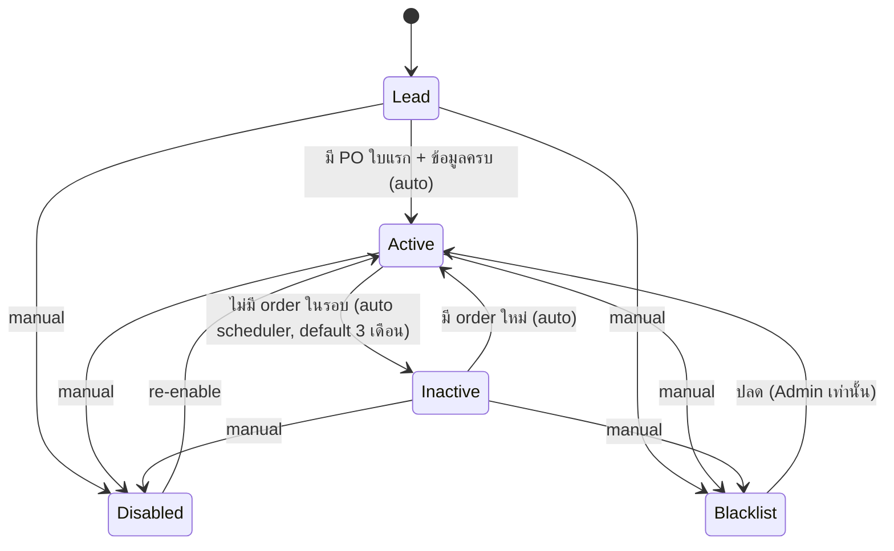
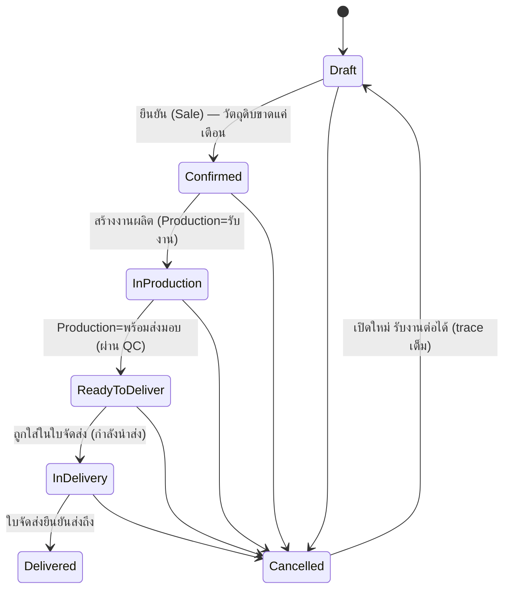
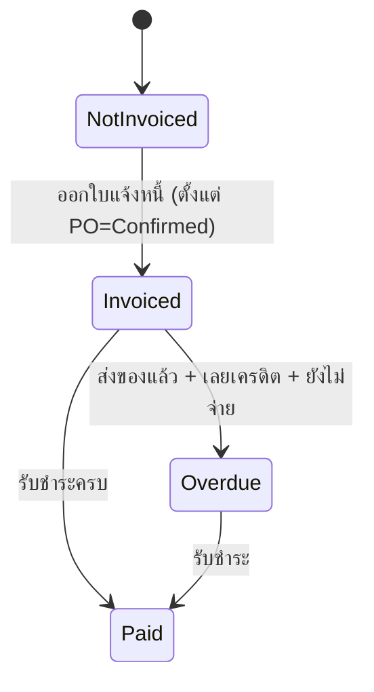
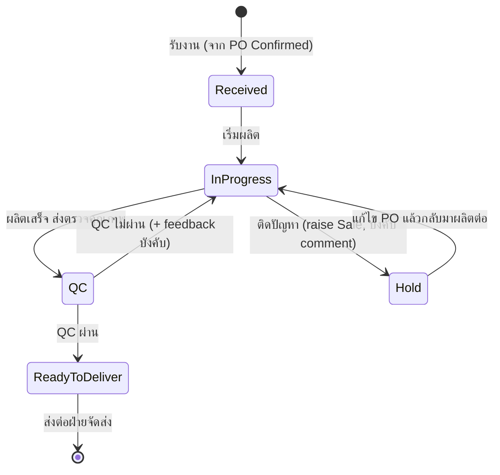
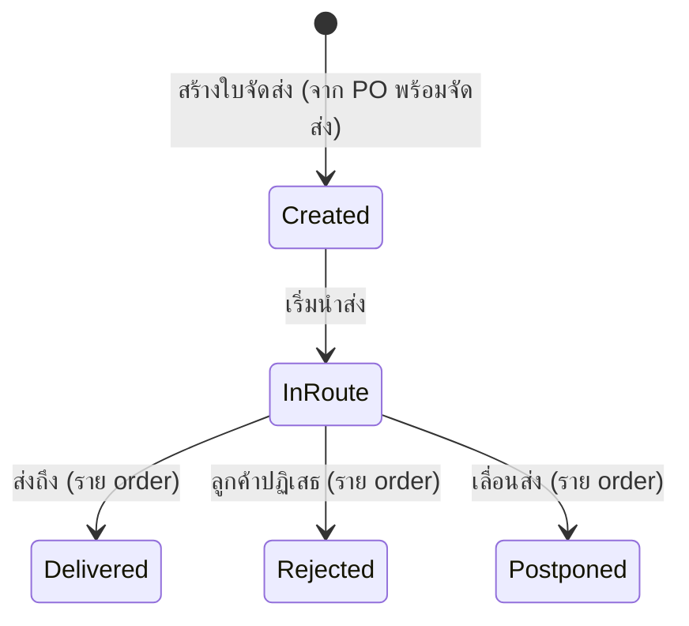
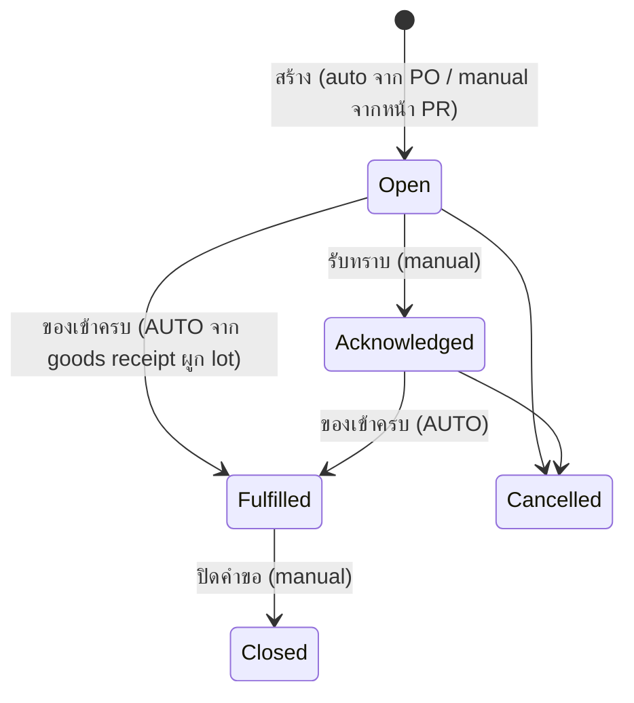
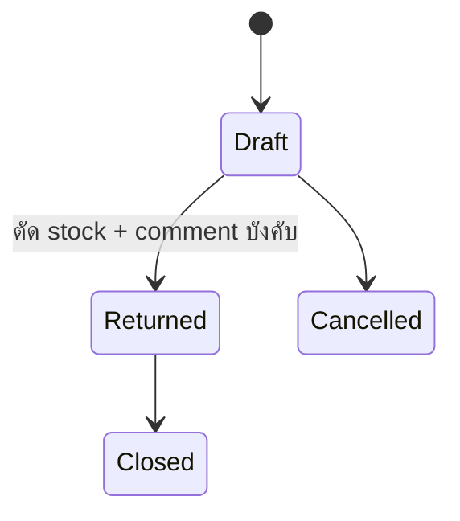

# Status Journeys — ESSENCE Hub System (ERP v2, UI-First Rebuild)

slug: `erp-v2-ui-first` · เขียนโดย PO (design phase) เพื่อให้ UX/UI ทำ mockup ทุกสถานะ และ BA/Engineer/QA ทำครบ
ที่มา: `pond-gate1-feedback.md` (รอบ1) + คำตอบ 6 ข้อ + `pond-gate1-r2-feedback.md` (รอบ2, 2026-07-08) + Notification/deep-link

## สรุปภาษาไทย
"แผนที่สถานะ" ของทั้งระบบ — ทุกสถานะต้องต่อเนื่องข้าม module ห้ามหลุด journey. รอบ 2 ปอนด์แก้ flow หลายจุด (อัปเดตแล้วในเอกสารนี้): **การผลิตจบที่ "พร้อมส่งมอบ"** ("ส่งมอบแล้ว" เป็นของฝ่ายจัดส่ง), เพิ่ม loop **QC ไม่ผ่าน→กลับกำลังผลิต** และ **Hold→แก้ไข PO→ผลิตต่อ (raise Sale)**, **PO cancel ได้ทุก case + กลับ Draft รับงานต่อได้**, **Shipping/Delivery Note redesign**, **Purchase Request สร้างตรงได้ + ของเข้าครบ auto จาก goods receipt**, **BOM cost = ราคาสูงสุดของ supplier ที่ active + snapshot ตอนบันทึก**, ลูกค้าเพิ่มกลไก **"ต้องติดตาม" + comment**. จุดที่ flow ยังกำกวมถามปอนด์ (ดู §12 + questions ใน status.json). สรุปย่อสำหรับปอนด์: `status-summary-for-pond.md`

**หลักการร่วม (ทุกสาย):**
1. **ทุกการเปลี่ยนสถานะมี trace เสมอ** (ใคร/จากอะไร→เป็นอะไร/เมื่อไหร่/เหตุผล) — รวม cancel/reopen
2. **comment ได้ทุกสถานะ** + **บังคับ comment** ในจุดที่ระบุ (QC fail feedback, Hold, disable/blacklist, return, follow-up, override)
3. **สถานะข้าม module reconcile กัน** — PO (แม่) สะท้อนสถานะ production/shipping/invoice และเห็นทุกหน้าที่เกี่ยว
4. สถานะ auto (Active/Inactive, Potential Delay, Overdue, PR ของเข้าครบ) มี rule/scheduler กำกับ + badge อธิบายเหตุผล
5. **Minimize clicks** — เปลี่ยนสถานะ+comment แบบ inline, deep link พาไปหน้าทำงานต่อ (ดู §10)
6. **สถานะอ่านออกด้วยภาษาคน** — ห้ามโชว์ enum ดิบ
7. **ทุกการส่งงานข้าม module ยิง Notification/Inbox + deep link** (§10)

> ⚠ เอกสารชุดนี้เป็น input ของ BA/Engineer/QA — ต้องละเอียดพอให้ทำครบ. จุดที่ยังกำกวมติดป้าย **[ถามปอนด์]** พร้อม **[DEFAULT]** ที่ผมเสนอ เพื่อไม่ block UX/UI

---

## 1. Customer Lifecycle
สถานะหลัก 5 สถานะ: `Lead` → `Active` ↔ `Inactive` → `Disabled` / `Blacklist`
**เพิ่มกลไก "ต้องติดตาม (Follow-up)"** — [DEFAULT] ออกแบบเป็น **flag ซ้อน** (overlay) เหนือสถานะหลัก ไม่ใช่สถานะที่ 6 เพราะลูกค้าที่ต้องติดตามอาจยัง Active/Inactive อยู่ — user เปลี่ยนเป็น "ต้องติดตาม" ได้พร้อม **comment free text** ว่าติดตามเรื่องอะไร; Sale Dashboard มี tile "ต้องติดตาม" (พฤติกรรมเหมือน tile ลูกค้าประจำ) **[ถามปอนด์: เป็น flag ซ้อน หรือ สถานะที่ 6 แยกจริง]**

> Follow-up flag: on/off ได้ทุกสถานะหลัก, บังคับ comment ตอนติดธง, เก็บใน note timeline + trace, โผล่ tile "ต้องติดตาม" ใน Sale Dashboard

| Transition | ทริกเกอร์ | ใครเปลี่ยนได้ | comment | สะกิดข้าม module |
|---|---|---|---|---|
| Lead → Active | PO ใบแรก + ข้อมูลครบ | ระบบ (auto) | optional | Sale Dashboard |
| Active → Inactive | ไม่มี order ในรอบ (config 1/3/6/8 ด. default 3) | scheduler | auto note | แจ้ง Sale + Dashboard |
| Inactive → Active | มี order ใหม่ | auto | auto note | Sale Dashboard |
| any → Disabled/Blacklist | manual | Sale Manager/Admin | **บังคับ** | ซ่อน/เตือนตอนเปิด PO |
| ติดธง "ต้องติดตาม" | manual | Sale/Sale Manager | **บังคับ (free text)** | tile "ต้องติดตาม" ใน Sale Dashboard |

**ผูกกับหน้า:** contact ไม่จำกัด · note/comment timeline · sale ที่ดูแล (reassign) · ประวัติ PO · search ลูกค้าด้วย PO/วันที่

---

## 2. PO Lifecycle (2 ราง — reconcile กัน) + Cancel/Reopen
วัตถุดิบขาด = **WARNING ไม่บล็อก** + auto Purchase Request ไป Stock (ไม่มี Awaiting Materials)

### 2A. Fulfilment track

- **Cancel ได้ทุก case** (ยืนยันปอนด์ ร2 ข้อ4) — บังคับ comment เหตุผล
- **Cancelled → Draft (เปิดใหม่)**: กลับมารับงานต่อได้ — **ต้องเก็บ trace เต็ม** ว่าเคย cancel เมื่อไหร่/ใคร/เหตุผล แล้ว reopen เมื่อไหร่ **[ถามปอนด์: เลขที่ PO เดิมคงไว้ หรือออกเลขใหม่ผูกกับเลขเดิม]** — [DEFAULT] คงเลข PO เดิม + บันทึก lifecycle event (cancelled→reopened) ใน trace/versioning เพื่อไม่ให้เลขเอกสารกระโดด

### 2B. Billing track

**หน้า PO — เพิ่มตามรอบ2:** search ด้วย **วันที่สร้าง / วันที่จัดส่งจริง / วันที่ต้องการรับสินค้า** (3 แบบ) · เพิ่มสินค้า (BOM/วัตถุดิบ) **แก้จำนวน+ราคา/หน่วยได้เสมอ ราคา = 0 ได้** · แสดง 2 ราง + sale ที่ดูแล + trace

---

## 3. Production Lifecycle (redesign รอบ2 — จบที่ "พร้อมส่งมอบ")
สถานะ: `รับงาน (Received)` → `กำลังผลิต (In Progress)` → `ตรวจคุณภาพ (QC)` → `พร้อมส่งมอบ (Ready to Deliver)` + `พักงาน (Hold)` + overlay `เสี่ยงล่าช้า (Potential Delay)`
**"ส่งมอบแล้ว (Delivered)" ไม่อยู่ในหน้าผลิตแล้ว** — เป็นของฝ่ายจัดส่ง (คำวินิจฉัยปอนด์ ร2 ข้อ9) หน้าผลิตส่งต่อที่ "พร้อมส่งมอบ"

- **Normal:** รับงาน → กำลังผลิต → QC → พร้อมส่งมอบ
- **QC ไม่ผ่าน:** QC → กลับ กำลังผลิต **พร้อม feedback (บังคับ comment)** (ยืนยันปอนด์ ร2 ข้อ10)
- **Hold:** กำลังผลิต → Hold → **แก้ไข PO** → กำลังผลิต → QC → พร้อมส่งมอบ; Hold **raise ไปที่ Sale** (บังคับ comment)
  - **[ถามปอนด์: "แก้ไข PO" ใน Hold แก้อะไรได้บ้าง (จำนวน/สินค้า/ราคา/วันส่ง) และใครแก้ (Sale?)]** — [DEFAULT] Sale เป็นผู้แก้ (จำนวน/สินค้า/ราคา/วันที่) ผ่านหน้า PO, ทุกการแก้มี trace, ผลิตกลับมาต่อหลังแก้เสร็จ
- **Potential Delay** = overlay badge: เกณฑ์ 2 วันผลิต + 1 วันส่ง (ไม่ใช่ state แยก)
- ปรับสถานะได้ตลอด **แต่ trace เสมอ** · เรียง/ค้นด้วย วันจัดส่ง/PO/ลูกค้า

| Transition | ใครเปลี่ยน | comment | สะกิดข้าม module |
|---|---|---|---|
| Received (เข้ามา) | ระบบ (PO Confirmed) | — | มาจาก PO |
| → QC | Production | optional | — |
| QC ผ่าน → ReadyToDeliver | QC | optional | **PO → พร้อมจัดส่ง, โผล่หน้าจัดส่ง** |
| QC ไม่ผ่าน → InProgress | QC | **บังคับ (feedback)** | กลับสายผลิต |
| → Hold | Production | **บังคับ** | **raise Sale** |
| Hold → InProgress | Sale แก้ PO เสร็จ | trace | Sale ↔ Production |

---

## 4. Shipping / Delivery Note (redesign รอบ2)
แยก 2 หน้าให้ชัด:
- **หน้าการจัดส่ง (Shipping)** = ที่ **สร้างใบจัดส่ง**: เลือก PO ก่อนแล้วสร้าง หรือ สร้างใบเปล่าแล้ว search PO เพิ่ม — **เลือกได้เฉพาะ PO สถานะ "พร้อมจัดส่ง" เท่านั้น** (แต่ search มองเห็นได้ทั้งหมด) · search PO ด้วย **PO ID หรือข้อมูลลูกค้า** (ชื่อ/นามสกุล/ชื่อบริษัท/เบอร์ contact/ชื่อ contact) · เป็น**คิวจัดส่ง** ที่เห็น PO ที่รอส่ง (รวม PO ที่ Postpone)
- **หน้าใบจัดส่ง (Delivery Note)** = ใบจัดส่งราย order **print ได้ทีละใบ ให้ลูกค้าเซ็น**

**กติกา reconcile ใบ ↔ PO:**
- แต่ละ order (PO) ในใบมีสถานะรายบรรทัด: Delivered / Rejected / Postponed
- ระดับใบ: ทุก order Delivered → `Delivered`; มีบางส่วน Reject/Postpone → `Partially Delivered` (แสดง breakdown, ใบยังไม่ปิดจนเคลียร์)
- **Reject → PO กลับ "พร้อมจัดส่ง" + raise ไปที่ Sale** (Sale ตัดสินใจ ติดต่อลูกค้า/ยกเลิก) (ยืนยันปอนด์ ร2 ข้อ11)
- **Postpone → PO = "พร้อมจัดส่ง" + flag "กันจัดส่ง Postpone" พร้อมวันที่** — **ค้างอยู่ในคิวจัดส่ง** ให้ฝ่ายจัดส่งเห็นว่ามี PO เลื่อน (ยืนยันปอนด์ ร2 ข้อ11)
- print ใบจัดส่งราย order สำหรับลูกค้าเซ็น · comment ได้ · trace เสมอ
- **[ถามปอนด์: 1 ใบจัดส่งรวมได้หลาย order/PO ไหม (แล้ว print แยกราย order) หรือ 1 ใบ = 1 order]** — [DEFAULT] 1 ใบสร้างรวมหลาย PO ได้ตอนสร้าง แต่ print เป็นสลิปราย order เพื่อให้ลูกค้าแต่ละรายเซ็น

| Transition | ใครเปลี่ยน | สะกิดข้าม module |
|---|---|---|
| สร้างใบ | Shipping (เลือก PO พร้อมจัดส่ง) | PO → กำลังนำส่ง เมื่อออกวิ่ง |
| InRoute → Delivered | Shipping | PO → Delivered → เริ่มนับ overdue |
| InRoute → Rejected | Shipping | PO กลับ พร้อมจัดส่ง + **raise Sale** |
| InRoute → Postponed | Shipping | PO = พร้อมจัดส่ง + flag Postpone(+วันที่) ค้างคิวจัดส่ง |

---

## 5. Purchase Request Flow (redesign รอบ2)
เกิดได้ 2 ทาง: **(ก) auto จาก PO วัตถุดิบขาด** หรือ **(ข) user สร้างตรงจากหน้า PR เอง** (ยืนยันปอนด์ ร2 ข้อ6)

| สถานะ/Transition | ใครเปลี่ยน | หมายเหตุ |
|---|---|---|
| สร้าง (Open) | ระบบ (จาก PO) หรือ Stock (manual หน้า PR) | ระบุวัตถุดิบ+จำนวน; โผล่ Stock + Production Dashboard |
| รับทราบ (Acknowledged) | Stock | **manual** |
| ของเข้าครบ (Fulfilled) | ระบบ | **AUTO** จากการทำ Goods Receipt ใน stock (ผูก lot) — เห็นว่ารับจาก lot ไหน |
| ปิดคำขอ (Closed) | Stock | **manual** |
| ยกเลิก (Cancelled) | Stock/Sale | บังคับ comment |

> การรับเข้า (Goods Receipt) หน้า stock **อ้างอิงเลข PR ได้ (search PR)** → เมื่อรับครบ **ปิด/เปลี่ยน PR เป็น "ของเข้าครบ" อัตโนมัติ** พร้อมเหตุผลว่ารับจาก lot ไหน (ยืนยันปอนด์ ร2 ข้อ5)

---

## 6. Return Flow (คืนของ supplier)

- ระบุ lot → auto แสดง supplier → แก้จำนวน return → **ตัด stock + comment บังคับ** (เหตุผล adjust ที่ไม่มี PO) · trace เสมอ

---

## 7. Invoice / Payment
- ออกใบแจ้งหนี้ได้ตั้งแต่ **PO = Confirmed** แต่แสดง PO fulfilment stage เสมอ
- Overdue: ส่งของแล้ว + เลยเครดิต + ยังไม่จ่าย → โชว์จำนวนวันค้าง (Finance Dashboard + Sale)
- คง versioning + ใบกำกับภาษีไทย (issuer จาก settings, เลขผู้เสียภาษี, VAT7%, discount, ตัวหนังสือไทย, ลายเซ็น 2 ช่อง)

---

## 8. ตารางความต่อเนื่องข้าม module (Cross-module continuity — หัวใจ)

| # | เหตุการณ์ต้นทาง | ผลลัพธ์ปลายทาง |
|---|---|---|
| C1 | Customer สร้าง PO ใบแรก | Lead → Active; Sale Dashboard |
| C2 | Customer ไม่มี order ในรอบ | Active → Inactive; แจ้ง Sale |
| C2b | Sale ติดธง "ต้องติดตาม" | tile ต้องติดตาม (Sale Dashboard) + note |
| C3 | PO วัตถุดิบขาด | WARNING (ไม่บล็อก) + สร้าง PR → Stock + Production Dashboard |
| C4 | Goods Receipt รับของครบ (ผูก lot) | PR → "ของเข้าครบ" อัตโนมัติ; Stock เพิ่ม (lot prefix supplier) |
| C5 | PO Confirmed | Production = รับงาน |
| C6 | Production QC ไม่ผ่าน | กลับ กำลังผลิต + feedback |
| C7 | Production Hold | raise Sale (แก้ไข PO) |
| C7b | Production Potential Delay | notify Sale + Stock |
| C8 | Production พร้อมส่งมอบ (QC ผ่าน) | PO → พร้อมจัดส่ง; โผล่คิวจัดส่ง |
| C9 | ใบจัดส่ง Delivered | PO → Delivered; เริ่มนับ overdue |
| C10 | ใบจัดส่ง order Rejected | PO กลับ พร้อมจัดส่ง + raise Sale |
| C10b | ใบจัดส่ง order Postponed | PO = พร้อมจัดส่ง + flag Postpone(+วันที่) ค้างคิวจัดส่ง |
| C11 | Invoice Overdue | แจ้ง Finance (+Sale) |
| C12 | Return Issued | Stock ลด (lot) + adjust ไม่มี PO + comment |
| C13 | PO Cancelled → Draft (reopen) | รับงานต่อได้; trace lifecycle เต็ม |
| C14 | Sale reassign ลูกค้า | customer.sale เปลี่ยน; Dashboard 2 ฝั่ง + trace |

**เกณฑ์ตรวจ (UX/UI + QA):** ทุกแถวต้องมี mockup แสดงต้นทาง+ปลายทาง + trace + ยิง Notification (§10)

---

## 9. Roles / Permission (RUCDAA)
- สิทธิ์ราย module × 6 ระดับ: **R**ead, **U**pdate, **C**reate, **D**elete, **A**pprove, **A**dmin (RUCDAA) — bit "Admin" = special capabilities (reassign customer, archive trace, ปลด Blacklist, force override, cancel/reopen PO)
- สร้าง role ไม่จำกัด; user อยู่ใต้ role; company profile ใน settings
- Role ใหม่: **Sale Manager** (reassign, dashboard ทีม), **Super User** (archive trace)
- **Read bit** = เห็น module + ได้รับ Notification ของ module นั้น (§10)

---

## 10. Notification / Inbox + Deep link
- **bell มุมบนขวา** → badge รวม → กด expand เป็นรายการ → **กดแต่ละรายการ = deep link ไปหน้าทำงานต่อ + acknowledge** (นับ badge ราย user)
- ผู้รับ = ผู้มีสิทธิ์ **Read** ของ module ปลายทาง
- (เสริม) badge ราย module บนเมนูซ้าย

| อ้าง §8 | เหตุการณ์ | Noti เข้า module | Role ที่เห็น (Read) | Deep link |
|---|---|---|---|---|
| C2b | ต้องติดตาม | Customer/Sale | Sale(เจ้าของ), Sale Manager | Customer detail |
| C3 | PR (วัตถุดิบขาด) | Stock + Production | Read Stock/Production | Purchase Request detail |
| C4 | ของเข้าครบ (auto) | Production + Stock | Read Production/Stock | Production order / PR ที่ปิด |
| C5 | PO Confirmed | Production | Read Production | Production order (คิว) |
| C6 | QC ไม่ผ่าน | Production | Read Production | Production order (feedback) |
| C7 | Hold (raise Sale) | Sale | Read Sale | PO detail (แก้ไข PO) |
| C7b | เสี่ยงล่าช้า | Sale + Stock | Read Sale/Stock | Production order |
| C8 | พร้อมส่งมอบ | Shipping | Read Shipping | หน้าจัดส่ง (สร้างใบ) |
| C9 | Delivered | Finance + Sale | Read Finance/Sale | Invoice/PO billing |
| C10 | order Rejected | Sale | Read Sale, Sale Manager | PO detail (ตัดสินใจ) |
| C10b | order Postponed | Shipping | Read Shipping | คิวจัดส่ง (PO flag Postpone) |
| C11 | Overdue | Finance + Sale | Read Finance/Sale | Invoice detail |
| C12 | Return | Stock | Read Stock | Return/stock adjust |
| C13 | PO reopen (Cancelled→Draft) | Production/Sale | Read Production/Sale | PO detail |
| C14 | reassign | Sale (เดิม+ใหม่) | sale เดิม/ใหม่, Sale Manager | Customer detail |

---

## 11. BOM Cost Rule (ยืนยันปอนด์ ร2 ข้อ8)
- **ราคาทุน = ราคารับซื้อ "สูงสุด" ของ supplier ที่ active เท่านั้น** (ไม่นับ supplier inactive) คำนวณ ณ ตอนสร้าง/แก้สูตร
- **user แก้ทับได้** (override ค่าที่คำนวณ)
- **เมื่อบันทึกสูตร → snapshot ราคาทุนไว้ ไม่คำนวณใหม่อัตโนมัติ** แม้ราคา supplier เปลี่ยนภายหลัง — จนกว่าจะเปิดแก้แล้ว save ใหม่
- **ราคาขายใน BOM = mandatory** (ยังคงเดิม)
- **[ถามปอนด์: เมื่อราคา supplier เปลี่ยนภายหลัง สูตรเดิมใช้ราคา snapshot ตลอดจนกว่าจะ save ใหม่ใช่ไหม + ควรมี badge เตือน "ราคาทุนอาจล้าสมัย" ไหม]** — [DEFAULT] ใช้ snapshot จนกว่า save ใหม่ + แสดง badge เตือนเมื่อราคา active supplier ปัจจุบันต่างจาก snapshot

---

## 12. คำถามถึงปอนด์ (flow ยังกำกวม — ปอนด์เปิดทางให้ถามเต็มที่)
1. **"ต้องติดตาม"** = flag ซ้อนสถานะเดิม (default ผม) หรือ สถานะที่ 6 แยกจริง?
2. **PO cancel → reopen (Draft)**: คงเลข PO เดิม (default ผม) หรือออกเลขใหม่ผูกเลขเดิม?
3. **"แก้ไข PO" ใน Hold**: แก้อะไรได้บ้าง (จำนวน/สินค้า/ราคา/วันส่ง) + ใครแก้ (default: Sale แก้ได้ทั้งหมด + trace)?
4. **BOM snapshot**: ราคา supplier เปลี่ยนภายหลัง → สูตรเดิมใช้ snapshot จนกว่า save ใหม่ (default ผม) + badge เตือน?
5. **ใบจัดส่ง**: 1 ใบรวมหลาย order/PO แล้ว print แยกราย order (default ผม) หรือ 1 ใบ = 1 order?
