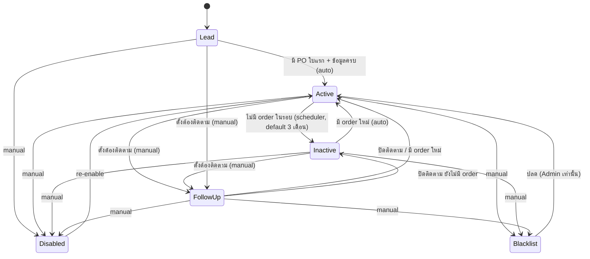
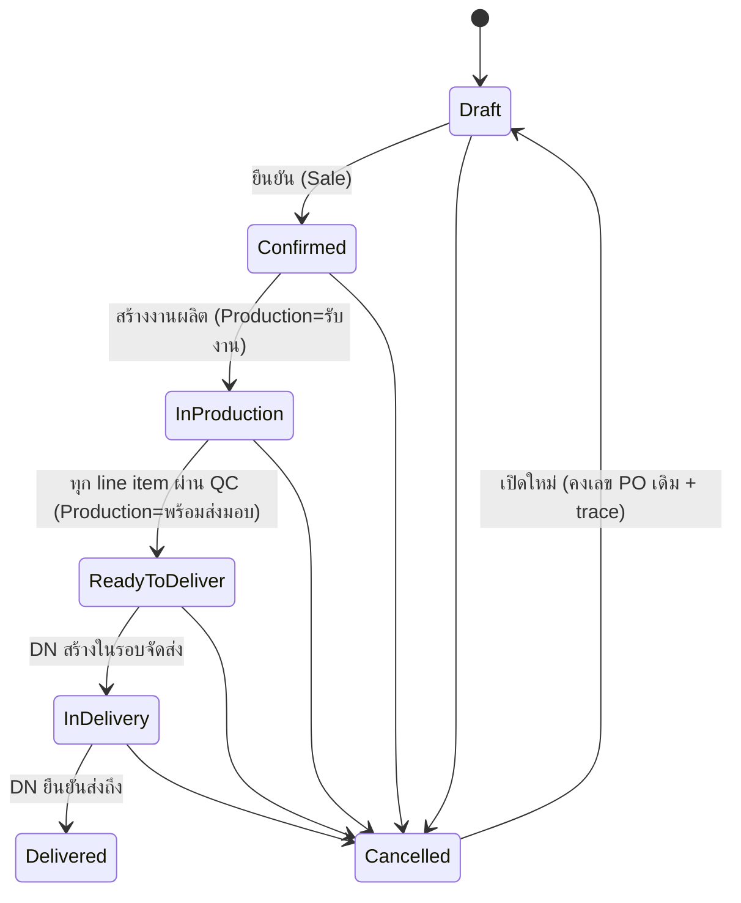
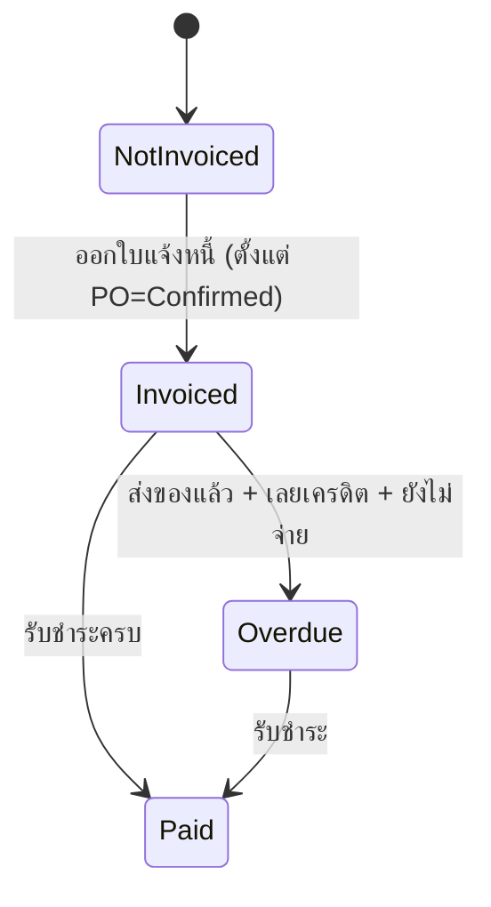
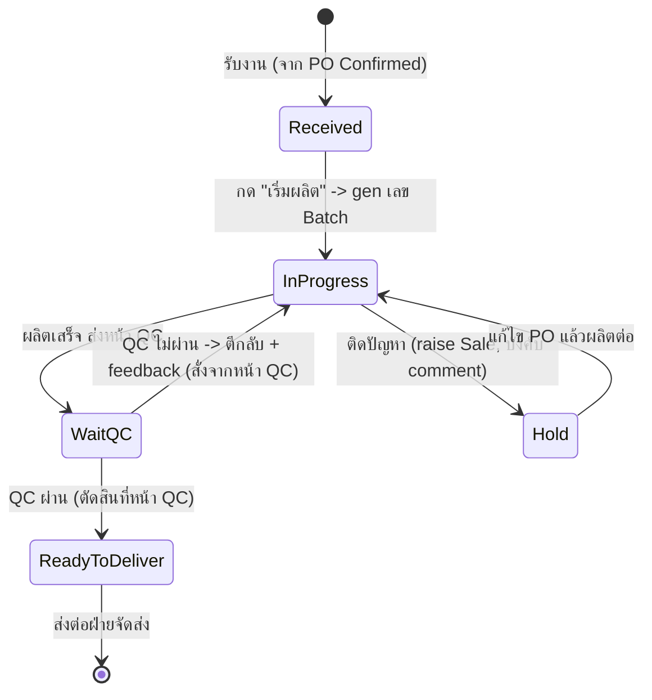
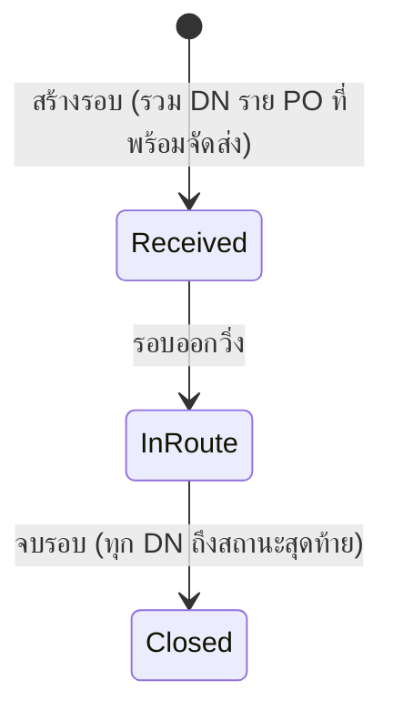
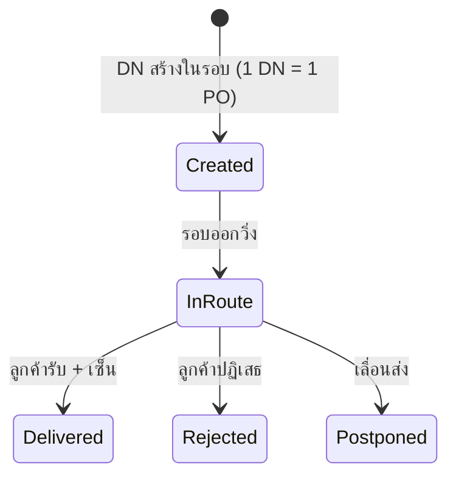
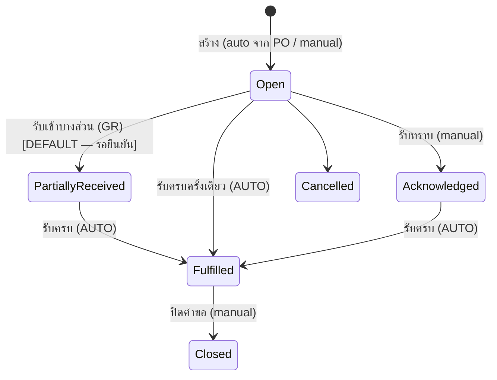
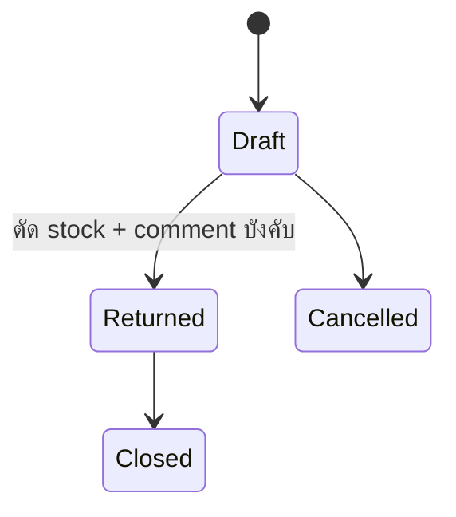

# Status Journeys — ESSENCE Hub System (ERP v2, UI-First Rebuild)

slug: `erp-v2-ui-first` · เขียนโดย PO (design phase) เพื่อให้ UX/UI ทำ mockup ทุกสถานะ และ BA/Engineer/QA ทำครบ
ที่มา: `pond-gate1-feedback.md` (ร1) + คำตอบ 6 ข้อ + `pond-gate1-r2-feedback.md` (ร2) + คำตอบ 5 ข้อ + `pond-gate1-r3-feedback.md` (ร3, 2026-07-08) + Notification/deep-link

## สรุปภาษาไทย
"แผนที่สถานะ" ของทั้งระบบ — ทุกสถานะต้องต่อเนื่องข้าม module ห้ามหลุด journey. อัปเดตล่าสุด (r3): **QC ตัดสินราย line item/ราย Batch ที่หน้า QC เท่านั้น** (หน้าผลิตไม่มีปุ่ม "QC ไม่ผ่าน") · **Batch สร้างตอน "เริ่มผลิต", 1 line item = 1 Batch** (GMP: Lot→Batch→line→PO→ลูกค้า) · **Goods Receipt หลายวัตถุดิบต่อใบ (header + หลาย line, lot gen รายบรรทัด, อ้าง PR ได้หลายใบ)** · **Shipment (รอบจัดส่ง) มีคนขับ/เบอร์/route/ประเภทรถ + สร้างได้ 2 ทาง** · ก่อนหน้า: ลูกค้า 6 สถานะ, Shipment→DN (DN=1 PO), PO cancel/reopen คงเลข, BOM snapshot. สรุปย่อ: `status-summary-for-pond.md`

**หลักการร่วม (ทุกสาย):**
1. **ทุกการเปลี่ยนสถานะมี trace เสมอ** (ใคร/จากอะไร→เป็นอะไร/เมื่อไหร่/เหตุผล) — รวม cancel/reopen
2. **comment ได้ทุกสถานะ** + **บังคับ comment** ในจุดที่ระบุ (QC fail feedback, Hold, Follow-up, disable/blacklist, return, override)
3. **สถานะข้าม module reconcile กัน** — PO (แม่) สะท้อนสถานะ production/shipping/invoice และเห็นทุกหน้าที่เกี่ยว
4. สถานะ auto (Active/Inactive, Potential Delay, Overdue, PR ของเข้าครบ) มี rule/scheduler กำกับ + badge อธิบายเหตุผล
5. **Minimize clicks** — เปลี่ยนสถานะ+comment แบบ inline, deep link พาไปหน้าทำงานต่อ (§10); dropdown ทุกจุด search ได้
6. **สถานะอ่านออกด้วยภาษาคน** — ห้ามโชว์ enum ดิบ
7. **ทุกการส่งงานข้าม module ยิง Notification/Inbox + deep link** (§10)

> ⚠ เอกสารเป็น input ของ BA/Engineer/QA — ทุกหน้า create/edit ต้องกดได้จริง + test data สมจริงตรง use case. จุดกำกวมติดป้าย **[ถามปอนด์]** + **[DEFAULT]**

---

## 1. Customer Lifecycle — 6 สถานะ
สถานะ: `Lead` → `Active` ↔ `Inactive` · `Follow-up (ต้องติดตาม)` · `Disabled` · `Blacklist`
**"ต้องติดตาม" = สถานะที่ 6 แยกจริง** — ตั้งโดย Sale/Sale Manager พร้อม **comment (บังคับ)**; โผล่ tile "ต้องติดตาม" ใน Sale Dashboard

**Use case Follow-up ↔ Production Hold:** Production `Hold` เหตุลูกค้า → raise Sale → Sale ตั้งลูกค้า "ต้องติดตาม" + comment → กลับ Active เมื่อจบ/มี order ใหม่
**ผูกกับหน้า:** contact ไม่จำกัด (**มีหน้า "เพิ่มผู้ติดต่อ" จริง**) · **หน้า "เพิ่มลูกค้า" ต้องเป็น create จริง (ไม่ใช่ edit)** · note timeline · reassign · ประวัติ PO · search ด้วย PO/วันที่ · **test data สมจริง** (Follow-up มีเคส Hold ประกอบ, Blacklist มี comment เหตุผล)

---

## 2. PO Lifecycle (2 ราง) + Cancel/Reopen + เปลี่ยนสถานะ
วัตถุดิบขาด = **WARNING ไม่บล็อก** + auto Purchase Request (ไม่มี Awaiting Materials)

### 2A. Fulfilment track

- **Cancel ได้ทุก case** (บังคับ comment) · **Cancelled → Draft** คงเลข PO เดิม + trace lifecycle
- **★ เปลี่ยนสถานะ PO (r3):** ต้องมี **UI เปลี่ยนสถานะ PO ชัดเจน** ที่หน้า po-detail — ปุ่ม/กล่องเปลี่ยนสถานะ (เช่น ยกเลิก, เปิดใหม่, แก้ไข PO) + บังคับ comment ในจุดที่ต้องระบุเหตุผล + **trace ทุกครั้ง** (ใคร/จาก→เป็น/เมื่อไหร่/เหตุผล). สถานะ fulfilment ส่วนใหญ่ขับเคลื่อนอัตโนมัติจาก Production/Shipping แต่ manual override (force) ทำได้เฉพาะสิทธิ์ Admin-bit (RUCDAA) + trace

### 2B. Billing track

**หน้า PO:** search 3 แบบวันที่ (สร้าง/จัดส่งจริง/ต้องการรับ) · แก้จำนวน+ราคา/หน่วยได้เสมอ ราคา 0 ได้ · 2 ราง + sale + trace + **UI เปลี่ยนสถานะ**

---

## 3. Production Lifecycle (จบที่ "พร้อมส่งมอบ") — QC ตัดสินที่หน้า QC เท่านั้น
สถานะราย Batch/line: `รับงาน (Received)` → `กำลังผลิต (In Progress)` → `รอ QC` → `พร้อมส่งมอบ (Ready to Deliver)` + `พักงาน (Hold)` + overlay `เสี่ยงล่าช้า`
**★ r3: หน้าการผลิต "ไม่มี" ปุ่ม "QC ไม่ผ่าน"** — การตัดสิน QC อยู่หน้า QC เท่านั้น หน้าผลิต **แค่เห็นผล + รับงานกลับ** (เมื่อ QC ตีกลับ Batch จะกลับมาเป็น "กำลังผลิต" พร้อม feedback อัตโนมัติ)

- **ตัวเปลี่ยนสถานะที่หน้าผลิต** = เริ่มผลิต / ส่งตรวจ QC / Hold (+raise Sale) · **ไม่มี "QC ไม่ผ่าน"** (มาจากหน้า QC)
- **Hold:** raise Sale → Sale แก้ไข PO ได้ทุกอย่าง (จำนวน/สินค้า/ราคา/วันส่ง) + trace ทุกช่อง → ผลิตต่อ
- **Potential Delay** overlay: เกณฑ์ 2 วันผลิต + 1 วันส่ง
- เรียง/ค้นด้วย วันจัดส่ง/PO/ลูกค้า

### 3.1 Batch Lifecycle + PO ↔ Batch ↔ QC (หัวใจ GMP — r3)
- **สร้างเลข Batch เมื่อ:** ฝ่ายผลิตกด **"เริ่มผลิต"** (Received → In Progress) ของ **line item นั้น** (ไม่ใช่ตอน PO confirm)
- **[DEFAULT] granularity: 1 line item = 1 Batch** (ต่อรอบผลิต) → **1 PO ที่มี N สินค้า = N Batch** (ถ้าแบ่งผลิตหลายรอบ line เดียวอาจได้หลาย Batch — เริ่มจาก 1:1) **[ถามปอนด์ ยืนยัน 1 line=1 Batch หรือ 1 PO=1 Batch]**
- **Batch ผูก:** PO ref + line-item ref + **Lot วัตถุดิบที่ใช้ (FIFO)** + จำนวนผลิต + ผู้ผลิต + เวลา
- **QC เห็นความเชื่อมโยง:** หน้า QC list Batch พร้อม **PO/line + Lot ที่ใช้** → QC ตัดสิน **ราย Batch/line item**
- **GMP chain:** Lot วัตถุดิบ → Batch (ผลิต) → line item → PO → ลูกค้า → DN/Invoice (ไล่ได้ที่หน้า Traceability)

### 3.2 QC ราย line item (r3 — วิเคราะห์ + เสนอ)
**โจทย์ปอนด์:** PO หลาย line item, ตัวใดตัวหนึ่งไม่ผ่าน = ทั้ง PO ไม่ผ่าน + ส่งกลับผลิตทั้งใบ ใช่ไหม?
**ข้อเสนอ PO (practical ต่อโรงงานจริง) [DEFAULT]:** QC ตัดสิน **ราย line item / ราย Batch**:
- line/Batch ที่ **ไม่ผ่าน** → **ตีกลับเฉพาะตัวนั้น** เป็น "กำลังผลิต" + feedback (บังคับ) — **ไม่ผลิตซ้ำตัวที่ผ่าน** (ลดของเสีย/เวลา)
- line ที่ **ผ่าน** → รอ (พร้อมส่งมอบ ราย line)
- **PO-level "พร้อมจัดส่ง" เกิดเมื่อทุก line item ผ่าน QC ครบ** (reconcile ที่ PO)
- เหตุผล: ผลิตซ้ำทั้ง PO เมื่อพลาดสินค้าตัวเดียว = สิ้นเปลืองมาก โรงงานจริงผลิตซ้ำเฉพาะ Batch ที่เสีย
- **[ถามปอนด์ ยืนยัน]:** ตีกลับเฉพาะ line ที่ไม่ผ่าน (default) หรือ ตีกลับทั้ง PO ตามที่ปอนด์เกริ่น
- QC ตัดสินที่หน้า QC เท่านั้น; ผลไป reflect ที่ production + PO + trace

| Transition | ใครเปลี่ยน (หน้า) | comment | สะกิดข้าม module |
|---|---|---|---|
| Received → InProgress (gen Batch) | Production ("เริ่มผลิต") | — | สร้าง Batch ผูก PO/line/Lot |
| InProgress → WaitQC | Production ("ส่งตรวจ QC") | optional | โผล่หน้า QC |
| WaitQC → ReadyToDeliver | **QC (หน้า QC)** | optional | ครบทุก line → **PO พร้อมจัดส่ง** |
| WaitQC → InProgress (ตีกลับ) | **QC (หน้า QC)** | **บังคับ (feedback)** | Batch กลับสายผลิต (เฉพาะ line ที่ไม่ผ่าน) |
| → Hold | Production | **บังคับ** | raise Sale |

---

## 4. Shipping (2 ชั้น: Shipment รอบ → DN ราย PO)
- **Shipment (รอบจัดส่ง)** รวมหลาย DN — สถานะรอบ: `รับเข้ารอบ` → `กำลังนำส่ง` → `จบรอบ`
- **DN = 1 ใบต่อ 1 PO เสมอ** (ลูกค้าเซ็นรายใบ, print ทีละใบ) — สถานะ DN: `กำลังนำส่ง` → `ส่งถึงแล้ว` / `ปฏิเสธ` / `เลื่อนส่ง`

**★ r3 — สร้างรอบจัดส่งได้ 2 ทาง (ต้องมีหน้าจอจริง กดได้):**
1. **เลือก PO ก่อน แล้วสร้างรอบ** (เลือกจากคิว PO "พร้อมจัดส่ง")
2. **สร้างรอบเปล่าก่อน แล้ว search เพิ่ม PO** (dropdown/search PO ด้วย PO ID หรือข้อมูลลูกค้า)

**★ r3 — ข้อมูลรอบจัดส่ง (Shipment) ต้องมี:** **คนขับ, เบอร์ติดต่อคนขับ, Route/เส้นทาง, ขนาด/ประเภทรถ** (เก๋ง / motorcycle / กระบะ / 10 ล้อ — เลือกจาก list, เพิ่ม/config ได้)

**reconcile:** รอบ Closed เมื่อทุก DN ถึงสถานะสุดท้าย · DN Delivered → PO Delivered (นับ overdue) · DN Rejected → PO "พร้อมจัดส่ง" + raise Sale · DN Postponed → PO "พร้อมจัดส่ง" + flag Postpone+วันที่ ค้างคิว → สร้าง DN รอบใหม่

---

## 5. Purchase Request + Goods Receipt (r3 — GR หลายวัตถุดิบต่อใบ)
**PR** เกิด 2 ทาง: auto จาก PO วัตถุดิบขาด / **สร้างตรงจากหน้า PR (หน้าเต็มจอ กดได้จริง)**

**★ r3 — Goods Receipt (หน้า stock) โครงสร้างใหม่ = header + หลาย line:**
- **Header:** supplier (dropdown search ได้), เลขใบรับจาก supplier, วันที่รับ, แนบเอกสาร (upload)
- **Lines (หลายรายการต่อใบ):** วัตถุดิบ (dropdown search ได้) × จำนวน × ราคาซื้อ/หน่วย (0 ได้) × **lot gen รายบรรทัด** (จาก prefix ของ supplier) × **อ้าง PR ได้รายบรรทัด**
- **PR linkage [DEFAULT — รอยืนยัน]:** **1 GR อ้างได้หลาย PR** (line ต่าง PR ได้) · **1 PR ปิดด้วยหลาย GR ได้** (รับบางส่วนสะสมจนครบ → Fulfilled อัตโนมัติ; รับไม่ครบ = PartiallyReceived)
- ทุก line สร้าง Lot ใหม่ (prefix supplier + running) → เข้า stock สถานะ "รอ QC ขาเข้า"

| สถานะ/Transition | ใครเปลี่ยน | หมายเหตุ |
|---|---|---|
| Open | ระบบ (จาก PO) / Stock (manual) | ระบุวัตถุดิบ+จำนวน |
| Acknowledged | Stock | manual |
| PartiallyReceived / Fulfilled | ระบบ | **AUTO** จาก Goods Receipt (สะสมจำนวนรับ ผูก lot) |
| Closed | Stock | manual |

---

## 6. Return Flow (คืนของ supplier)

- ระบุ lot → auto แสดง supplier → แก้จำนวน return → ตัด stock + comment บังคับ · trace เสมอ

---

## 7. Invoice / Payment
- ออกได้ตั้งแต่ PO=Confirmed แต่แสดง PO fulfilment stage เสมอ · Overdue: ส่งของแล้ว+เลยเครดิต+ยังไม่จ่าย → โชว์วันค้าง (Finance+Sale)
- ใบกำกับภาษีไทย (issuer จาก settings, เลขผู้เสียภาษี, VAT7%+effective date, discount, ตัวหนังสือไทย, ลายเซ็น 2 ช่อง)

---

## 8. ตารางความต่อเนื่องข้าม module (Cross-module continuity)

| # | เหตุการณ์ต้นทาง | ผลลัพธ์ปลายทาง |
|---|---|---|
| C1 | Customer สร้าง PO ใบแรก | Lead → Active; Sale Dashboard |
| C2 | Customer ไม่มี order ในรอบ | Active → Inactive; แจ้ง Sale |
| C2b | Sale ตั้ง "ต้องติดตาม" | Customer → Follow-up + comment; tile Sale Dashboard |
| C3 | PO วัตถุดิบขาด | WARNING (ไม่บล็อก) + สร้าง PR → Stock + Production Dashboard |
| C4 | Goods Receipt รับของ (ผูก lot รายบรรทัด) | PR → PartiallyReceived/Fulfilled อัตโนมัติ; Stock เพิ่ม (lot รอ QC) |
| C5 | PO Confirmed | Production = รับงาน |
| C5b | Production "เริ่มผลิต" | gen Batch (ผูก PO/line/Lot) |
| C6 | QC (หน้า QC) ตีกลับ Batch/line | Batch กลับ "กำลังผลิต" + feedback |
| C7 | Production Hold (ลูกค้า) | raise Sale → อาจตั้ง Follow-up (C2b) + แก้ไข PO |
| C7b | Potential Delay | notify Sale + Stock |
| C8 | ทุก line ผ่าน QC → PO พร้อมส่งมอบ | PO → พร้อมจัดส่ง; โผล่คิวจัดส่ง |
| C9 | DN Delivered | PO → Delivered; นับ overdue |
| C10 | DN Rejected | PO พร้อมจัดส่ง + raise Sale |
| C10b | DN Postponed | PO พร้อมจัดส่ง + flag Postpone+วันที่ ค้างคิว |
| C11 | Invoice Overdue | แจ้ง Finance (+Sale) |
| C12 | Return Issued | Stock ลด (lot) + adjust + comment |
| C13 | PO Cancelled → Draft (reopen, คงเลข) | รับงานต่อ; trace lifecycle |
| C14 | Sale reassign ลูกค้า | customer.sale เปลี่ยน; Dashboard 2 ฝั่ง + trace |

---

## 9. Roles / Permission (RUCDAA)
- ราย module × 6 ระดับ: **R**ead, **U**pdate, **C**reate, **D**elete, **A**pprove, **A**dmin — bit "Admin" = special (reassign customer, archive trace, ปลด Blacklist, force override, cancel/reopen PO)
- สร้าง role ไม่จำกัด; user ใต้ role; company profile ใน settings · Sale Manager, Super User (ใหม่) · Read bit = เห็น module + รับ Notification

---

## 10. Notification / Inbox + Deep link
- **bell มุมบนขวา** → badge รวม → expand รายการ → กดแต่ละรายการ = deep link + acknowledge (นับ badge ราย user) · ผู้รับ = ผู้มีสิทธิ์ Read module ปลายทาง
- deep link: PR detail, production order, PO detail, shipping queue, invoice detail, customer detail ฯลฯ ตามตาราง §8

---

## 11. BOM Cost Rule
- ราคาทุน = ราคารับซื้อ **สูงสุดของ supplier ที่ active** เท่านั้น + user แก้ทับได้ + **snapshot ตอนบันทึก** + **badge เตือน "ราคาทุนอาจล้าสมัย"** เมื่อราคา active ปัจจุบันต่างจาก snapshot · ราคาขาย mandatory
- **หน้า "สร้างสูตรใหม่" ต้องกดได้จริง (create ≠ edit)** — เลือกวัตถุดิบ (dropdown search), ปริมาณ, ราคาทุน/ขาย
- **[ถามปอนด์]** ถ้า component ไม่มี supplier active เลย → ราคาทุนตัวนั้นเป็น 0 + badge (default) หรือ บล็อกจนกรอก override

---

## 12. Dashboard Date Filter (r3 — วิเคราะห์ + เสนอ)
**โจทย์ปอนด์:** เลือก "เดือนนี้" → ทุก tile สะท้อนช่วงนั้น + ต้อง practical "อยากให้มีคนใช้"
**ข้อเสนอ PO:**
- **UI filter เรียบง่าย:** preset chips **วันนี้ / สัปดาห์นี้ / เดือนนี้ (default) / กำหนดเอง (date range)** วางบนสุดของ dashboard, มีผลทุก tile พร้อมกัน
- **แยก metric 2 ชนิด + นิยาม caption ต่อ tile ให้ชัด:**
  - **Event/flow metric** (นับสิ่งที่เกิดในช่วง) — filter ตรงตัว:
    - PO (เดือนนี้) = PO ที่**สร้างในช่วง**
    - ค้างชำระ = invoice ที่**ครบกำหนดในช่วง** และยังไม่จ่าย (หรือ toggle "ค้าง ณ ตอนนี้")
    - ห่างหาย = ลูกค้าที่**กลายเป็น Inactive ในช่วง** (status-change event)
    - ต้องติดตาม = ลูกค้าที่**ถูกตั้ง Follow-up ในช่วง** (+ toggle "ค้างอยู่ตอนนี้")
    - เสร็จวันนี้/ผ่าน QC/DN ส่งถึง = event ในช่วง
  - **State/snapshot metric** (สถานะปัจจุบัน) — filter = "ณ วันสิ้นช่วง (as-of)":
    - ลูกค้าประจำ (Active) = **ลูกค้าที่มี order ในช่วง** (activity-based ให้ filter มีความหมาย) หรือ as-of end
    - คิวงานผลิต / รอ QC / คงคลังใกล้หมด = สถานะ ณ ปัจจุบัน (ติด badge "ตอนนี้")
- **แต่ละ tile แสดง caption เล็ก ๆ ว่าเลขหมายถึงอะไรกับช่วงที่เลือก** (กันงง BA/QA) + กด tile = drill-down list ของช่วงนั้น
- **[ถามปอนด์]** ยืนยัน default = เดือนนี้ + แนวตีความ event/state ตามนี้

---

## 13. คำถามถึงปอนด์ (r3 — flow ที่ยังต้องยืนยัน; ตั้ง default แล้วไม่ block)
1. **QC ราย line:** ตีกลับ**เฉพาะ line ที่ไม่ผ่าน** (default, practical) หรือ ตีกลับ**ทั้ง PO**?
2. **Batch granularity:** **1 line item = 1 Batch** (default) หรือ 1 PO = 1 Batch?
3. **Dashboard:** default "เดือนนี้" + แนวตีความ event/state (§12) — ยืนยันไหม
4. **Goods Receipt/PR:** 1 GR อ้างหลาย PR + 1 PR ปิดด้วยหลาย GR (partial) — ยืนยัน default (§5)
5. **BOM component ไม่มี supplier active:** ราคาทุน 0 + badge (default) หรือ บล็อก
