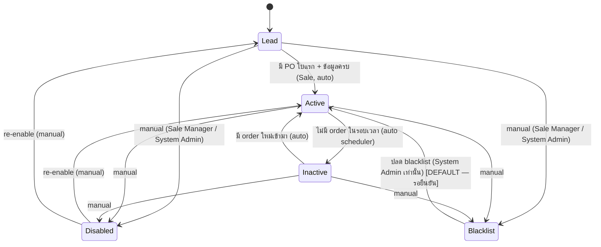
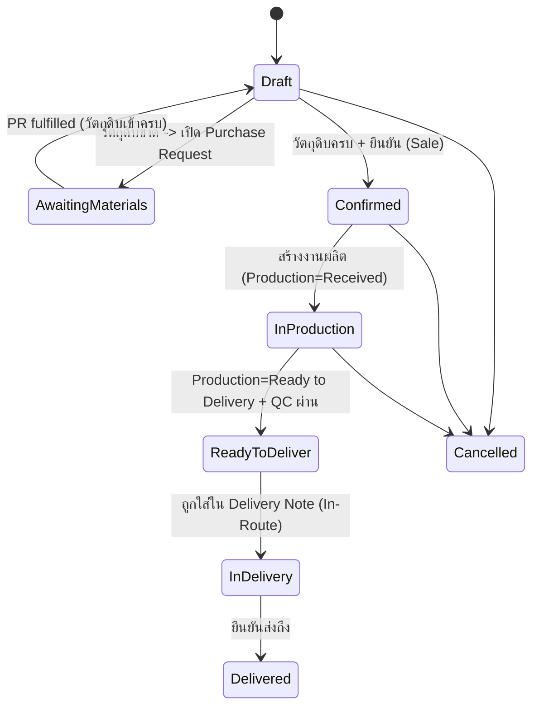
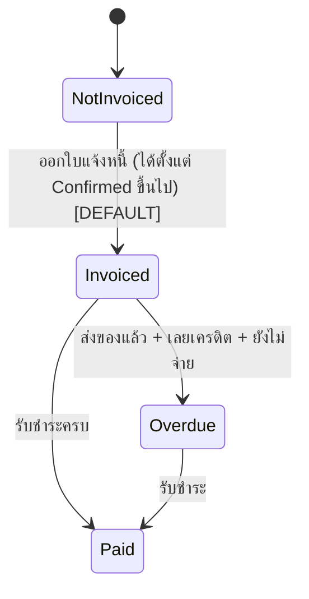
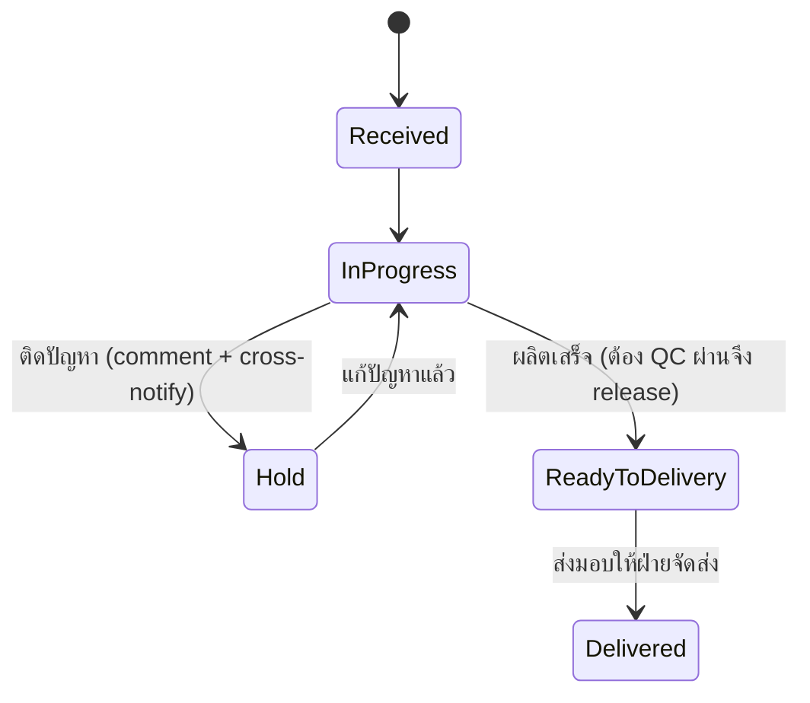
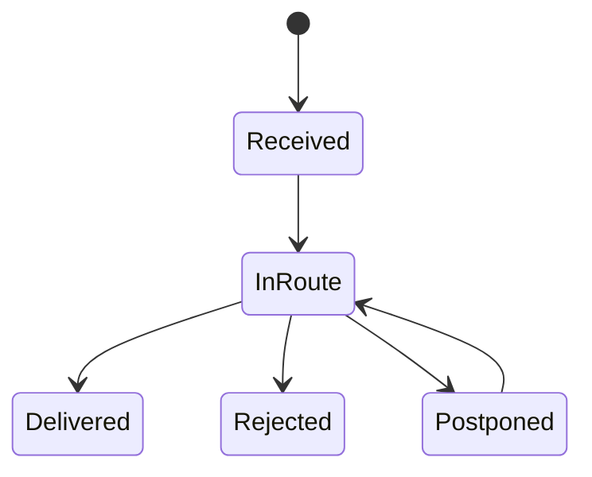
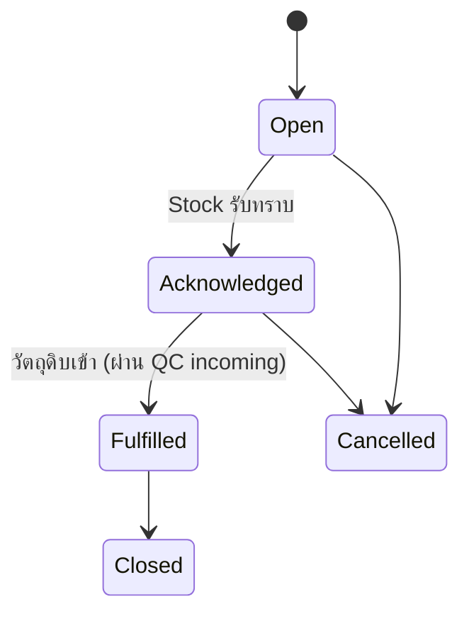
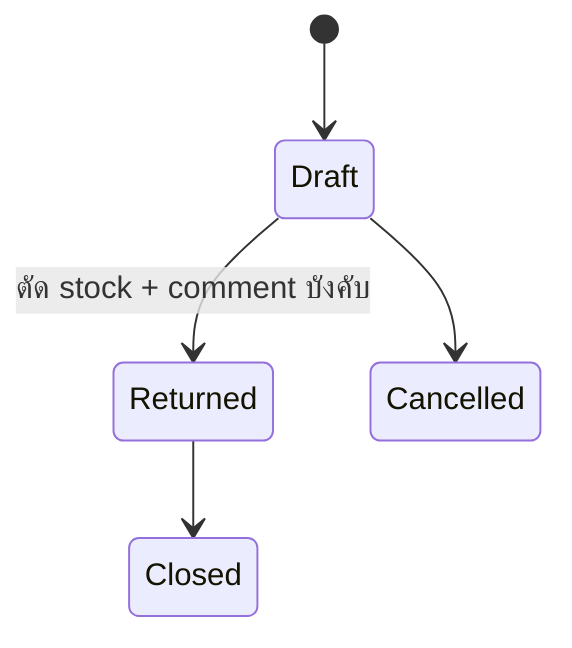

# Status Journeys — ERP v2 (UI-First Rebuild)

slug: `erp-v2-ui-first` · เขียนโดย PO (design phase) เพื่อให้ UX/UI ทำ mockup ทุกสถานะ และ BA แตก story ต่อ
ที่มา requirement: `docs/requirements/erp-v2-ui-first/pond-gate1-feedback.md` (Gate 1 รอบ 1, 2026-07-08)

## สรุปภาษาไทย
เอกสารนี้คือ "แผนที่สถานะ" ของทั้งระบบตามคำสั่งเน้นของปอนด์: **ทุกสถานะต้องต่อเนื่องกันข้าม module ห้ามหลุด journey** ครอบคลุม 7 สาย — Customer, PO (แยก 2 ราง: การผลิต/จัดส่ง กับ การวางบิล), Production, Shipping/Delivery Note, Purchase Request, Return, Invoice/Payment — แต่ละสายมี diagram, กติกาการเปลี่ยนสถานะ, ใครมีสิทธิ์เปลี่ยน, จุดที่ comment/trace บังคับ และ "สะกิดข้าม module" (เช่น PO Confirmed → สร้างงานผลิต, วัตถุดิบขาด → เปิด Purchase Request ไป Stock+ผลิต, ผลิตเสร็จ+QC ผ่าน → ไปโผล่หน้าจัดส่ง, ส่งของแล้วยังไม่จ่าย → overdue) ตาราง cross-module ท้ายเอกสารคือหัวใจที่ต้องไม่หลุด

**หลักการร่วม (ใช้ทุกสาย):**
1. **ทุกการเปลี่ยนสถานะมี trace เสมอ** — ใคร / จากสถานะอะไร → เป็นอะไร / เมื่อไหร่ / เหตุผล (ห้ามเปลี่ยนแบบไม่มีร่องรอย)
2. **comment ได้ทุกสถานะ** และ **บังคับ comment** ในจุดที่ระบุ (manual disable/blacklist, return, hold, override, cross-notify)
3. **สถานะข้าม module ต้อง reconcile กัน** — สถานะ "แม่" (PO) ต้องสะท้อนสถานะ "ลูก" (production/shipping/invoice) และเห็นได้จากทุกหน้าที่เกี่ยวข้อง
4. สถานะที่คำนวณอัตโนมัติ (Active/Inactive, Potential Delay, Overdue) มี **scheduler/rule** กำกับ และแสดง badge ให้ผู้ใช้เข้าใจว่าทำไม
5. **Minimize clicks (คำสั่งปอนด์):** การเปลี่ยนสถานะ + ใส่ comment ต้องทำได้ **inline คลิกน้อยสุด** ไม่พาผู้ใช้ออกหลายหน้า — ผู้ใช้ routine ถ้าเปลี่ยนสถานะแล้วต้องกดหลายจอจะเลิกใช้ (ดู brief §2.1 / BKV-1)
6. **สถานะต้องอ่านออกด้วยภาษาคน** — ใช้ป้าย/สีสื่อความหมาย ห้ามโชว์ enum ดิบ

> หมายเหตุ: จุดที่ยังต้องยืนยันกับปอนด์ ติดป้าย **[DEFAULT — รอยืนยัน]** ไว้ พร้อมตั้งค่าเริ่มต้นที่สมเหตุสมผล เพื่อไม่ block UX/UI
> ⚠ **Gate 1 รอบ 2 = การเสนองานจริงครั้งเดียว ต้องเนี๊ยบที่สุด** — mockup ทุกสถานะ/ทุก transition ในเอกสารนี้ต้องครบ ห้ามครึ่งๆ กลางๆ

---

## 1. Customer Lifecycle
สถานะ: `Lead` → `Active` ↔ `Inactive` → `Disabled` / `Blacklist`

| Transition | ทริกเกอร์ | ใครเปลี่ยนได้ | comment | สะกิดข้าม module |
|---|---|---|---|---|
| Lead → Active | สร้าง PO ใบแรกสำเร็จ + ข้อมูลลูกค้าครบ | ระบบ (auto) จาก action ของ Sale | optional (logged) | ขึ้น Sale Dashboard เป็นลูกค้า active |
| Active → Inactive | ไม่มี order ภายในรอบเวลา (config ต่อลูกค้า: 1/3/6/8 เดือน, **default 3 เดือน**) | scheduler (auto รายวัน) | auto note | แจ้ง Sale ที่ดูแล + Sale Dashboard |
| Inactive → Active | มี order ใหม่ในรอบเวลา | scheduler/auto เมื่อสร้าง PO | auto note | Sale Dashboard |
| any → Disabled | ผู้ใช้กด disable | Sale Manager / System Admin | **บังคับ** | ซ่อนจากรายการสั่งซื้อปกติ |
| any → Blacklist | ลูกค้ามีปัญหา | Sale Manager / System Admin | **บังคับ** | เตือนเมื่อพยายามเปิด PO ให้ลูกค้ารายนี้ |
| Disabled/Blacklist → กลับมา | ปลดสถานะ | Disabled: Sale Manager/Admin · Blacklist: Admin [DEFAULT] | **บังคับ** | Sale Dashboard |

**ข้อมูล/หน้าที่ผูกกับสถานะ:** contact ไม่จำกัดต่อลูกค้า · comment/note timeline (ประวัติการจัดการ) · sale ที่ดูแล (reassign โดย Sale Manager/Admin) · ประวัติ PO ทั้งหมด · search ลูกค้าด้วยเลข PO / วันที่สั่งซื้อ · ทุกสถานะไปแสดงบน Sale Dashboard

---

## 2. PO Lifecycle (2 รางขนานกัน — reconcile กัน)
ปอนด์: "ออกใบแจ้งหนี้ได้ตลอดเวลา แต่ต้องเห็น status PO เสมอ" → แยก **ราง Fulfilment** (ผลิต→ส่ง) ออกจาก **ราง Billing** (วางบิล→จ่าย) แล้วแสดงคู่กันในหน้า Invoice และทุกหน้าที่อ้าง PO

### 2A. Fulfilment track

> **[DEFAULT — รอยืนยัน]** เมื่อวัตถุดิบขาด: **ไม่ block ทิ้ง** แต่บันทึก PO เป็น `AwaitingMaterials` ผูกกับ Purchase Request เพื่อรักษาความต่อเนื่อง (ทางเลือกอื่น: block ไม่ให้ save เลย — ดูคำถามข้อ 1)

### 2B. Billing track

| Transition | ทริกเกอร์ | ใครเปลี่ยนได้ | comment/trace | สะกิดข้าม module |
|---|---|---|---|---|
| Draft → AwaitingMaterials | add-product เจอวัตถุดิบไม่พอ | ระบบ | auto (ระบุว่าขาดตัวไหน) | **เปิด Purchase Request → Stock + Production Dashboard** |
| AwaitingMaterials → Draft/Confirmed | PR ปิด (ของเข้า) | ระบบ/Sale | trace | ปลดบล็อก PO |
| Draft → Confirmed | ยืนยัน PO | Sale | trace | **สร้างงานผลิต Production=Received** |
| InProduction → ReadyToDeliver | ผลิตเสร็จ + QC ผ่าน | ระบบ (จาก Production) | trace | **โผล่หน้า Shipping** |
| InDelivery → Delivered | Delivery Note ยืนยันส่ง | Shipping | trace | เริ่มนับ overdue (ราง Billing) |
| NotInvoiced → Invoiced | ออกใบแจ้งหนี้ | Finance/Sale | trace + versioning | หน้า Invoice โชว์ PO fulfilment stage |
| Invoiced → Overdue | delivered + เลยเครดิต ยังไม่จ่าย | scheduler | auto | **แจ้งเตือน Finance (+ Sale ที่ดูแล) [DEFAULT]** |

**หน้า PO/Invoice ต้องแสดงพร้อมกัน:** ราคา, VAT, sale ที่ดูแล, สถานะ fulfilment, สถานะ billing, ประวัติ trace. ขายได้ทั้งสินค้า BOM และวัตถุดิบตรง; ราคา default = ราคาขายใน BOM/ราคาขายวัตถุดิบ แต่แก้ได้

---

## 3. Production Lifecycle
สถานะ: `Received` → `In-Progress` → `Hold` → `Ready to Delivery` → `Delivered` + overlay `Potential Delay`

- **Potential Delay** = overlay badge (ไม่ใช่ state แยก): เกณฑ์ lead time = **2 วันผลิต + 1 วันส่ง**; ถ้าเวลาที่เหลือถึงวันจัดส่ง < lead time และยังไม่ Ready → ติดป้าย `Potential Delay` มิฉะนั้นปกติ
- **ทุกสถานะ comment ได้** · **Hold บังคับ comment + เลือกปลายทางแจ้ง**: ติดที่ลูกค้า → notify **Sale**; ติดที่ stock → notify **Stock**
- **ปรับสถานะได้ตลอด แต่ trace เสมอ** (ใครเปลี่ยนจากอะไรเป็นอะไร เมื่อไหร่)
- รายการเรียง/ค้นด้วย **วันจัดส่ง / PO / ลูกค้า**

| Transition | ใครเปลี่ยนได้ | comment | สะกิดข้าม module |
|---|---|---|---|
| Received (เข้ามา) | ระบบ (จาก PO Confirmed) | — | มาจาก PO |
| → Hold | Production | **บังคับ** + เลือก Sale/Stock | cross-notify Sale หรือ Stock |
| → Ready to Delivery | Production (ต้อง QC pass) | optional | **PO → ReadyToDeliver, โผล่ Shipping** |
| Potential Delay (badge) | scheduler/rule | auto | **notify Sale + Stock** |

---

## 4. Shipping / Delivery Note Lifecycle
สถานะใบจัดส่ง: `Received` → `In-Route` → `Delivered` / `Rejected` / `Postponed`
1 Delivery Note รวมได้หลาย PO → **สถานะระดับใบ vs ระดับ PO ต้อง reconcile**

**กติกา reconcile ใบ ↔ PO [DEFAULT — รอยืนยัน]:**
- แต่ละ PO ในใบมีสถานะรายบรรทัด (Delivered / Rejected / Postponed)
- สถานะ "ระดับใบ" = aggregate: ทุก PO Delivered → ใบ `Delivered`; ถ้ามีบางส่วน Rejected/Postponed → ใบ `Partially Delivered` (แสดง breakdown รายบรรทัด) และใบยังไม่ปิดจนกว่าจะเคลียร์ทุก PO
- PO ที่ `Rejected` → **[DEFAULT]** กลับไป Production=ReadyToDelivery + notify Sale (ดูคำถามข้อ 3)
- PO ที่ `Postponed` → คงอยู่ในใบ/ใบใหม่พร้อมวันใหม่
- ใส่ comment ได้ · แก้สถานะได้ตลอด · **trace เสมอ**

| Transition | ทริกเกอร์ | ใครเปลี่ยนได้ | สะกิดข้าม module |
|---|---|---|---|
| (สร้างใบ) | PO = ReadyToDeliver + QC ผ่าน | Shipping | ดึง PO จาก Production |
| Received → In-Route | เริ่มจัดส่ง | Shipping | PO → InDelivery |
| In-Route → Delivered | ส่งถึง | Shipping | PO → Delivered → เริ่มนับ overdue |
| In-Route → Rejected | ลูกค้าปฏิเสธ | Shipping | PO กลับ Production + notify Sale |
| In-Route → Postponed | เลื่อนส่ง | Shipping | คงสถานะ + วันใหม่ |

---

## 5. Purchase Request Flow
เกิดเมื่อ: เปิด PO แล้ววัตถุดิบขาด → ระบบสร้าง PR ส่งไป **Stock** และไปโชว์บน **Production Dashboard**

| Transition | ใครเปลี่ยนได้ | comment | สะกิดข้าม module |
|---|---|---|---|
| (สร้าง) | ระบบ จาก PO material shortage | auto (ระบุวัตถุดิบ+จำนวนขาด) | โผล่ Stock Dashboard + Production Dashboard, PO=AwaitingMaterials |
| Open → Acknowledged | Stock | optional | — |
| Acknowledged → Fulfilled | รับเข้าของครบ (QC incoming / lot receipt) | trace | **ปลดบล็อก PO (AwaitingMaterials→Draft/Confirmable)** |
| Fulfilled → Closed | ปิดคำขอ | Stock | — |
| → Cancelled | ยกเลิก | Stock/Sale | **บังคับ** — PO ยังคง AwaitingMaterials จนกว่าจะแก้ |

---

## 6. Return Flow (คืนของ supplier)
เกิดเมื่อ: รับวัตถุดิบมาแล้ว QC เจอเสียหาย → ทำใบส่งคืน

- ระบุ **เลข lot** → ระบบ auto แสดง supplier → แก้จำนวน return → **ตัด stock พร้อม comment บังคับ** (เหตุผลการ adjust stock ที่ไม่มี PO)
- ผูก lot ↔ supplier ↔ รายการ adjust stock; **trace เสมอ**

| Transition | ใครเปลี่ยนได้ | comment | สะกิดข้าม module |
|---|---|---|---|
| Draft → Returned | QC/Stock | **บังคับ** | **ตัด stock (lot)** + บันทึก adjust แบบไม่มี PO |
| Returned → Closed | Stock | optional | ปิดรายการ |

---

## 7. Invoice / Payment
- **ออกใบแจ้งหนี้ได้ตลอด** (default: ตั้งแต่ PO=Confirmed) แต่หน้า Invoice ต้อง**แสดง PO fulfilment stage เสมอ**
- **Overdue alert**: ส่งของแล้ว (PO=Delivered) + เลยเครดิต + ยังไม่จ่าย → แสดง **จำนวนวันค้าง** บน Finance Dashboard (+ Sale ที่ดูแล [DEFAULT])
- คง versioning + โครงสร้างใบกำกับภาษีไทยจาก `prototype-feedback-reference.md` / brief §5 (discount, VAT7%, ตัวหนังสือไทย, ลายเซ็น 2 ช่อง)

Billing states ดูราง 2B. Overdue = scheduler คำนวณจาก (delivery date + credit terms) [DEFAULT — รอยืนยัน]

---

## 8. ตารางความต่อเนื่องข้าม module (Cross-module continuity — หัวใจ ห้ามหลุด)

| # | เหตุการณ์ต้นทาง | ผลลัพธ์ปลายทาง (module อื่น) |
|---|---|---|
| C1 | Customer สร้าง PO ใบแรก | Customer: Lead → Active; Sale Dashboard update |
| C2 | Customer ไม่มี order ในรอบ config | Customer: Active → Inactive; แจ้ง Sale |
| C3 | PO add-product เจอวัตถุดิบขาด | สร้าง Purchase Request → Stock Dashboard **และ** Production Dashboard; PO = AwaitingMaterials |
| C4 | Purchase Request Fulfilled (ของเข้า via QC incoming) | ปลดบล็อก PO (AwaitingMaterials → Confirmable); Stock เพิ่ม (lot ใหม่ prefix supplier) |
| C5 | PO Confirmed | สร้างงานผลิต Production = Received |
| C6 | Production Hold (เหตุลูกค้า/stock) | cross-notify Sale หรือ Stock (บังคับ comment) |
| C7 | Production Potential Delay | notify Sale + Stock |
| C8 | Production Ready to Delivery + QC ผ่าน | PO → ReadyToDeliver; โผล่หน้า Shipping |
| C9 | Delivery Note = Delivered | PO → Delivered; เริ่มนับ overdue clock (Billing) |
| C10 | Delivery PO Rejected | PO กลับ Production ReadyToDelivery + notify Sale [DEFAULT] |
| C11 | Invoice Issued + Delivered + เลยเครดิต ยังไม่จ่าย | PO Billing → Overdue; แจ้ง Finance (+Sale) |
| C12 | QC incoming รับเข้า | Stock เพิ่ม (lot + supplier prefix); อาจปิด PR (C4) |
| C13 | Return Issued | Stock ลด (lot) + adjust ไม่มี PO + comment บังคับ |
| C14 | Sale reassign ลูกค้า | customer.sale เปลี่ยน; Sale Dashboard ทั้ง 2 ฝั่ง update; trace |

**เกณฑ์ตรวจ (สำหรับ UX/UI + QA):** ทุกแถวในตารางนี้ต้องมี mockup ที่แสดง "ทั้งต้นทางและปลายทาง" เห็นความต่อเนื่อง และทุก transition ต้องมี trace entry

---

## 9. Roles / Permission (RUCDA) — ผลจาก feedback

**Role ใหม่:**
- **Sale Manager** — reassign ลูกค้าให้ sale แต่ละคน, เห็นลูกค้า/ยอดของทีม, ปลด Disabled
- **Super User** — สิทธิ์ **archive traceability ลง text file** (เฉพาะ role นี้), มองเห็น trace ทุก module

**โมเดลสิทธิ์ใหม่ (หน้า Settings):**
- สิทธิ์ราย **module ตามเมนูซ้าย** × 5 ระดับ: **R**ead, **U**pdate, **C**reate, **D**elete, **A**pprove (RUCDA)
- **สร้าง Role ได้ไม่จำกัด**; User อยู่ใต้ Role; แก้ company profile ได้
- **⚠ ข้อสังเกต:** บาง capability เป็น "สิทธิ์พิเศษข้าม RUCDA" ไม่ใช่แค่ CRUD ราย module — ต้องมี capability flag แยก เช่น: reassign customer (Sale Manager), archive trace (Super User), status override/force-transition, ปลด Blacklist. RUCDA matrix อย่างเดียวไม่พอครอบคลุม → BA ต้องออกแบบ capability layer เพิ่ม (ดูคำถามข้อ 5)
- Role เดิมจาก prototype (7 roles) ยังคงอยู่เป็น seed + เพิ่ม Sale Manager, Super User

| Role (seed) | จุดเด่นสิทธิ์ |
|---|---|
| System Admin | company profile, settings, สร้าง role/permission, ปลด Blacklist |
| Super User [ใหม่] | archive trace, เห็น trace ทุก module |
| Sale Manager [ใหม่] | reassign customer, dashboard ทีม sale |
| Sale / Stock / Production / QC / Shipping / Finance | ตาม module + RUCDA ที่กำหนด |
