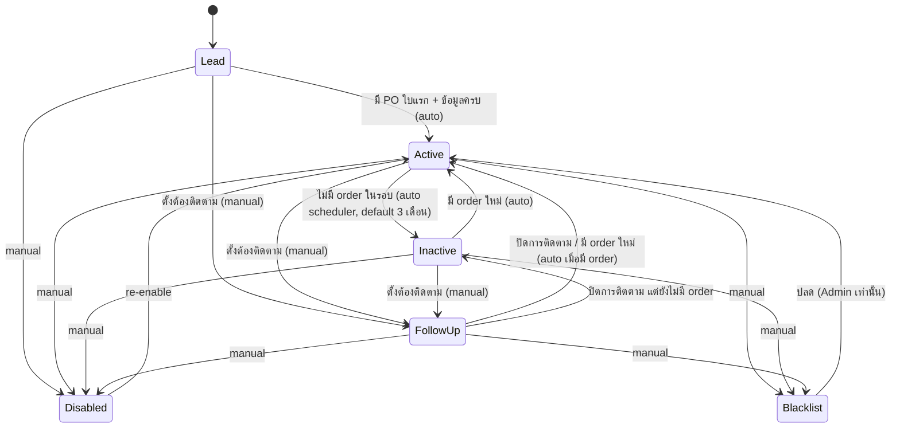
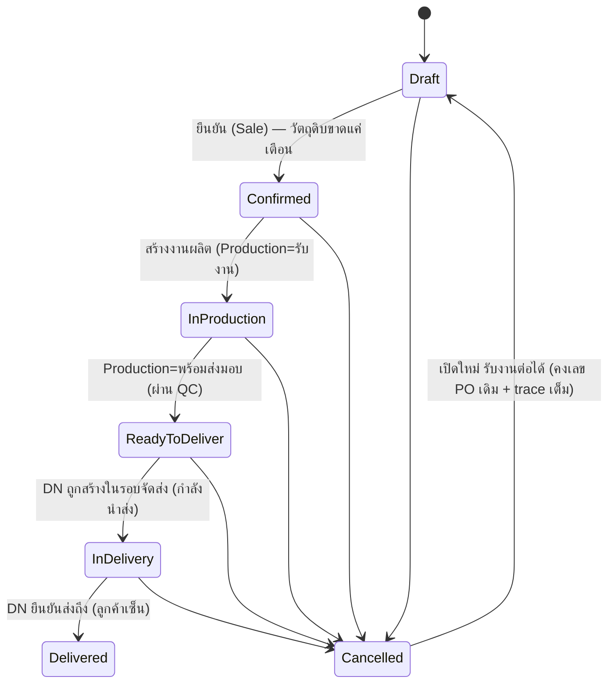
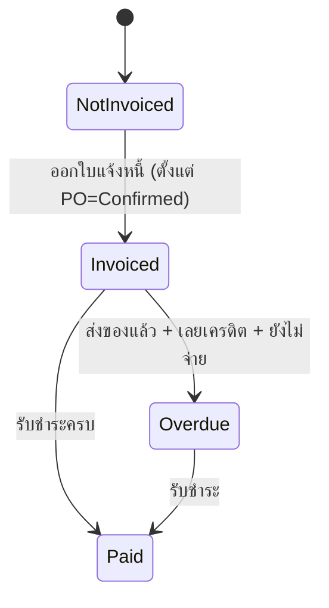
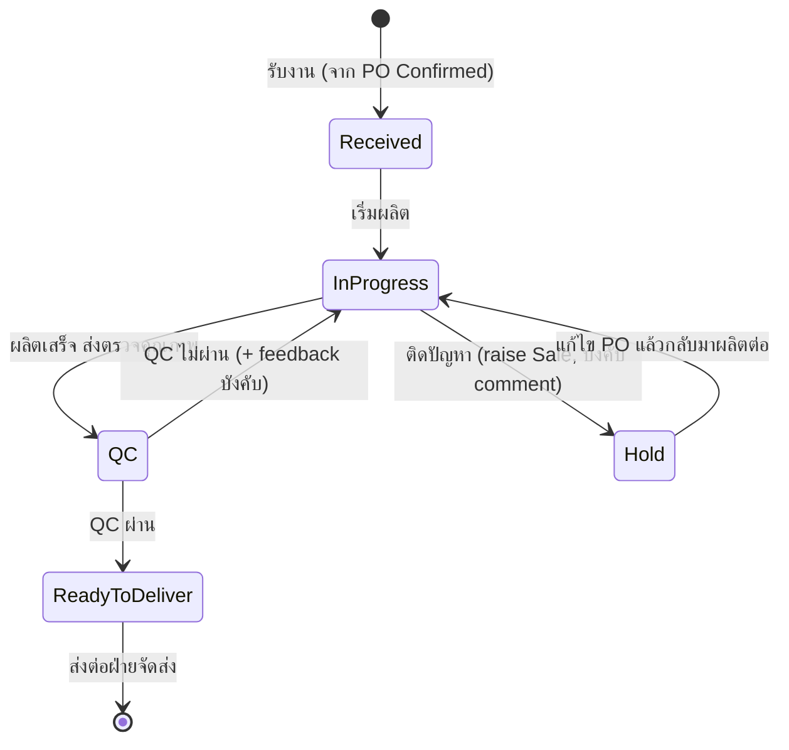
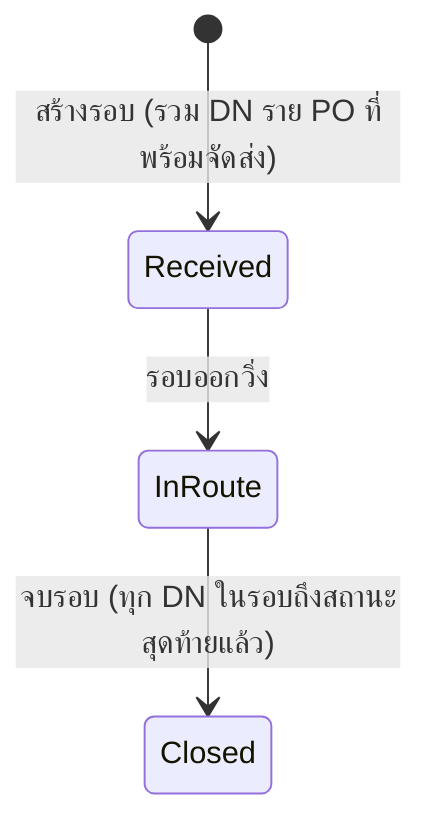
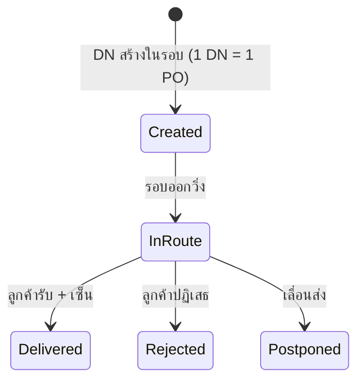
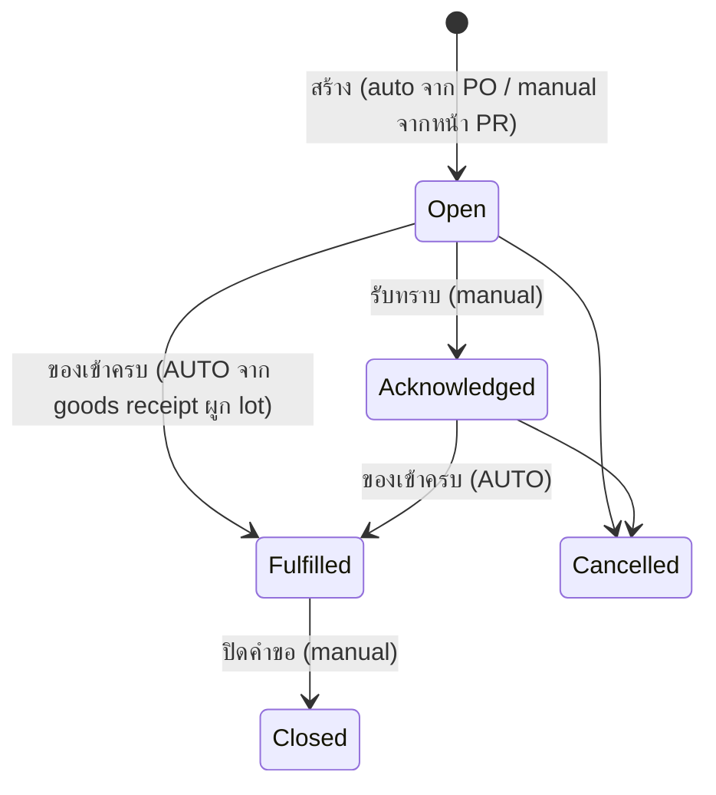
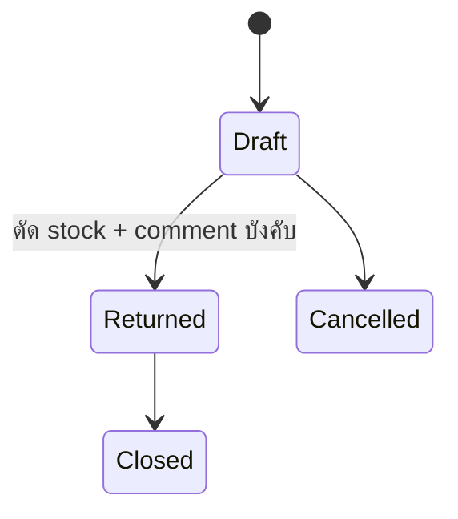

# Status Journeys — ESSENCE Hub System (ERP v2, UI-First Rebuild)

slug: `erp-v2-ui-first` · เขียนโดย PO (design phase) เพื่อให้ UX/UI ทำ mockup ทุกสถานะ และ BA/Engineer/QA ทำครบ
ที่มา: `pond-gate1-feedback.md` (ร1) + คำตอบ 6 ข้อ + `pond-gate1-r2-feedback.md` (ร2) + **คำตอบ 5 ข้อ (r2-analysis, 2026-07-08)** + Notification/deep-link

## สรุปภาษาไทย
"แผนที่สถานะ" ของทั้งระบบ — ทุกสถานะต้องต่อเนื่องข้าม module ห้ามหลุด journey. อัปเดตล่าสุดตามคำตอบปอนด์ (r2-analysis): **ลูกค้ามี 6 สถานะจริง** (เพิ่ม "ต้องติดตาม (Follow-up)" เป็นสถานะแยก) · **การจัดส่งเป็น 2 ชั้น**: **Shipment (รอบจัดส่ง)** 1 รอบรวมหลาย **DN** และ **DN 1 ใบ = 1 PO เสมอ** (ลูกค้าเซ็นรายใบ) · การผลิตจบที่ "พร้อมส่งมอบ" + QC loop + Hold→แก้ไข PO · PO cancel ได้ทุก case + reopen (คงเลขเดิม) · BOM cost = max active supplier + snapshot + badge เตือน. สรุปย่อสำหรับปอนด์: `status-summary-for-pond.md`

**หลักการร่วม (ทุกสาย):**
1. **ทุกการเปลี่ยนสถานะมี trace เสมอ** (ใคร/จากอะไร→เป็นอะไร/เมื่อไหร่/เหตุผล) — รวม cancel/reopen
2. **comment ได้ทุกสถานะ** + **บังคับ comment** ในจุดที่ระบุ (QC fail, Hold, Follow-up, disable/blacklist, return, override)
3. **สถานะข้าม module reconcile กัน** — PO (แม่) สะท้อนสถานะ production/shipping/invoice และเห็นทุกหน้าที่เกี่ยว
4. สถานะ auto (Active/Inactive, Potential Delay, Overdue, PR ของเข้าครบ) มี rule/scheduler กำกับ + badge อธิบายเหตุผล
5. **Minimize clicks** — เปลี่ยนสถานะ+comment แบบ inline, deep link พาไปหน้าทำงานต่อ (ดู §10)
6. **สถานะอ่านออกด้วยภาษาคน** — ห้ามโชว์ enum ดิบ
7. **ทุกการส่งงานข้าม module ยิง Notification/Inbox + deep link** (§10)

> ⚠ เอกสารชุดนี้เป็น input ของ BA/Engineer/QA — ต้องละเอียดพอให้ทำครบ. คำถาม flow ทั้ง 5 ข้อ **ปอนด์ตอบครบแล้ว** (ดู §12) — ไม่มี [ถามปอนด์] ค้าง

---

## 1. Customer Lifecycle — 6 สถานะ (คำตอบปอนด์: "ต้องติดตาม" = สถานะแยกจริง)
สถานะ: `Lead` → `Active` ↔ `Inactive` · `Follow-up (ต้องติดตาม)` · `Disabled` · `Blacklist`
**"ต้องติดตาม (Follow-up)" = สถานะที่ 6 แยกจริง** (mutually exclusive กับ Active/Inactive) — ตั้งโดย **Sale / Sale Manager** พร้อม **comment (บังคับ)** ว่าติดตามเรื่องอะไร; โผล่ **tile "ต้องติดตาม" ใน Sale Dashboard**

| Transition | ทริกเกอร์ | ใครเปลี่ยนได้ | comment | สะกิดข้าม module |
|---|---|---|---|---|
| Lead → Active | PO ใบแรก + ข้อมูลครบ | ระบบ (auto) | optional | Sale Dashboard |
| Active → Inactive | ไม่มี order ในรอบ (config 1/3/6/8 ด. default 3) | scheduler | auto note | แจ้ง Sale + Dashboard |
| Inactive → Active | มี order ใหม่ | auto | auto note | Sale Dashboard |
| (Lead/Active/Inactive) → **Follow-up** | ตั้ง "ต้องติดตาม" | **Sale / Sale Manager** | **บังคับ (free text)** | tile "ต้องติดตาม" ใน Sale Dashboard |
| Follow-up → Active | ปิดติดตาม / มี order ใหม่ | Sale (manual) หรือ auto เมื่อมี order | optional | Sale Dashboard |
| Follow-up → Inactive | ปิดติดตาม ยังไม่มี order | Sale / scheduler | auto note | Sale Dashboard |
| any → Disabled/Blacklist | manual | Sale Manager/Admin | **บังคับ** | ซ่อน/เตือนตอนเปิด PO |

**Use case ผูก Follow-up ↔ การผลิต Hold (สำคัญ):** เมื่อ Production `Hold` เพราะ "ติดที่ลูกค้า" → raise ไป **Sale** (C7) → Sale สามารถตั้งลูกค้าเป็น **"ต้องติดตาม" พร้อม comment** (เช่น "รอลูกค้ายืนยันสูตร") — ลูกค้ากลับเป็น Active เมื่อจัดการจบ/มี order ใหม่
**ผูกกับหน้า:** contact ไม่จำกัด · note/comment timeline · sale ที่ดูแล (reassign) · ประวัติ PO · search ลูกค้าด้วย PO/วันที่

---

## 2. PO Lifecycle (2 ราง — reconcile กัน) + Cancel/Reopen
วัตถุดิบขาด = **WARNING ไม่บล็อก** + auto Purchase Request ไป Stock (ไม่มี Awaiting Materials)

### 2A. Fulfilment track

- **Cancel ได้ทุก case** — บังคับ comment เหตุผล
- **Cancelled → Draft (เปิดใหม่):** **คงเลข PO เดิมไว้** (คำตอบปอนด์) + บันทึก lifecycle event (cancelled→reopened) ใน trace/versioning เพื่อไม่ให้เลขเอกสารกระโดด — เลขที่ PO ไม่เปลี่ยน

### 2B. Billing track

**หน้า PO — เพิ่มตามรอบ2:** search ด้วย **วันที่สร้าง / วันที่จัดส่งจริง / วันที่ต้องการรับสินค้า** (3 แบบ) · เพิ่มสินค้า (BOM/วัตถุดิบ) **แก้จำนวน+ราคา/หน่วยได้เสมอ ราคา = 0 ได้** · แสดง 2 ราง + sale ที่ดูแล + trace

---

## 3. Production Lifecycle (จบที่ "พร้อมส่งมอบ")
สถานะ: `รับงาน (Received)` → `กำลังผลิต (In Progress)` → `ตรวจคุณภาพ (QC)` → `พร้อมส่งมอบ (Ready to Deliver)` + `พักงาน (Hold)` + overlay `เสี่ยงล่าช้า (Potential Delay)`
**"ส่งมอบแล้ว (Delivered)" ไม่อยู่ในหน้าผลิต** — เป็นของฝ่ายจัดส่ง

- **Normal:** รับงาน → กำลังผลิต → QC → พร้อมส่งมอบ
- **QC ไม่ผ่าน:** QC → กลับ กำลังผลิต **พร้อม feedback (บังคับ comment)**
- **Hold:** กำลังผลิต → Hold → **แก้ไข PO** → กำลังผลิต → QC → พร้อมส่งมอบ; Hold **raise ไปที่ Sale** (บังคับ comment)
  - **"แก้ไข PO" ในเคส Hold (คำตอบปอนด์):** **Sale แก้ได้ทั้งหมด** (จำนวน / สินค้า / ราคา / วันส่ง) ผ่านหน้า PO — **ทุกช่องที่แก้มี trace** ว่าใครแก้อะไรจากอะไรเป็นอะไร; ผลิตกลับมาต่อหลังแก้เสร็จ
- **Potential Delay** = overlay badge: เกณฑ์ 2 วันผลิต + 1 วันส่ง (ไม่ใช่ state แยก)
- ปรับสถานะได้ตลอด **แต่ trace เสมอ** · เรียง/ค้นด้วย วันจัดส่ง/PO/ลูกค้า

| Transition | ใครเปลี่ยน | comment | สะกิดข้าม module |
|---|---|---|---|
| Received (เข้ามา) | ระบบ (PO Confirmed) | — | มาจาก PO |
| → QC | Production | optional | — |
| QC ผ่าน → ReadyToDeliver | QC | optional | **PO → พร้อมจัดส่ง, โผล่หน้าจัดส่ง** |
| QC ไม่ผ่าน → InProgress | QC | **บังคับ (feedback)** | กลับสายผลิต |
| → Hold | Production | **บังคับ** | **raise Sale** (Sale อาจตั้งลูกค้า Follow-up) |
| Hold → InProgress | Sale แก้ PO เสร็จ | trace ทุกช่อง | Sale ↔ Production |

---

## 4. Shipping (2 ชั้น: Shipment รอบ → DN ราย PO) — คำตอบปอนด์
โครงสร้างใหม่ 2 ชั้น:
- **Shipment (รอบจัดส่ง)** = 1 รอบการนำส่ง **รวมได้หลาย DN** — สถานะระดับรอบ: `รับเข้ารอบ (Received)` → `กำลังนำส่ง (In-Route)` → `จบรอบ (Closed)`
- **DN (ใบจัดส่ง) = 1 ใบต่อ 1 PO เสมอ** (ลูกค้าเซ็นรายใบ, print ทีละใบ) — สถานะระดับ DN (ราย order): `กำลังนำส่ง (In-Route)` → `ส่งถึงแล้ว (Delivered)` / `ปฏิเสธ (Rejected)` / `เลื่อนส่ง (Postponed)`

**หน้าการจัดส่ง (Shipping)** = ที่ **สร้างรอบจัดส่ง (Shipment)**: เลือก **PO สถานะ "พร้อมจัดส่ง"** (search มองเห็นได้ทั้งหมด, ค้นด้วย **PO ID หรือข้อมูลลูกค้า** = ชื่อ/นามสกุล/ชื่อบริษัท/เบอร์ contact/ชื่อ contact) → ระบบ **สร้าง DN ราย PO (1 DN/PO)** แล้วรวมเป็น 1 รอบ · เป็น**คิวจัดส่ง** ที่เห็น PO รอส่ง (รวม PO ที่ Postpone)
**หน้าใบจัดส่ง (Delivery Note)** = DN ราย PO **print ได้ทีละใบ ให้ลูกค้าเซ็น**

### 4A. Shipment (รอบจัดส่ง)

### 4B. DN (1 ใบ = 1 PO)

**กติกา reconcile รอบ ↔ DN ↔ PO:**
- **รอบ (Shipment) จบ (Closed) เมื่อ DN ทุกใบในรอบ ถึงสถานะสุดท้าย** (Delivered / Rejected / Postponed จัดการแล้ว)
- **DN Delivered → PO = Delivered** (เริ่มนับ overdue)
- **DN Rejected → PO กลับ "พร้อมจัดส่ง" + raise ไปที่ Sale** (Sale ตัดสินใจ ติดต่อลูกค้า/ยกเลิก) — PO กลับเข้าคิวจัดส่งเพื่อสร้าง DN ใหม่ในรอบถัดไป
- **DN Postponed → PO = "พร้อมจัดส่ง" + flag "กันจัดส่ง Postpone" พร้อมวันที่** (flag อยู่ระดับ PO/DN) — **ค้างในคิวจัดส่ง** เพื่อให้ฝ่ายจัดส่งรู้ว่ามี PO เลื่อน แล้วสร้าง DN ใหม่ในรอบถัดไปตามวันที่
- print DN ราย PO สำหรับลูกค้าเซ็น · comment ได้ · trace ทุกระดับ (รอบ + DN)

| Transition | ระดับ | ใครเปลี่ยน | สะกิดข้าม module |
|---|---|---|---|
| สร้างรอบ + DN ราย PO | Shipment/DN | Shipping (เลือก PO พร้อมจัดส่ง) | ดึง PO จาก Production (พร้อมส่งมอบ) |
| รอบ Received → In-Route | Shipment | Shipping | DN ทุกใบ → กำลังนำส่ง; PO → กำลังนำส่ง |
| DN In-Route → Delivered | DN | Shipping | PO → Delivered → เริ่มนับ overdue |
| DN In-Route → Rejected | DN | Shipping | PO กลับ พร้อมจัดส่ง + **raise Sale** |
| DN In-Route → Postponed | DN | Shipping | PO = พร้อมจัดส่ง + flag Postpone(+วันที่) ค้างคิว |
| รอบ → Closed | Shipment | ระบบ/Shipping | เมื่อ DN ทุกใบในรอบจบ |

---

## 5. Purchase Request Flow
เกิดได้ 2 ทาง: **(ก) auto จาก PO วัตถุดิบขาด** หรือ **(ข) user สร้างตรงจากหน้า PR เอง**

| สถานะ/Transition | ใครเปลี่ยน | หมายเหตุ |
|---|---|---|
| สร้าง (Open) | ระบบ (จาก PO) หรือ Stock (manual หน้า PR) | ระบุวัตถุดิบ+จำนวน; โผล่ Stock + Production Dashboard |
| รับทราบ (Acknowledged) | Stock | **manual** |
| ของเข้าครบ (Fulfilled) | ระบบ | **AUTO** จากการทำ Goods Receipt ใน stock (ผูก lot) |
| ปิดคำขอ (Closed) | Stock | **manual** |
| ยกเลิก (Cancelled) | Stock/Sale | บังคับ comment |

> Goods Receipt หน้า stock **อ้างอิงเลข PR ได้ (search PR)** → รับครบ **ปิด/เปลี่ยน PR เป็น "ของเข้าครบ" อัตโนมัติ** พร้อมเหตุผลว่ารับจาก lot ไหน

---

## 6. Return Flow (คืนของ supplier)

- ระบุ lot → auto แสดง supplier → แก้จำนวน return → **ตัด stock + comment บังคับ** · trace เสมอ

---

## 7. Invoice / Payment
- ออกใบแจ้งหนี้ได้ตั้งแต่ **PO = Confirmed** แต่แสดง PO fulfilment stage เสมอ
- Overdue: ส่งของแล้ว + เลยเครดิต + ยังไม่จ่าย → โชว์จำนวนวันค้าง (Finance Dashboard + Sale)
- คง versioning + ใบกำกับภาษีไทย (issuer จาก settings, เลขผู้เสียภาษี, VAT7% + effective date, discount, ตัวหนังสือไทย, ลายเซ็น 2 ช่อง)

---

## 8. ตารางความต่อเนื่องข้าม module (Cross-module continuity — หัวใจ)

| # | เหตุการณ์ต้นทาง | ผลลัพธ์ปลายทาง |
|---|---|---|
| C1 | Customer สร้าง PO ใบแรก | Lead → Active; Sale Dashboard |
| C2 | Customer ไม่มี order ในรอบ | Active → Inactive; แจ้ง Sale |
| C2b | Sale ตั้ง "ต้องติดตาม" (สถานะที่ 6) | Customer → Follow-up + comment; tile ต้องติดตาม (Sale Dashboard) |
| C3 | PO วัตถุดิบขาด | WARNING (ไม่บล็อก) + สร้าง PR → Stock + Production Dashboard |
| C4 | Goods Receipt รับของครบ (ผูก lot) | PR → "ของเข้าครบ" อัตโนมัติ; Stock เพิ่ม (lot prefix supplier) |
| C5 | PO Confirmed | Production = รับงาน |
| C6 | Production QC ไม่ผ่าน | กลับ กำลังผลิต + feedback |
| C7 | Production Hold (ติดที่ลูกค้า) | raise Sale → Sale อาจตั้งลูกค้า Follow-up (C2b) + แก้ไข PO |
| C7b | Production Potential Delay | notify Sale + Stock |
| C8 | Production พร้อมส่งมอบ (QC ผ่าน) | PO → พร้อมจัดส่ง; โผล่คิวจัดส่ง (พร้อมสร้าง DN ในรอบ) |
| C9 | DN Delivered (ลูกค้าเซ็น) | PO → Delivered; เริ่มนับ overdue |
| C10 | DN Rejected | PO กลับ พร้อมจัดส่ง + raise Sale; รอสร้าง DN รอบใหม่ |
| C10b | DN Postponed | PO = พร้อมจัดส่ง + flag Postpone(+วันที่) ค้างคิว; สร้าง DN รอบถัดไป |
| C10c | Shipment รอบ Closed | เมื่อ DN ทุกใบในรอบถึงสถานะสุดท้าย |
| C11 | Invoice Overdue | แจ้ง Finance (+Sale) |
| C12 | Return Issued | Stock ลด (lot) + adjust ไม่มี PO + comment |
| C13 | PO Cancelled → Draft (reopen, คงเลขเดิม) | รับงานต่อได้; trace lifecycle เต็ม |
| C14 | Sale reassign ลูกค้า | customer.sale เปลี่ยน; Dashboard 2 ฝั่ง + trace |

**เกณฑ์ตรวจ (UX/UI + QA):** ทุกแถวต้องมี mockup แสดงต้นทาง+ปลายทาง + trace + ยิง Notification (§10)

---

## 9. Roles / Permission (RUCDAA)
- สิทธิ์ราย module × 6 ระดับ: **R**ead, **U**pdate, **C**reate, **D**elete, **A**pprove, **A**dmin (RUCDAA) — bit "Admin" = special capabilities (reassign customer, archive trace, ปลด Blacklist, force override, cancel/reopen PO)
- สร้าง role ไม่จำกัด; user อยู่ใต้ role; company profile ใน settings
- Role ใหม่: **Sale Manager** (reassign, dashboard ทีม, ตั้ง Follow-up), **Super User** (archive trace)
- **Read bit** = เห็น module + ได้รับ Notification ของ module นั้น (§10)

---

## 10. Notification / Inbox + Deep link
- **bell มุมบนขวา** → badge รวม → กด expand เป็นรายการ → **กดแต่ละรายการ = deep link ไปหน้าทำงานต่อ + acknowledge** (นับ badge ราย user)
- ผู้รับ = ผู้มีสิทธิ์ **Read** ของ module ปลายทาง · (เสริม) badge ราย module บนเมนูซ้าย

| อ้าง §8 | เหตุการณ์ | Noti เข้า module | Role ที่เห็น (Read) | Deep link |
|---|---|---|---|---|
| C2b | ต้องติดตาม | Customer/Sale | Sale(เจ้าของ), Sale Manager | Customer detail |
| C3 | PR (วัตถุดิบขาด) | Stock + Production | Read Stock/Production | Purchase Request detail |
| C4 | ของเข้าครบ (auto) | Production + Stock | Read Production/Stock | Production order / PR ที่ปิด |
| C5 | PO Confirmed | Production | Read Production | Production order (คิว) |
| C6 | QC ไม่ผ่าน | Production | Read Production | Production order (feedback) |
| C7 | Hold (raise Sale) | Sale | Read Sale | PO detail (แก้ไข PO) |
| C7b | เสี่ยงล่าช้า | Sale + Stock | Read Sale/Stock | Production order |
| C8 | พร้อมส่งมอบ | Shipping | Read Shipping | หน้าจัดส่ง (สร้างรอบ/DN) |
| C9 | DN Delivered | Finance + Sale | Read Finance/Sale | Invoice/PO billing |
| C10 | DN Rejected | Sale | Read Sale, Sale Manager | PO detail (ตัดสินใจ) |
| C10b | DN Postponed | Shipping | Read Shipping | คิวจัดส่ง (PO flag Postpone) |
| C11 | Overdue | Finance + Sale | Read Finance/Sale | Invoice detail |
| C12 | Return | Stock | Read Stock | Return/stock adjust |
| C13 | PO reopen | Production/Sale | Read Production/Sale | PO detail |
| C14 | reassign | Sale (เดิม+ใหม่) | sale เดิม/ใหม่, Sale Manager | Customer detail |

---

## 11. BOM Cost Rule
- **ราคาทุน = ราคารับซื้อ "สูงสุด" ของ supplier ที่ active เท่านั้น** (ไม่นับ supplier inactive) คำนวณ ณ ตอนสร้าง/แก้สูตร
- **user แก้ทับได้** (override)
- **เมื่อบันทึกสูตร → snapshot ราคาทุนไว้ ไม่คำนวณใหม่อัตโนมัติ** แม้ราคา supplier เปลี่ยนภายหลัง — จนกว่าจะเปิดแก้แล้ว save ใหม่
- **มี badge เตือน "ราคาทุนอาจล้าสมัย"** เมื่อราคา active supplier ปัจจุบันต่างจาก snapshot (คำตอบปอนด์)
- **ราคาขายใน BOM = mandatory**

---

## 12. คำถามถึงปอนด์ — ตอบครบแล้ว (r2-analysis, 2026-07-08)
1. **"ต้องติดตาม"** → **สถานะที่ 6 แยกจริง** (ดู §1) ✅
2. **PO cancel → reopen** → **คงเลข PO เดิม** + trace lifecycle (ดู §2A) ✅
3. **"แก้ไข PO" ใน Hold** → **Sale แก้ได้ทั้งหมด** (จำนวน/สินค้า/ราคา/วันส่ง) + trace ทุกช่อง (ดู §3) ✅
4. **BOM snapshot** → ใช้ snapshot จนกว่า save ใหม่ + **มี badge เตือนราคาล้าสมัย** (ดู §11) ✅
5. **ใบจัดส่ง** → **2 ชั้น: Shipment (รอบ) รวมหลาย DN / DN 1 ใบ = 1 PO** (ลูกค้าเซ็นรายใบ) (ดู §4) ✅
