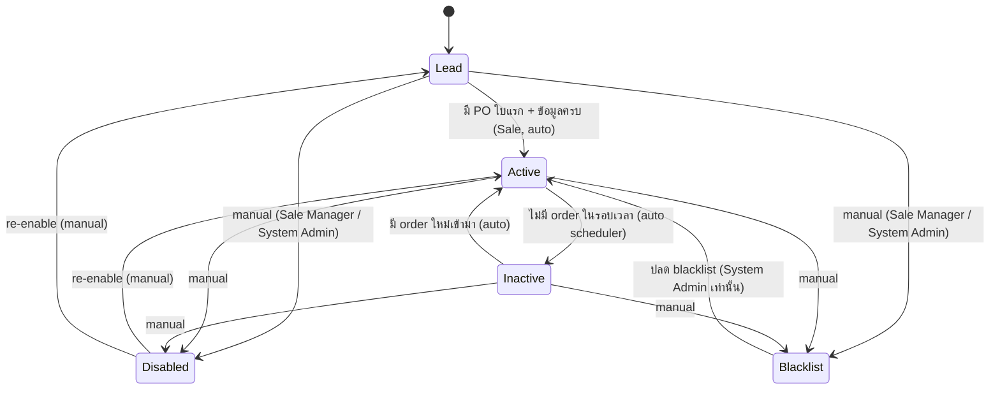
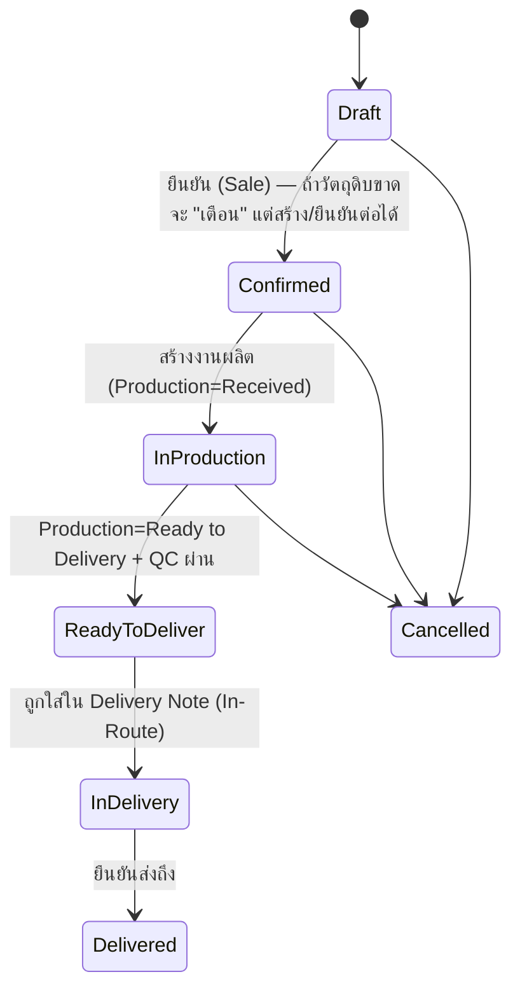
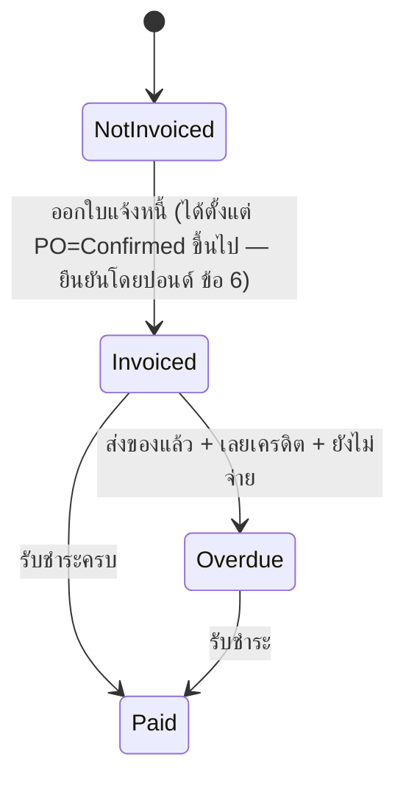
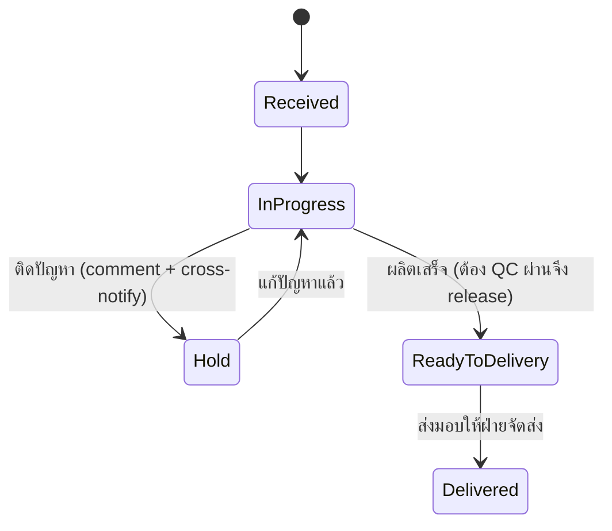
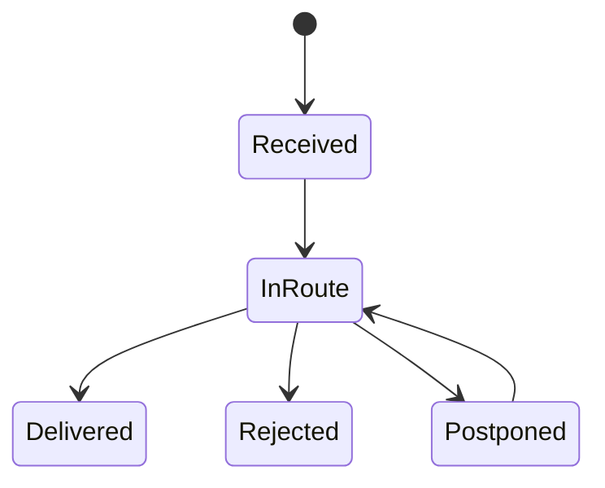
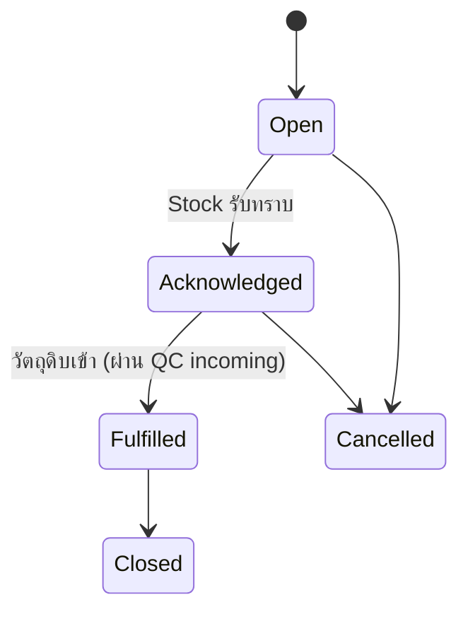
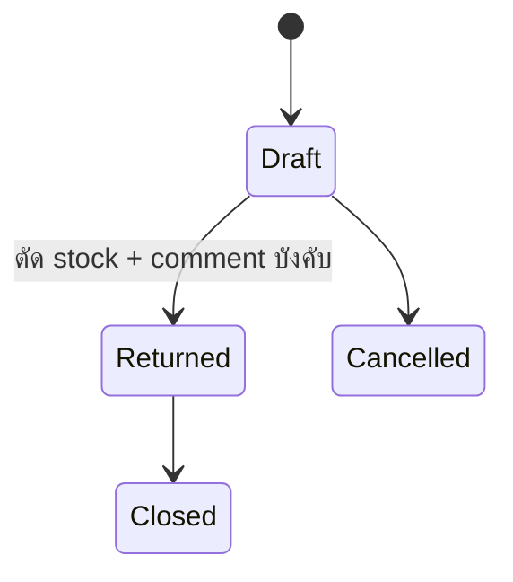

# Status Journeys — ESSENCE Hub System (ERP v2, UI-First Rebuild)

slug: `erp-v2-ui-first` · เขียนโดย PO (design phase) เพื่อให้ UX/UI ทำ mockup ทุกสถานะ และ BA แตก story ต่อ
ที่มา requirement: `docs/requirements/erp-v2-ui-first/pond-gate1-feedback.md` (Gate 1 รอบ 1, 2026-07-08) + คำตอบยืนยันของปอนด์ 6 ข้อ (2026-07-08) + requirement Notification/Inbox + deep-link (2026-07-08)

## สรุปภาษาไทย
เอกสารนี้คือ "แผนที่สถานะ" ของทั้งระบบตามคำสั่งเน้นของปอนด์: **ทุกสถานะต้องต่อเนื่องกันข้าม module ห้ามหลุด journey** ครอบคลุม 7 สาย — Customer, PO (แยก 2 ราง: การผลิต/จัดส่ง กับ การวางบิล), Production, Shipping/Delivery Note, Purchase Request, Return, Invoice/Payment — แต่ละสายมี diagram, กติกาการเปลี่ยนสถานะ, ใครมีสิทธิ์เปลี่ยน, จุดที่ comment/trace บังคับ และ "สะกิดข้าม module" (เช่น PO Confirmed → สร้างงานผลิต, วัตถุดิบขาด → **เตือน + ส่ง Purchase Request ไป Stock แต่ไม่บล็อกการสร้าง PO**, ผลิตเสร็จ+QC ผ่าน → ไปโผล่หน้าจัดส่ง, ส่งของแล้วยังไม่จ่าย → overdue) ตาราง cross-module (§8) คือหัวใจ และทุกแถวยิง **Notification/Inbox** ตาม role + **deep link** (§10). สรุปสถานะฉบับย่อสำหรับปอนด์อยู่ที่ `status-summary-for-pond.md`

**หลักการร่วม (ใช้ทุกสาย):**
1. **ทุกการเปลี่ยนสถานะมี trace เสมอ** — ใคร / จากสถานะอะไร → เป็นอะไร / เมื่อไหร่ / เหตุผล (ห้ามเปลี่ยนแบบไม่มีร่องรอย)
2. **comment ได้ทุกสถานะ** และ **บังคับ comment** ในจุดที่ระบุ (manual disable/blacklist, return, hold, override, cross-notify)
3. **สถานะข้าม module ต้อง reconcile กัน** — สถานะ "แม่" (PO) ต้องสะท้อนสถานะ "ลูก" (production/shipping/invoice) และเห็นได้จากทุกหน้าที่เกี่ยวข้อง
4. สถานะที่คำนวณอัตโนมัติ (Active/Inactive, Potential Delay, Overdue) มี **scheduler/rule** กำกับ และแสดง badge ให้ผู้ใช้เข้าใจว่าทำไม
5. **Minimize clicks (คำสั่งปอนด์):** การเปลี่ยนสถานะ + ใส่ comment ต้องทำได้ **inline คลิกน้อยสุด** ไม่พาผู้ใช้ออกหลายหน้า (ดู brief §2.1 / BKV-1)
6. **สถานะต้องอ่านออกด้วยภาษาคน** — ใช้ป้าย/สีสื่อความหมาย ห้ามโชว์ enum ดิบ
7. **ทุกการส่งงานข้าม module ยิง Notification/Inbox + deep link** — ดู §10

> คำตอบปอนด์ (2026-07-08) ยืนยันทั้ง 6 ข้อแล้ว — เอกสารนี้อัปเดตให้ตรงคำตอบจริง (ไม่มี [DEFAULT] ค้างในจุดที่ถามแล้ว)
> ⚠ **Gate 1 รอบ 2 = การเสนองานจริงครั้งเดียว ต้องเนี๊ยบที่สุด** — mockup ทุกสถานะ/ทุก transition + noti ในเอกสารนี้ต้องครบ ห้ามครึ่งๆ กลางๆ

---

## 1. Customer Lifecycle
สถานะ: `Lead` → `Active` ↔ `Inactive` → `Disabled` / `Blacklist`

| Transition | ทริกเกอร์ | ใครเปลี่ยนได้ | comment | สะกิดข้าม module |
|---|---|---|---|---|
| Lead → Active | สร้าง PO ใบแรกสำเร็จ + ข้อมูลลูกค้าครบ | ระบบ (auto) จาก action ของ Sale | optional (logged) | ขึ้น Sale Dashboard เป็นลูกค้า active |
| Active → Inactive | ไม่มี order ภายในรอบเวลา (config ต่อลูกค้า: 1/3/6/8 เดือน, **default 3 เดือน**) | scheduler (auto รายวัน) | auto note | แจ้ง Sale ที่ดูแล + Sale Dashboard |
| Inactive → Active | มี order ใหม่ในรอบเวลา | scheduler/auto เมื่อสร้าง PO | auto note | Sale Dashboard |
| any → Disabled | ผู้ใช้กด disable | Sale Manager / System Admin | **บังคับ** | ซ่อนจากรายการสั่งซื้อปกติ |
| any → Blacklist | ลูกค้ามีปัญหา | Sale Manager / System Admin | **บังคับ** | เตือนเมื่อพยายามเปิด PO ให้ลูกค้ารายนี้ |
| Disabled/Blacklist → กลับมา | ปลดสถานะ | Disabled: Sale Manager/Admin · Blacklist: Admin | **บังคับ** | Sale Dashboard |

**ข้อมูล/หน้าที่ผูกกับสถานะ:** contact ไม่จำกัดต่อลูกค้า · comment/note timeline (ประวัติการจัดการ) · sale ที่ดูแล (reassign โดย Sale Manager/Admin) · ประวัติ PO ทั้งหมด · search ลูกค้าด้วยเลข PO / วันที่สั่งซื้อ · ทุกสถานะไปแสดงบน Sale Dashboard

---

## 2. PO Lifecycle (2 รางขนานกัน — reconcile กัน)
ปอนด์: "ออกใบแจ้งหนี้ได้ตลอดเวลา แต่ต้องเห็น status PO เสมอ" → แยก **ราง Fulfilment** (ผลิต→ส่ง) ออกจาก **ราง Billing** (วางบิล→จ่าย) แล้วแสดงคู่กันในหน้า Invoice และทุกหน้าที่อ้าง PO

**★ คำตอบปอนด์ (ข้อ 1): วัตถุดิบขาด "ไม่บล็อก"** — ระบบแค่ **เตือน (warning)** ให้ผู้ใช้ตัดสินใจสร้าง PO ต่อได้ตามปกติ และ **ส่ง Purchase Request ไป Stock อัตโนมัติ** → **ไม่มีสถานะ `Awaiting Materials` ในเส้นบังคับอีกต่อไป** (PO เดินหน้า Draft → Confirmed ได้เลย)

### 2A. Fulfilment track

> วัตถุดิบขาด = **warning + auto Purchase Request ไป Stock** (ดู §5) ไม่หยุด PO. Production จะรอวัตถุดิบเข้าตาม PR ก่อนเริ่มผลิตจริงได้ แต่ **สถานะ PO ไม่ถูกบล็อก**

### 2B. Billing track

| Transition | ทริกเกอร์ | ใครเปลี่ยนได้ | comment/trace | สะกิดข้าม module |
|---|---|---|---|---|
| (ตอนสร้าง/ยืนยัน) วัตถุดิบขาด | add-product เจอวัตถุดิบไม่พอ | ระบบ (warning) | auto (ระบุว่าขาดตัวไหน) | **ส่ง Purchase Request → Stock + Production Dashboard (PO ไม่ถูกบล็อก)** |
| Draft → Confirmed | ยืนยัน PO | Sale | trace | **สร้างงานผลิต Production=Received** |
| InProduction → ReadyToDeliver | ผลิตเสร็จ + QC ผ่าน | ระบบ (จาก Production) | trace | **โผล่หน้า Shipping** |
| InDelivery → Delivered | Delivery Note ยืนยันส่ง | Shipping | trace | เริ่มนับ overdue (ราง Billing) |
| NotInvoiced → Invoiced | ออกใบแจ้งหนี้ (ตั้งแต่ Confirmed) | Finance/Sale | trace + versioning | หน้า Invoice โชว์ PO fulfilment stage |
| Invoiced → Overdue | delivered + เลยเครดิต ยังไม่จ่าย | scheduler | auto | **แจ้งเตือน Finance (+ Sale ที่ดูแล)** |

**หน้า PO/Invoice ต้องแสดงพร้อมกัน:** ราคา, VAT, sale ที่ดูแล, สถานะ fulfilment, สถานะ billing, ประวัติ trace. ขายได้ทั้งสินค้า BOM และวัตถุดิบตรง; ราคา default = ราคาขายใน BOM/ราคาขายวัตถุดิบ แต่แก้ได้

---

## 3. Production Lifecycle
สถานะ: `Received` → `In-Progress` → `Hold` → `Ready to Delivery` → `Delivered` + overlay `Potential Delay`

- **Potential Delay** = overlay badge (ไม่ใช่ state แยก): เกณฑ์ lead time = **2 วันผลิต + 1 วันส่ง**; ถ้าเวลาที่เหลือถึงวันจัดส่ง < lead time และยังไม่ Ready → ติดป้าย `Potential Delay` มิฉะนั้นปกติ
- **ทุกสถานะ comment ได้** · **Hold บังคับ comment + เลือกปลายทางแจ้ง**: ติดที่ลูกค้า → notify **Sale**; ติดที่ stock → notify **Stock**
- **ปรับสถานะได้ตลอด แต่ trace เสมอ** (ใครเปลี่ยนจากอะไรเป็นอะไร เมื่อไหร่)
- รายการเรียง/ค้นด้วย **วันจัดส่ง / PO / ลูกค้า**

| Transition | ใครเปลี่ยนได้ | comment | สะกิดข้าม module |
|---|---|---|---|
| Received (เข้ามา) | ระบบ (จาก PO Confirmed) | — | มาจาก PO |
| → Hold | Production | **บังคับ** + เลือก Sale/Stock | cross-notify Sale หรือ Stock |
| → Ready to Delivery | Production (ต้อง QC pass) | optional | **PO → ReadyToDeliver, โผล่ Shipping** |
| Potential Delay (badge) | scheduler/rule | auto | **notify Sale + Stock** |

---

## 4. Shipping / Delivery Note Lifecycle
สถานะใบจัดส่ง: `Received` → `In-Route` → `Delivered` / `Rejected` / `Postponed`
1 Delivery Note รวมได้หลาย PO → **สถานะระดับใบ vs ระดับ PO ต้อง reconcile**

**กติกา reconcile ใบ ↔ PO (ยืนยันปอนด์ ข้อ 3):**
- แต่ละ PO ในใบมีสถานะรายบรรทัด (Delivered / Rejected / Postponed)
- สถานะ "ระดับใบ" = aggregate: ทุก PO Delivered → ใบ `Delivered`; ถ้ามีบางส่วน Rejected/Postponed → ใบ `Partially Delivered` (แสดง breakdown รายบรรทัด) และใบยังไม่ปิดจนกว่าจะเคลียร์ทุก PO
- **PO ที่ `Postponed` → สร้าง Delivery Note ใบใหม่ได้** สำหรับรอบส่งถัดไป (มี flow "สร้างใบใหม่จาก PO ที่เลื่อน")
- **PO ที่ `Rejected` (ยืนยันปอนด์ ข้อ 4):** กลับไป Production = `Ready to Delivery` **และแจ้ง Sale ให้ตัดสินใจ** (ติดต่อลูกค้าเพื่อส่งใหม่ / ยกเลิก) — เป็นลำดับเดียว: Rejected → Production Ready to Delivery + notify Sale → Sale ตัดสินใจ
- ใส่ comment ได้ · แก้สถานะได้ตลอด · **trace เสมอ**

| Transition | ทริกเกอร์ | ใครเปลี่ยนได้ | สะกิดข้าม module |
|---|---|---|---|
| (สร้างใบ) | PO = ReadyToDeliver + QC ผ่าน | Shipping | ดึง PO จาก Production |
| Received → In-Route | เริ่มจัดส่ง | Shipping | PO → InDelivery |
| In-Route → Delivered | ส่งถึง | Shipping | PO → Delivered → เริ่มนับ overdue |
| In-Route → Rejected | ลูกค้าปฏิเสธ | Shipping | PO กลับ Production Ready to Delivery + **notify Sale ให้ตัดสินใจ (ติดต่อ/ยกเลิก)** |
| In-Route → Postponed | เลื่อนส่ง | Shipping | PO คงค้าง + **เปิด flow สร้าง Delivery Note ใบใหม่** สำหรับรอบถัดไป |

---

## 5. Purchase Request Flow
เกิดเมื่อ: เปิด PO แล้ววัตถุดิบขาด → ระบบ **เตือน user + สร้าง PR ส่งไป Stock อัตโนมัติ** และไปโชว์บน **Production Dashboard** — **PO ไม่ถูกบล็อก** (ยืนยันปอนด์ ข้อ 1)

| Transition | ใครเปลี่ยนได้ | comment | สะกิดข้าม module |
|---|---|---|---|
| (สร้าง) | ระบบ จาก PO material shortage (warning) | auto (ระบุวัตถุดิบ+จำนวนขาด) | โผล่ Stock Dashboard + Production Dashboard · **PO เดินหน้าได้ตามปกติ ไม่บล็อก** |
| Open → Acknowledged | Stock | optional | — |
| Acknowledged → Fulfilled | รับเข้าของครบ (QC incoming / lot receipt) | trace | **Stock เพิ่ม → Production มีวัตถุดิบพอเริ่มผลิต** (PO ไม่ต้องปลดบล็อกเพราะไม่เคยถูกบล็อก) |
| Fulfilled → Closed | ปิดคำขอ | Stock | — |
| → Cancelled | ยกเลิก | Stock/Sale | **บังคับ** |

---

## 6. Return Flow (คืนของ supplier)
เกิดเมื่อ: รับวัตถุดิบมาแล้ว QC เจอเสียหาย → ทำใบส่งคืน

- ระบุ **เลข lot** → ระบบ auto แสดง supplier → แก้จำนวน return → **ตัด stock พร้อม comment บังคับ** (เหตุผลการ adjust stock ที่ไม่มี PO)
- ผูก lot ↔ supplier ↔ รายการ adjust stock; **trace เสมอ**

| Transition | ใครเปลี่ยนได้ | comment | สะกิดข้าม module |
|---|---|---|---|
| Draft → Returned | QC/Stock | **บังคับ** | **ตัด stock (lot)** + บันทึก adjust แบบไม่มี PO |
| Returned → Closed | Stock | optional | ปิดรายการ |

---

## 7. Invoice / Payment
- **ออกใบแจ้งหนี้ได้ตั้งแต่ PO = Confirmed ขึ้นไป** (ยืนยันปอนด์ ข้อ 6) แต่หน้า Invoice ต้อง**แสดง PO fulfilment stage เสมอ**
- **Overdue alert**: ส่งของแล้ว (PO=Delivered) + เลยเครดิต + ยังไม่จ่าย → แสดง **จำนวนวันค้าง** บน Finance Dashboard (+ Sale ที่ดูแล)
- คง versioning + โครงสร้างใบกำกับภาษีไทยจาก `prototype-feedback-reference.md` / brief §5 (discount, VAT7%, ตัวหนังสือไทย, ลายเซ็น 2 ช่อง)

Billing states ดูราง 2B. Overdue = scheduler คำนวณจาก (delivery date + credit terms)

---

## 8. ตารางความต่อเนื่องข้าม module (Cross-module continuity — หัวใจ ห้ามหลุด)

| # | เหตุการณ์ต้นทาง | ผลลัพธ์ปลายทาง (module อื่น) |
|---|---|---|
| C1 | Customer สร้าง PO ใบแรก | Customer: Lead → Active; Sale Dashboard update |
| C2 | Customer ไม่มี order ในรอบ config | Customer: Active → Inactive; แจ้ง Sale |
| C3 | PO add-product เจอวัตถุดิบขาด | **เตือน user (ไม่บล็อก)** + สร้าง Purchase Request → Stock Dashboard **และ** Production Dashboard; PO เดินหน้าได้ตามปกติ |
| C4 | Purchase Request Fulfilled (ของเข้า via QC incoming) | Stock เพิ่ม (lot ใหม่ prefix supplier); Production มีวัตถุดิบพอเริ่มผลิต |
| C5 | PO Confirmed | สร้างงานผลิต Production = Received |
| C6 | Production Hold (เหตุลูกค้า/stock) | cross-notify Sale หรือ Stock (บังคับ comment) |
| C7 | Production Potential Delay | notify Sale + Stock |
| C8 | Production Ready to Delivery + QC ผ่าน | PO → ReadyToDeliver; โผล่หน้า Shipping |
| C9 | Delivery Note = Delivered | PO → Delivered; เริ่มนับ overdue clock (Billing) |
| C10 | Delivery PO Rejected | PO กลับ Production Ready to Delivery + **notify Sale ให้ตัดสินใจ (ติดต่อลูกค้า/ยกเลิก)** |
| C10b | Delivery PO Postponed | เปิด flow สร้าง Delivery Note ใบใหม่สำหรับรอบถัดไป |
| C11 | Invoice Issued + Delivered + เลยเครดิต ยังไม่จ่าย | PO Billing → Overdue; แจ้ง Finance (+Sale) |
| C12 | QC incoming รับเข้า | Stock เพิ่ม (lot + supplier prefix); อาจปิด PR (C4) |
| C13 | Return Issued | Stock ลด (lot) + adjust ไม่มี PO + comment บังคับ |
| C14 | Sale reassign ลูกค้า | customer.sale เปลี่ยน; Sale Dashboard ทั้ง 2 ฝั่ง update; trace |

**เกณฑ์ตรวจ (สำหรับ UX/UI + QA):** ทุกแถวในตารางนี้ต้องมี mockup ที่แสดง "ทั้งต้นทางและปลายทาง" เห็นความต่อเนื่อง และทุก transition ต้องมี trace entry + ยิง Notification ตาม §10

---

## 9. Roles / Permission (RUCDAA) — ผลจาก feedback + คำตอบปอนด์ ข้อ 5

**★ คำตอบปอนด์ (ข้อ 5): RUCDA → RUCDAA** — เพิ่ม permission ระดับที่ 6 **"Admin"** สำหรับ special capabilities แทน capability-layer แยกที่ PO เสนอไว้เดิม

**Role ใหม่:**
- **Sale Manager** — reassign ลูกค้าให้ sale แต่ละคน, เห็นลูกค้า/ยอดของทีม, ปลด Disabled
- **Super User** — สิทธิ์ **archive traceability ลง text file**, มองเห็น trace ทุก module

**โมเดลสิทธิ์ (หน้า Settings):**
- สิทธิ์ราย **module ตามเมนูซ้าย** × **6 ระดับ: R**ead, **U**pdate, **C**reate, **D**elete, **A**pprove, **A**dmin (RUCDAA)
  - ระดับที่ 6 **Admin** = ความสามารถพิเศษของ module นั้น เช่น reassign customer, archive trace, ปลด Blacklist, force เปลี่ยนสถานะ (status override) — **ไม่ต้องมี capability layer แยกอีกต่อไป** ใช้ bit ที่ 6 นี้แทน
  - **Read bit** = ตัวกำหนดว่าใครเห็น module นั้น รวมถึง**ได้รับ Notification ของ module นั้น** (ดู §10)
- **สร้าง Role ได้ไม่จำกัด**; User อยู่ใต้ Role; แก้ company profile ได้
- Role เดิมจาก prototype (7 roles) ยังคงอยู่เป็น seed + เพิ่ม Sale Manager, Super User

| Role (seed) | จุดเด่นสิทธิ์ (ผูกกับ Admin-bit ของ module ที่เกี่ยว) |
|---|---|
| System Admin | company profile, settings, สร้าง role/permission, ปลด Blacklist (Admin bit หลาย module) |
| Super User [ใหม่] | archive trace, เห็น trace ทุก module (Admin bit ของ Traceability) |
| Sale Manager [ใหม่] | reassign customer, dashboard ทีม sale (Admin bit ของ Customer/Sale) |
| Sale / Stock / Production / QC / Shipping / Finance | ตาม module + RUCDAA ที่กำหนด |

---

## 10. Notification / Inbox (การส่งงานข้ามแผนก) — requirement ปอนด์ (2026-07-08)

**กติกาหลัก (ตามที่ปอนด์สั่ง):**
1. **ทุกการส่งงานต่อระหว่างแผนก = ทุกแถวในตาราง continuity §8** ต้องยิง **Notification** เข้า **Inbox ของ module ปลายทาง** พร้อม **badge บอกจำนวน inbox ค้าง**
2. **แยก noti ตาม role โดยยึด Read permission:** role ที่มีสิทธิ์ **Read ของ module ปลายทาง** = ได้รับ noti ของ module นั้น (ผูกกับ RUCDAA Read bit §9)
3. **Acknowledge ราย user:** กดเข้าดูรายการ = acknowledge → noti ตัวนั้นหายจาก badge ของ user คนนั้น (มี 5 alerts กด 1 เหลือ 4) — **นับต่อ user** ไม่ใช่ต่อ role (user A กดแล้ว ไม่ทำให้ badge ของ user B ที่ role เดียวกันลด)

**UI spec (ยืนยันโดยปอนด์ 2026-07-08) — ส่งให้ UX/UI:**
- ใช้ **bell icon ที่มุมบนขวา (ตัวที่มีอยู่แล้วใน mockup)** — แสดง **badge ตัวเลขรวม** ของ noti ค้างของ user (ข้ามทุก module ที่ตนมีสิทธิ์ Read)
- **กด bell → expand เป็นรายการเตือน (dropdown/panel)** เห็นแต่ละ noti: เหตุการณ์, เอกสารอ้างอิง (PO/DN/PR/Invoice no.), เวลา
- **กดแต่ละรายการ = (ก) deep link พาไปหน้า flow นั้นต่อทันที + (ข) acknowledge รายการนั้น** (badge ลด 1 ราย user)
- (เสริม) แสดง **badge ราย module บนเมนูซ้าย** ให้เห็นว่างานค้างอยู่ module ไหน — ตัวเลขเดียวกับที่รวมในกระดิ่ง

**ตาราง mapping: transition → noti เข้า module ไหน → role ที่เห็น (Read) → deep link ปลายทาง:**

| อ้าง §8 | เหตุการณ์ (ส่งงาน) | Noti เข้า module | Role ที่เห็น (Read) | Deep link ไปหน้า (flow ต่อ) |
|---|---|---|---|---|
| C1 | Customer Lead → Active | Customer / Sale | Sale (เจ้าของ), Sale Manager | หน้า Customer detail ของลูกค้ารายนั้น |
| C2 | Customer Active → Inactive | Customer / Sale | Sale (เจ้าของ), Sale Manager | หน้า Customer detail (ปุ่มติดตาม/บันทึก note) |
| C3 | วัตถุดิบขาด → Purchase Request | Stock **และ** Production | Read Stock, Read Production | หน้า Purchase Request detail |
| C4 | Purchase Request Fulfilled | Production (+ Stock) | Read Production, Read Stock | หน้า Production order ที่รอวัตถุดิบ |
| C5 | PO Confirmed → งานผลิต | Production | Read Production | หน้า Production order (คิวผลิต) ของ PO นั้น |
| C6 | Production Hold (ลูกค้า/stock) | Sale **หรือ** Stock (ตามเหตุ) | Read Sale หรือ Read Stock | หน้า Production order ที่ Hold (เห็น comment) |
| C7 | Production Potential Delay | Sale + Stock | Read Sale, Read Stock | หน้า Production order ที่ติดป้าย Delay |
| C8 | Ready to Delivery + QC ผ่าน | Shipping | Read Shipping | หน้า Shipping — PO พร้อมส่ง (สร้าง Delivery Note) |
| C9 | Delivery Note Delivered | Finance + Sale | Read Finance, Read Sale (เจ้าของ) | หน้า Invoice/PO billing ของ PO นั้น |
| C10 | Delivery PO Rejected | Sale | Read Sale (เจ้าของ), Sale Manager | หน้า PO detail (ปุ่มตัดสินใจ ส่งใหม่/ยกเลิก) |
| C10b | Delivery PO Postponed | Shipping | Read Shipping | หน้า Shipping — สร้าง Delivery Note ใบใหม่ |
| C11 | Invoice Overdue | Finance + Sale | Read Finance, Read Sale (เจ้าของ) | หน้า Invoice detail (ยอดค้าง + จำนวนวัน) |
| C12 | QC incoming รับเข้า | Stock (+ Production ถ้าปิด PR) | Read Stock, Read Production | หน้า Stock/lot ที่รับเข้า (หรือ PR ที่ปิด) |
| C13 | Return Issued | Stock | Read Stock | หน้า Return/stock adjust detail |
| C14 | Sale reassign ลูกค้า | Sale (ทั้ง sale เดิม+ใหม่) | sale เดิม, sale ใหม่, Sale Manager | หน้า Customer detail ที่ถูก reassign |

> หมายเหตุการออกแบบ: "เจ้าของ" = sale ที่ดูแลลูกค้า/PO นั้นโดยตรง ควรเห็นเป็นลำดับแรก แต่ทุก user ที่มี Read module ปลายทางก็เห็น noti ได้ตามกติกาข้อ 2 · acknowledge เป็น per-user read-state (ตาราง user × notification) · deep link ต้องพาไปที่ "หน้าให้ทำงานต่อ" ไม่ใช่แค่หน้า list (ลด clicks ตาม brief §2.1)
