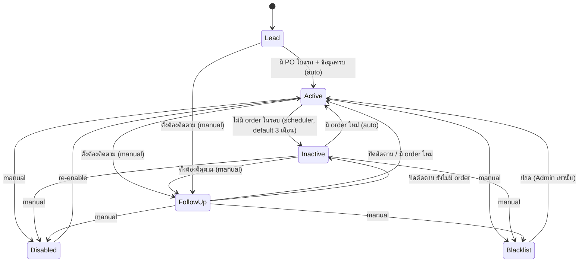
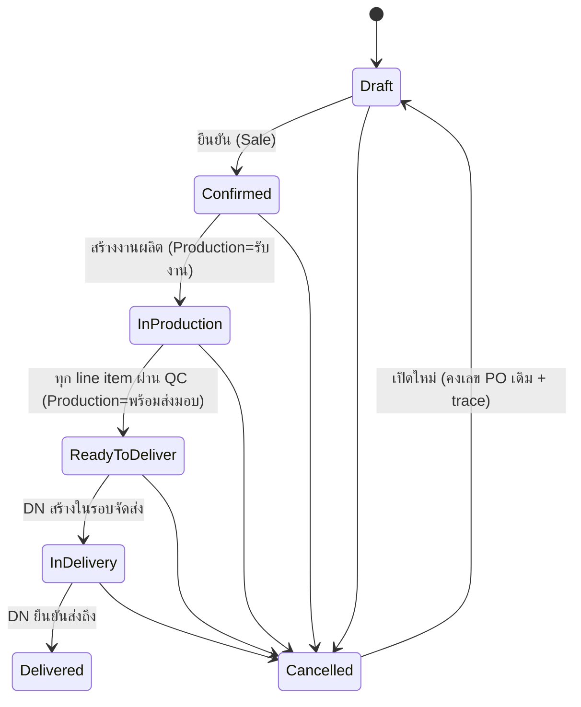
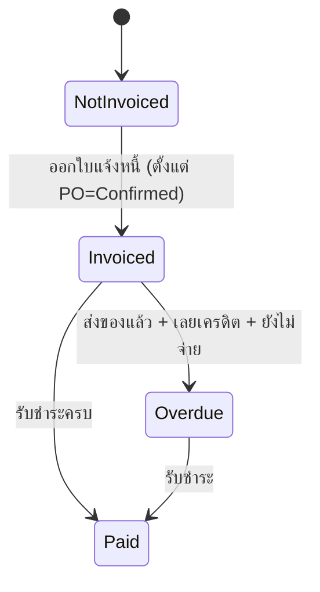
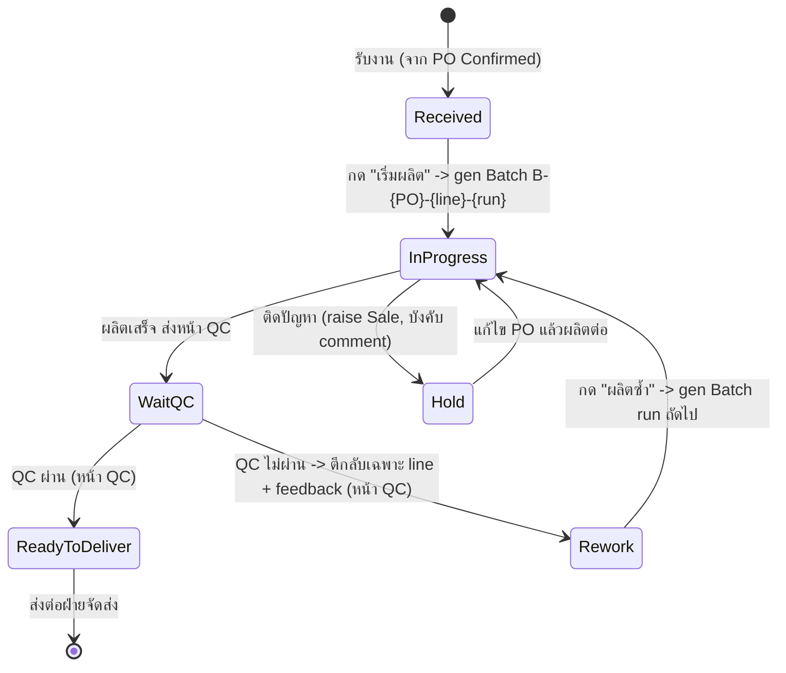
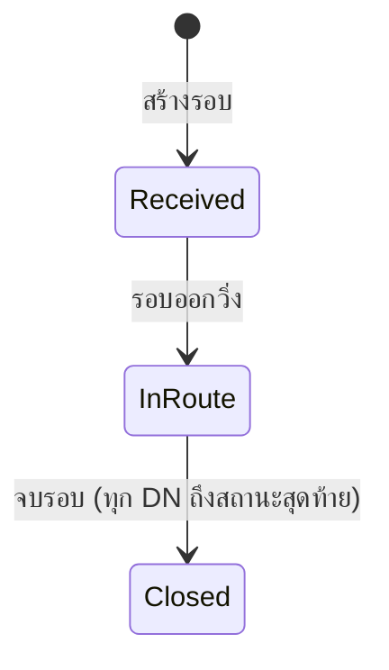
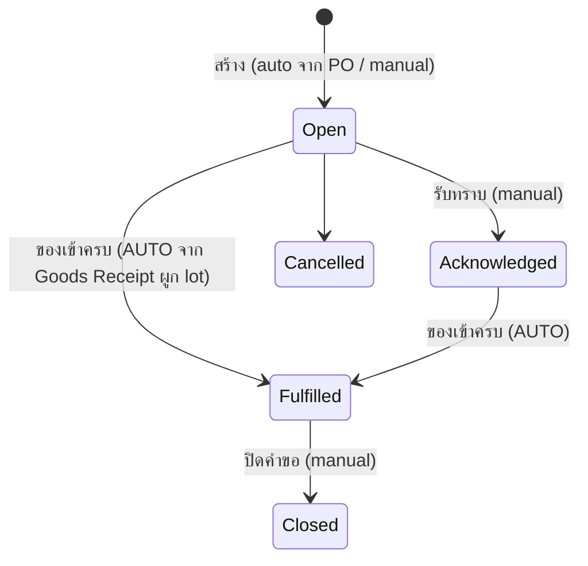
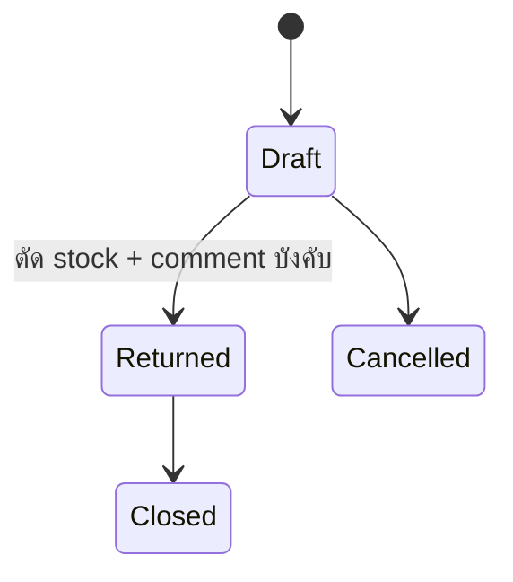

# Status Journeys — ESSENCE Hub System (ERP v2, UI-First Rebuild)

slug: `erp-v2-ui-first` · เขียนโดย PO (design phase) เพื่อให้ UX/UI ทำ mockup ทุกสถานะ และ BA/Engineer/QA ทำครบ
ที่มา: `pond-gate1-feedback.md` (ร1) + คำตอบ 6 ข้อ + `pond-gate1-r2-feedback.md` (ร2) + คำตอบ 5 ข้อ + `pond-gate1-r3-feedback.md` (ร3) + คำตอบ r3 ครบ (2026-07-08) + Notification/deep-link

## สรุปภาษาไทย
"แผนที่สถานะ" ของทั้งระบบ — ทุกสถานะต้องต่อเนื่องข้าม module ห้ามหลุด journey. อัปเดตล่าสุด (r3 ตอบครบ): **QC ตัดสินราย line/Batch ที่หน้า QC เท่านั้น — ตีกลับเฉพาะตัวเสีย + rework loop ชัดเจน (Batch run ใหม่)** · **เลข Batch = `B-{PO}-{line}-{run}`** (ปอนด์เลือกตามเหตุผล GMP), สร้างตอน "เริ่มผลิต", 1 line = 1 Batch · **Goods Receipt multi-line, 1 GR อ้างหลาย PR; รับไม่ครบ → เสนอ PR ใหม่เฉพาะที่ขาด user review ก่อน** · **Dashboard date filter default เดือนนี้ + เลือกอิสระ เดือน/ปี/date range** · **BOM ไม่มี supplier active → บล็อกจนกรอก override** · ก่อนหน้า: ลูกค้า 6 สถานะ, Shipment→DN (DN=1 PO), PO cancel/reopen คงเลข, BOM snapshot

**หลักการร่วม (ทุกสาย):**
1. **ทุกการเปลี่ยนสถานะมี trace เสมอ** (ใคร/จากอะไร→เป็นอะไร/เมื่อไหร่/เหตุผล) — รวม cancel/reopen
2. **comment ได้ทุกสถานะ** + **บังคับ comment** ในจุดที่ระบุ (QC fail feedback, Hold, Follow-up, disable/blacklist, return, override)
3. **สถานะข้าม module reconcile กัน** — PO (แม่) สะท้อนสถานะ production/shipping/invoice
4. สถานะ auto (Active/Inactive, Potential Delay, Overdue, PR ของเข้าครบ) มี rule/scheduler + badge อธิบายเหตุผล
5. **Minimize clicks** — เปลี่ยนสถานะ+comment inline, deep link พาไปหน้าทำงานต่อ; **dropdown ทุกจุด search ได้**
6. **สถานะอ่านออกด้วยภาษาคน** — ห้ามโชว์ enum ดิบ
7. **ทุกการส่งงานข้าม module ยิง Notification/Inbox + deep link** (§10)

> ⚠ เอกสารเป็น input ของ BA/Engineer/QA — ทุกหน้า create/edit ต้องกดได้จริง + test data สมจริงตรง use case

---

## 1. Customer Lifecycle — 6 สถานะ
สถานะ: `Lead` → `Active` ↔ `Inactive` · `Follow-up (ต้องติดตาม)` · `Disabled` · `Blacklist`
**"ต้องติดตาม" = สถานะที่ 6 แยกจริง** — ตั้งโดย Sale/Sale Manager พร้อม **comment (บังคับ)**; โผล่ tile "ต้องติดตาม" ใน Sale Dashboard

**Use case Follow-up ↔ Production Hold:** Production `Hold` เหตุลูกค้า → raise Sale → Sale ตั้งลูกค้า "ต้องติดตาม" + comment → กลับ Active เมื่อจบ/มี order ใหม่
**ผูกกับหน้า:** contact ไม่จำกัด (**หน้า "เพิ่มผู้ติดต่อ" จริง**) · **หน้า "เพิ่มลูกค้า" ต้องเป็น create จริง** · note timeline · reassign · ประวัติ PO · search · **test data สมจริง** (Follow-up มีเคส Hold, Blacklist มี comment เหตุผล)

---

## 2. PO Lifecycle (2 ราง) + Cancel/Reopen + เปลี่ยนสถานะ
วัตถุดิบขาด = **WARNING ไม่บล็อก** + auto Purchase Request (ไม่มี Awaiting Materials)

### 2A. Fulfilment track

- **Cancel ได้ทุก case** (บังคับ comment) · **Cancelled → Draft** คงเลข PO เดิม + trace
- **UI เปลี่ยนสถานะ PO ชัดเจน** ที่ po-detail (ปุ่ม/กล่อง + เหตุผล + trace). manual force เฉพาะ Admin-bit (RUCDAA) + trace
- **po-detail แสดงภาพรวมทุก line item + Batch/สถานะราย line** (line ไหน rework, line ไหนไปต่อ, line ไหนผ่าน QC) — เห็นทั้งใบในที่เดียว

### 2B. Billing track

- **เครดิต:** ตั้งที่**ระดับลูกค้า (default) + แก้ต่อใบ invoice ได้** · **VAT rate:** ยึด effective date ณ **วันที่ออกใบกำกับภาษี (invoice date)**
**หน้า PO:** search 3 แบบวันที่ · แก้จำนวน+ราคา (0 ได้) · 2 ราง + sale + trace + UI เปลี่ยนสถานะ

---

## 3. Production Lifecycle (จบที่ "พร้อมส่งมอบ") — QC ตัดสินที่หน้า QC เท่านั้น
สถานะราย Batch/line: `รับงาน` → `กำลังผลิต` → `รอ QC` → `พร้อมส่งมอบ` + `พักงาน (Hold)` + overlay `เสี่ยงล่าช้า`
**หน้าการผลิต "ไม่มี" ปุ่ม "QC ไม่ผ่าน"** — QC ตัดสินที่หน้า QC หน้าผลิตแค่เห็นผล + รับงานกลับ (rework)

- ตัวเปลี่ยนสถานะที่หน้าผลิต = เริ่มผลิต / ส่งตรวจ QC / Hold(+raise Sale) / **ผลิตซ้ำ (เมื่อ line ถูก rework)** — **ไม่มี "QC ไม่ผ่าน"**
- Hold: raise Sale → Sale แก้ไข PO ได้ทุกอย่าง + trace → ผลิตต่อ · Potential Delay overlay (2+1 วัน)

### 3.1 Batch Lifecycle + PO ↔ Batch ↔ QC (หัวใจ GMP — ปอนด์ตัดสินแล้ว)
- **สร้าง Batch เมื่อ:** ฝ่ายผลิตกด **"เริ่มผลิต"** ของ line item นั้น (ไม่ใช่ตอน PO confirm)
- **1 line item = 1 Batch** → 1 PO N สินค้า = N Batch (line เดียวผลิต/ผลิตซ้ำหลายรอบ = หลาย Batch run)
- **★ รูปแบบเลข Batch (ปอนด์เลือก): `B-{PO}-{line}-{run}`**
  - เช่น **`B-PO-2026-0012-2-1`** = PO-2026-0012, line item ที่ 2, ผลิตครั้งที่ 1
  - ผลิตซ้ำ (rework) ครั้งแรกของ line 2 → **`B-PO-2026-0012-2-2`** (run เพิ่มทีละ 1)
  - อ่านแล้วรู้ทันทีว่ามาจาก PO/line ไหน + เป็นการผลิตรอบที่เท่าไร
- **Batch ผูก:** PO ref + line ref + **Lot วัตถุดิบที่ใช้ (FIFO)** + จำนวน + ผู้ผลิต + เวลา + run ก่อนหน้า (ถ้า rework)
- **GMP chain:** Lot → Batch → line → PO → ลูกค้า → DN/Invoice
- **ทำไมต้องแยก Batch จาก PO (เหตุผล GMP):** 1 PO หลายสินค้า/ผลิตคนละรอบ/คนละ lot; QC ไม่ผ่านผลิตซ้ำ = Batch ใหม่ (run ถัดไป) ของ line เดิม; recall ต้องไล่ Batch→Lot; ฉลาก อย./GMP ต้องมีเลขรุ่นผลิต

### 3.2 QC ราย line + Rework Loop (UI requirement — คำกำชับปอนด์ "อย่าให้ฝ่ายผลิตงง + ส่งกลับ QC ลื่น")
QC ตัดสิน **ราย line item / ราย Batch** ที่หน้า QC เท่านั้น · line ไม่ผ่าน → ตีกลับเฉพาะตัวนั้น + **feedback (บังคับ)** · line ผ่าน → รอ · **PO "พร้อมจัดส่ง" เมื่อทุก line ผ่าน QC**

**Rework loop — ต้องเห็นชัดในหน้าจอ (ส่งให้ UX/UI):**
- **(ก) หน้าผลิต** แสดง line ที่ถูกตีกลับด้วย **badge "Rework"** + ระบุ **Batch run ใหม่ที่จะเกิด** (เช่น "Batch ใหม่: B-PO-2026-0012-2-2") + **feedback จาก QC แสดงติดกับ line นั้น** (เห็นว่าเสียเรื่องอะไร)
- **(ข) กด "ผลิตซ้ำ"** → ระบบ **gen Batch run ถัดไปอัตโนมัติ** (`...-{run+1}`) ผูก run ก่อนหน้า
- **(ค) ส่งกลับ QC** → **คิว QC เห็นเป็นรายการใหม่** พร้อม **ประวัติ run ก่อนหน้า** (run 1 ไม่ผ่านเพราะอะไร) — ตรวจซ้ำได้ลื่น
- **(ง) line อื่นใน PO เดินต่อไม่สะดุด** + **po-detail เห็นภาพรวมทุก line/Batch** (สถานะราย line: ผ่าน/รอ QC/Rework)
- ทุกขั้นมี **trace** (ใคร/เมื่อไหร่/feedback/run)

| Transition | หน้า | comment | สะกิดข้าม module |
|---|---|---|---|
| Received → InProgress (gen Batch run 1) | Production ("เริ่มผลิต") | — | สร้าง Batch `B-{PO}-{line}-1` ผูก PO/line/Lot |
| InProgress → WaitQC | Production ("ส่งตรวจ QC") | optional | โผล่หน้า QC |
| WaitQC → ReadyToDeliver | **QC** | optional | ครบทุก line → PO พร้อมจัดส่ง |
| WaitQC → Rework | **QC** | **บังคับ (feedback)** | line ที่เสีย → badge Rework ที่หน้าผลิต + feedback |
| Rework → InProgress (gen run ถัดไป) | Production ("ผลิตซ้ำ") | optional | Batch run ใหม่ `...-{run+1}` → ส่งกลับคิว QC |
| → Hold | Production | **บังคับ** | raise Sale |

---

## 4. Shipping (2 ชั้น: Shipment รอบ → DN ราย PO)
- **Shipment (รอบจัดส่ง)** รวมหลาย DN — สถานะรอบ: `รับเข้ารอบ` → `กำลังนำส่ง` → `จบรอบ`
- **DN = 1 ใบต่อ 1 PO เสมอ** — สถานะ DN: `กำลังนำส่ง` → `ส่งถึงแล้ว` / `ปฏิเสธ` / `เลื่อนส่ง`

**สร้างรอบได้ 2 ทาง (หน้าจอจริง):** เลือก PO ก่อนแล้วสร้างรอบ / สร้างรอบเปล่าแล้ว search PO เพิ่ม (dropdown search: PO ID หรือข้อมูลลูกค้า)
**ข้อมูลรอบจัดส่ง:** **คนขับ, เบอร์คนขับ, Route/เส้นทาง, ประเภทรถ (เก๋ง/motorcycle/กระบะ/10 ล้อ — dropdown, config เพิ่มได้)**

**reconcile:** DN Delivered → PO Delivered (นับ overdue) · DN Rejected → PO "พร้อมจัดส่ง" + raise Sale · DN Postponed → PO "พร้อมจัดส่ง" + flag Postpone+วันที่ ค้างคิว → สร้าง DN รอบใหม่

---

## 5. Purchase Request + Goods Receipt (multi-line)
**PR** เกิด 2 ทาง: auto จาก PO วัตถุดิบขาด (จำนวน = ส่วนที่ขาด, สร้างใบใหม่แยกทุกครั้ง, ผูก PR↔PO) / **สร้างตรงจากหน้า PR (หน้าเต็มจอ กดได้จริง)**

**★ Goods Receipt (หน้า stock) = header + หลาย line:**
- **Header:** supplier (dropdown search), เลขใบรับจาก supplier, วันที่รับ, แนบเอกสาร
- **Lines (หลายรายการต่อใบ):** วัตถุดิบ (dropdown search) × จำนวน × ราคาซื้อ/หน่วย (0 ได้) × **lot gen รายบรรทัด** × **อ้าง PR รายบรรทัด**
- **1 GR อ้างได้หลาย PR** (line ต่าง PR ได้)
- **รับไม่ครบตาม PR (partial):** ระบบ**เสนอสร้าง PR ใหม่เหลือเฉพาะ item/จำนวนที่ขาด** แต่ **user ต้อง review + ยืนยันก่อนสร้าง** (ไม่ auto เงียบ ๆ) — PR ใบเดิมปิดตามของที่รับจริง, ผูก PR↔PO↔Lot ให้ครบ
- ทุก line สร้าง Lot ใหม่ (prefix supplier + running) → เข้า stock "รอ QC ขาเข้า"

---

## 6. Return Flow (คืนของ supplier)

- ระบุ lot → auto แสดง supplier → แก้จำนวน return → ตัด stock + comment บังคับ · trace เสมอ

---

## 7. Invoice / Payment
- ออกได้ตั้งแต่ PO=Confirmed แต่แสดง PO fulfilment stage เสมอ · Overdue: ส่งของแล้ว+เลยเครดิต(ระดับลูกค้า/ต่อใบ)+ยังไม่จ่าย → วันค้าง (Finance+Sale)
- ใบกำกับภาษีไทย (issuer จาก settings, VAT7% ตาม effective date ณ invoice date, discount, ตัวหนังสือไทย, ลายเซ็น 2 ช่อง)

---

## 8. ตารางความต่อเนื่องข้าม module

| # | เหตุการณ์ต้นทาง | ผลลัพธ์ปลายทาง |
|---|---|---|
| C1 | Customer สร้าง PO ใบแรก | Lead → Active; Sale Dashboard |
| C2 | Customer ไม่มี order ในรอบ | Active → Inactive; แจ้ง Sale |
| C2b | Sale ตั้ง "ต้องติดตาม" | Follow-up + comment; tile Sale Dashboard |
| C3 | PO วัตถุดิบขาด | WARNING + สร้าง PR (ส่วนที่ขาด) → Stock + Production Dashboard |
| C4 | Goods Receipt รับของ (ผูก lot รายบรรทัด) | PR → Fulfilled อัตโนมัติ (รับไม่ครบ = เสนอ PR ใหม่ user ยืนยัน); Stock เพิ่ม (lot รอ QC) |
| C5 | PO Confirmed | Production = รับงาน |
| C5b | Production "เริ่มผลิต" | gen Batch `B-{PO}-{line}-{run}` (ผูก PO/line/Lot) |
| C6 | QC ตีกลับ line/Batch | line → Rework + feedback + badge; ผลิตซ้ำ → Batch run ใหม่ → กลับคิว QC (line อื่นเดินต่อ) |
| C7 | Production Hold (ลูกค้า) | raise Sale → อาจตั้ง Follow-up (C2b) + แก้ไข PO |
| C7b | Potential Delay | notify Sale + Stock |
| C8 | ทุก line ผ่าน QC | PO → พร้อมจัดส่ง; โผล่คิวจัดส่ง |
| C9 | DN Delivered | PO → Delivered; นับ overdue |
| C10 | DN Rejected | PO พร้อมจัดส่ง + raise Sale |
| C10b | DN Postponed | PO พร้อมจัดส่ง + flag Postpone+วันที่ ค้างคิว |
| C11 | Invoice Overdue | แจ้ง Finance (+Sale) |
| C12 | Return Issued | Stock ลด (lot) + adjust + comment |
| C13 | PO Cancelled → Draft (reopen, คงเลข) | รับงานต่อ; trace lifecycle |
| C14 | Sale reassign ลูกค้า | customer.sale เปลี่ยน; Dashboard 2 ฝั่ง + trace |

---

## 9. Roles / Permission (RUCDAA)
- ราย module × 6 ระดับ: R/U/C/D/Approve/Admin — bit "Admin" = special (reassign, archive trace, ปลด Blacklist, force override, cancel/reopen PO) · สร้าง role ไม่จำกัด · Sale Manager, Super User · Read bit = เห็น module + รับ Notification

## 10. Notification / Inbox + Deep link
- bell มุมบนขวา → badge รวม → expand → กดรายการ = deep link + acknowledge (ราย user) · ผู้รับ = ผู้มีสิทธิ์ Read module ปลายทาง · **QC ตีกลับ → noti ถึงฝ่ายผลิต (deep link ไป line ที่ต้อง rework)**

## 11. BOM Cost Rule
- ราคาทุน = ราคารับซื้อ **สูงสุดของ supplier ที่ active** + แก้ทับได้ + **snapshot ตอนบันทึก** + **badge "ราคาทุนอาจล้าสมัย"** · ราคาขาย mandatory · **หน้า "สร้างสูตรใหม่" กดได้จริง**, dropdown วัตถุดิบ search ได้
- **component ไม่มี supplier active เลย: บล็อกไม่ให้บันทึกสูตรจนกว่า user กรอกราคาทุน override เอง** — ตัวนั้นใช้เฉพาะราคา override

## 12. Dashboard Date Filter (ยืนยันแล้ว)
- **UI:** preset **วันนี้ / สัปดาห์นี้ / เดือนนี้ (default) / กำหนดเอง** + **เลือกอิสระได้: เดือนไหน / ปีไหน / date range** มีผลทุก tile
- **แยก metric 2 ชนิด + caption ต่อ tile:** **Event** (PO=สร้างในช่วง, ค้างชำระ=ครบกำหนดในช่วง, ห่างหาย=กลายเป็น Inactive ในช่วง, ต้องติดตาม=ตั้งในช่วง) vs **State/activity** (ลูกค้าประจำ=มี order ในช่วง; คิวผลิต/รอ QC=ตอนนี้) · กด tile = drill-down list ของช่วงนั้น

## 13. คำถามถึงปอนด์ (r3 — ตอบครบแล้ว ✅)
1. **QC ราย line:** ✅ ตีกลับเฉพาะ line ที่ไม่ผ่าน + rework loop (§3.2)
2. **เลข Batch:** ✅ **`B-{PO}-{line}-{run}`** (ปอนด์เลือก, GMP) — ผลิตซ้ำ run+1 (§3.1)
3. **Dashboard:** ✅ default เดือนนี้ + เลือกอิสระ เดือน/ปี/date range + event/state (§12)
4. **Goods Receipt/PR:** ✅ 1 GR อ้างหลาย PR; รับไม่ครบ → เสนอ PR ใหม่เฉพาะที่ขาด + user review (§5)
5. **BOM ไม่มี supplier active:** ✅ บล็อกจนกรอก override (§11)
> ไม่มีคำถามค้างในรอบนี้
